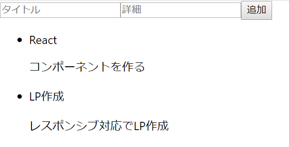

## コンポーネント構築
それでは、実際にReactでアプリを作ってみましょう。今回は、TODOアプリを作っていきます。目標は、[このようなサイト(githubPage)](https://sawaki1998.github.io/React-class/)になります。

1. コンポーネント構築
1. データの受け渡しと機能実装
1. スタイルをつける
1. マテリアルデザインを取り入れる

の順番で作っていきます。

### 基本機能の説明
今回作るTODOアプリでは、

1. タスクの一覧表示
1. タスクの追加機能
1. タスクの完了・未完了切替機能

の3つの機能を実装していきます。

### 基本機能のコンポーネント作成
Reactでは、アプリをコンポーネントに分けて管理します。
機械のひとつひとつの部品に役割があるように、アプリをコンポーネントごとの部品にして、機能を作って組み合わせます。
<br><br>
[完成像のサイト]()を見て、どうコンポーネントごとに分けるか、考えてみてください。
<br><br>
今回は、

1. TODOアプリの全体を統括するコンポーネント
1. TODOを追加するformのコンポーネント
1. TODOリストのコンポーネント
1. TODOアイテム(ひとつひとつのTODOのことです。)のコンポーネント

に分けて構築していきます。
コンポーネント構築の段階では、データの受け渡しはなくコンポーネントを使ってhtmlをレンダリングするところまでを行います。

#### App.jsxコンポーネント
まずは、TODOアプリの全体を統括するコンポーネントから記述していきます。
<br>
first-app/src/App.jsをApp.jsxとします。
App.jsxファイルを開くと、以下のようなコードが書かれていると思います。

```jsx:App.jsx
import React from 'react';
import logo from './logo.svg';
import './App.css';

function App() {
  return (
    <div className="App">
      <header className="App-header">
        
        <p>
          Edit <code>src/App.js</code> and save to reload.
        </p>
        <a
          className="App-link"
          href="https://reactjs.org"
          target="_blank"
          rel="noopener noreferrer"
        >
          Learn React
        </a>
      </header>
    </div>
  );
}

export default App;

```
ここでは、ReactをインポートしてAppという関数を定義し、htmlのようなものをreturnして、最初にyarn startで表示されたものを返しています。これがjsxの記法になります。
Appをexportすることで、public/index.html内の

```html
<div id="root"></div>
```

内にAppのreturnが入るようになっています。
<br>
それでは、実際にTODOアプリのためのApp.jsxを記述していきましょう。
App.jsx内のコードをすべて消して、以下のコードを書いてみてください。

```js:App.jsx
import React from "react";
import Form from "./Form";
import TodoList from "./TodoList";

class App extends React.Component {
    render() {
        return (
            <div>
                <p>Hello, React world!</p>
            </div>
        )
    }
};
export default App;
```

コンポーネントは、

1. Reactや他のコンポーネント等のimport
1. コンポーネントの定義
1. コンポーネントのレンダリング(htmlの描画)
1. コンポーネントのexport

で構成されます。
<br>
基本的にクラス内のメソッドを機能として追加し、renderメソッドはコンパイル後のhtmlを書くイメージです。
<br>

renderメソッドの返り値は、**ひとつのhtml要素である**ため、divで囲っています。

<br>
ここでは、Appが全体のコンポーネントとなり、その中にFormとTodoListコンポーネントがあるため、その2つをインポートしています。
ここで、yarn startを実行し、http://localhost:3000/
を訪れるとHello, React world!が表示されているはずです。
<br>それでは、renderメソッド内のreturn内を、以下のように変更しましょう。

```js:App.jsx
：
<div>
    <From></Form>
    <TodoList></TodoList>
</div>
：
```
このように、importしたコンポーネントは、htmlのタグのように記述して使います。

#### Form.jsxコンポーネント
次にTODOを追加するためのformコンポーネントを作っていきます。src内にForm.jsxを作成し、App.jsxのコンポーネントを記述した時のテンプレートを使って自分でコードを書いてみてください。TODOに必要な項目は、「TODOのタイトル」「TODOの詳細」「完了したかどうか(Boolean)」とします。以下のようなコードになります。

```js:Form.jsx
import React from "react"

export default class Form extends React.Component {
    render() {
        return (
            <form action="">
                <input type="text" name="title" />
                <input type="text" name="desc" />
                <button type="submit">追加</button>
            </form>
        )
    }
}
```
ここでは、コンポーネントの定義とexportを同時に行っています。

#### TodoList.jsxコンポーネント
TODOリストのコンポーネントを作ります。同じように、src内にTodoList.jsxを作成します。自分で記述してみた上で、以下のコードと照らし合わせてみてください。
```js:TodoList.jsx
import React from "react"
import TodoItem from "./TodoItem"

export default class TodoList extends React.Component {
    render() {
        return (
            <ul>
                <TodoItem></TodoItem>
            </ul>
        )
    }
}
```

#### TodoItem.jsxコンポーネント
最後に、TODOアイテムのコンポーネントを作ります。src内にTodoItem.jsxを作成し、コードを記述してみてください。以下のようになるかと思います。
```js:TodoItem.jsx
import React from "react"

export default class TodoItem extends React.Component {
    render() {
        return (
            <li>
                <p>タイトル : React</p>
                <p>詳細 : コンポーネントを作る</p>
            </li>
            <li>
                <p>タイトル : LP作成</p>
                <p>詳細 : レスポンシブ対応でLP作成</p>
            </li>
        )
    }
}
```
<br><br>
ここまで、コンポーネントを作成してきました。yarn startを実行してhttp://localhost:3000/
を訪れると、画像のようなフォームとTODOリストが見れると思います。
<br>



###### 備考
classは予約語なのでclassNameになります。<br>
eslintが入っていない場合は入れましょう。
