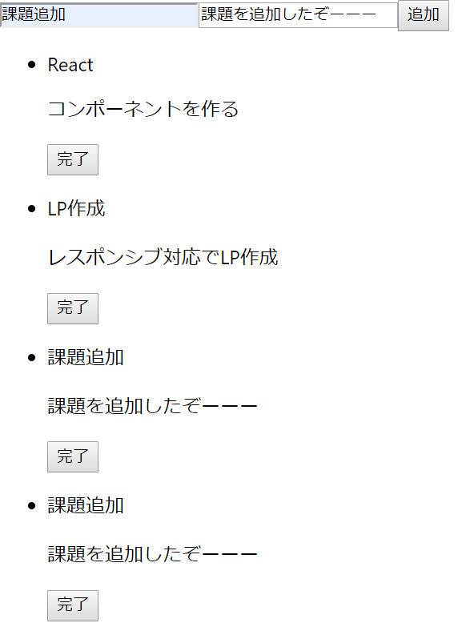
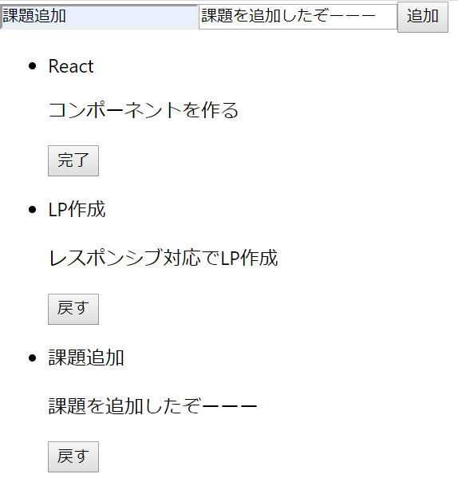

## stateとpropsの応用-stateの更新
ここまで、stateからpropsにしてコンポーネント同士でデータを受け渡す処理を記述してきました。
TODOのデータの受け渡し処理は完了しているので、

1. タスクの追加機能
=>formに入力したデータをstateに入れて更新する機能
1. タスクの完了・戻す切替機能
=>TodoItemのボタンが押された時にそのtodoのisDoneをtrueに変更して更新する機能

を実装していきます。

### タスクの追加機能の実装
propsは不変データなので、Formからsubmitされたデータは、formコンポーネントでは更新できません。代わりに、stateを管理しているAppコンポーネントから操作することによって更新していきます。つまり、本来ならForm.jsxに記入すべきメソッドをApp.jsxの方に記述します。

App.jsxには、

1. 機能のメソッドを定義する
1. submit時にそのメソッドを呼び出す

ことが必要です。

#### App.jsxでのメソッド定義
それでは、以下のコードをApp.jsxに記述してみてください。

```js:App.jsx
：
constructor() {
：
}
handleSubmit(e) {
	e.preventDefault()
	const title = e.target.title.value
	const desc = e.target.desc.value
	const newTodos = this.state.todos.slice()
	newTodos.push({
		title : title,
		desc : desc,
		isDone : false
	})
	this.setState({
		todos : newTodos
	})
}
render() {
	return (
  		<div>
			<Form handleSubmit{this.handleSubmit.bind(this)}><Form>
			<TodoList todos={this.state.todos}><TodoList>
  		</div>
	)
}
```
まずは、

1. 機能のメソッドを定義する
    1. イベントのデフォルト設定の解除
    1. フォームに入力された内容の取得
    1. stateの更新

を行っています。
<br>
eというのは、任意の引数で、第一引数に記述することで、イベント発動時に任意の引数が入るようになっています。(任意というのは、文字自体はなんでもよいという意味です。)
<br>
イベントのデフォルト設定では、type="submit"ではデータ送信をして、ページを更新する設定になっています。これを防いでメソッド内の処理のみを動作させるために、e.preventDefault()を入れています。よくわからない場合は、一度e.preventDefault()なしでやってみてください。preventDefault()の詳細は、[こちら(qiita)](https://qiita.com/tochiji/items/4e9e64cabc0a1cd7a1ae)です。
<br>
イベントを発生させたオブジェクトは、e.targetで参照することができます。また、フォームに入力された値は、name.valueで取り出すことができます。今回は、form全体をsubmitしているので、e.target.name.valueでフォームに入力された内容を取得できます。
<br>
setState()は、引数の内容をそのままstateにするので、
```
setState({
    title: title,
    desc: desc,
    isDone: false
})
```
としてしまうと、stateがこれのみになってしまい、前回までのTODOが消えてしまいます。ですので、現在のstateを複製して追加する処理を行っています。
<br>
render(){}時には、このメソッドはイベントが発生するForm.jsx上で呼び出したいので、プロパティとしてこのメソッドを渡しています。ここで、.bind(this)をつけています。.bindでthisをメソッドを定義したApp.jsxコンポーネント上に固定しなければ、Form.jsx内でメソッドが実行された際に、thisがFormコンポーネント上からメソッドを探そうとしてしまい、エラーが発生します。なので.bind(this)が必要です。

#### Form.jsxでのメソッド使用
App.jsxがプロパティとしてhandleSubmitメソッドを渡してくれているので、あとはForm.jsxでsubmitが実行された時にメソッドを呼び出すのみです。それでは、Form.jsxにコードを書いてみましょう。
```js:Form.jsx
：
render() {
    return (
        <form onSubmit={this.props.handleSubmit}>
            <input type="text" name="title" />
            <input type="text" name="desc" />
            <button type="submit">追加</button>
        </form>
    )
}
：
```
それでは、実際にアプリを走らせてフォームに入力して追加ボタンを押してみてください。画像のようにうまく追加できれば成功です。



### タスクの完了・戻す切替機能の実装[SHA1値 : 4ef2dc5]
それでは、最後の機能を実装していきましょう。ここまで学習した知識で実装可能なので、コードを読む前に記述してみてください。


#### App.jsxでのid定義
ここで実装するのは、完了ボタンを押すと、そのオブジェクトのisDoneのみを変更する機能です。今回の場合、そのオブジェクトのisDoneを指定するには、
```
this.state.todos[i]
```
という記述になります。しかし、完了ボタンを押した時にiの数字を求めることができないので、現段階では指定できません。そこで、そのタスク自身が何番目のタスクなのかを判定できるように、todosの中にidというキーを追加して、何番目のタスクかが分かるようにしましょう。
<br>
stateが変化するのは、handleSubmitでタスクが追加された時のみです。ですので、その処理にidを記述していきましょう。
App.jsxに以下のコードを書いてください。

```js:App.jsx
：
constructor() {
		super()
		this.state = {
			todos : [
				{
					id : 0,
					title : "React",
					desc : "コンポーネントを作る",
					isDone: false
				},
				{
					id : 1,
					title : "LP作成",
					desc : "レスポンシブ対応でLP作成",
					isDone : false
				}
			]
		}
	}
	handleSubmit(e) {
		e.preventDefault()
		const title = e.target.title.value
		const desc = e.target.desc.value
		const newTodos = this.state.todos.slice()
		newTodos.push({
			id : this.state.todos.length,
			title : title,
			desc : desc,
			isDone : false
		})
		this.setState({
			todos : newTodos
		})
	}
：
```
stateの定義にidを追加し、handleSubmitでstateに追加する時にもidを追加しています。レンダリング時にはTodoList.jsxへthis.state.todosごと渡しているので、idもTodoList.jsxに渡されています。

#### TodoList.jsxとTodoItem.jsxへのidの受け渡し
それでは、App.jsxで定義したidをTodoItem.jsxへと受け渡していきましょう。TodoList.jsxに以下のコードを書いてください。
```js:TodoList.jsx
：
return (
    <TodoItem 
    id={todo.id}
    title={todo.title}
    desc={todo.desc}
    isDone={todo.isDone}
    ></TodoItem>
)
：
```
これで、idの受け渡しについては問題ないです。

#### App.jsxでのメソッド定義
タスクの完了・戻す切替機能は、TodoItem.jsx上で実行してstateを更新する機能なので、App.jsx上で定義します。
このメソッドの処理は、

1. クリックイベントが発生したtodoを特定
1. todosのidを参照
1. 該当するtodoのisDoneを変更

になります。
しかし、App.jsxからtodoの特定とtodoのidを参照することは難しいので、これらはコンポーネントの段階でtodoの特定とidの参照が可能なTodoItem.jsx上で行い、引数の形でidを渡してあげた方がいいです。

よって、該当するtodoのisDoneの変更のみ行います。
それでは、以下のメソッドを追加してください。
```js:App.jsx
：
handleClick(id) {
    const newTodos = this.state.todos.slice()
    newTodos[id].isDone =! newTodos[id].isDone
    this.setState({
        todos : newTodos
    })
}
：
```
そして、以下のようにhandleClickをTodoList.jsxに渡しましょう。
```js:App.jsx
<TodoList todos={this.state.todos} handleClick={this.handleClick.bind(this)}></TodoList>
```

#### TodoList.jsxからTodoItem.jsxへのhandleClickの受け渡し
TodoItem.jsxにhandleClickを受け渡します。TodoList.jsx内にプロパティを追加してください。
```js:TodoList.jsx
<TodoItem 
id={todo.id}
title={todo.title}
desc={todo.desc}
isDone={todo.isDone}
handleClick={this.props.handleClick}
></TodoItem>
```
#### TodoItem.jsxでの機能実装
それでは、TodoItem.jsxでhandleClickを動作させましょう。
以下をTodoItem.jsxに書きましょう。
```js:TodoItem.jsx
：
render() {
    const buttonText = this.props.isDone ? "戻す" : "完了" 
    const id = this.props.id
    const handleClick = this.props.handleClick
    return (
        <li>
            <p>{this.props.id}</p>
            <p>{this.props.title}</p>
            <p>{this.props.desc}</p>
            <button onClick={()=>{handleClick(id)}}>{buttonText}</button>
        </li>
    )
}
：
```
このようにして、handleClickにidを渡すと、タスク完了・戻す切替機能が実装できたと思います。


###### 備考
```jsx
<button onClick={()=>{handleClick(id)}}>{buttonText}</button>
```


