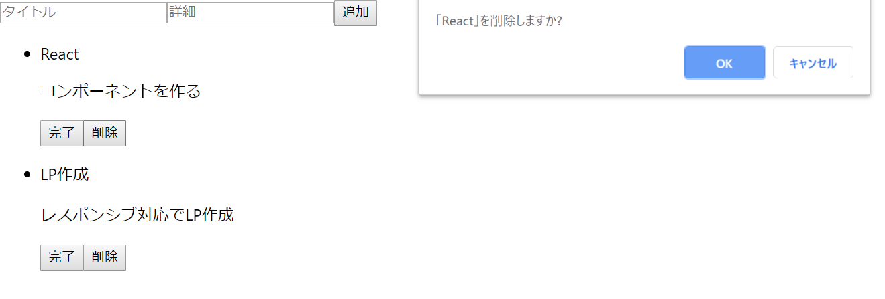
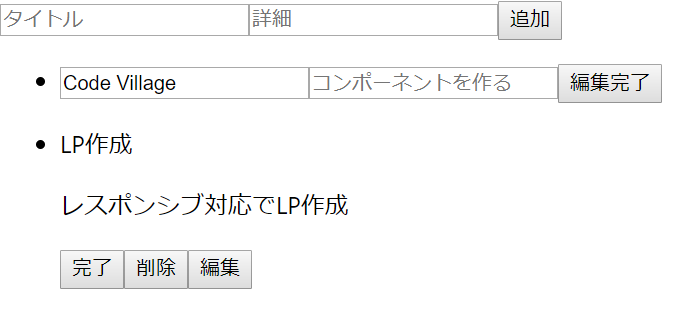
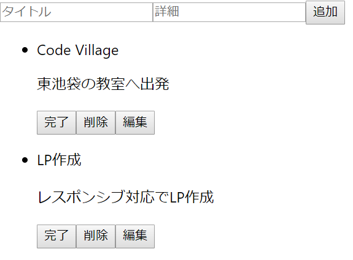

## propsとstateの練習
ここまでの知識があれば、

- タスクの削除機能
- タスクの編集機能

を実装できるはずです。

これまでの復習をしながら自分で実装してみてください。どうしてもわからない点があったりヒントがほしい場合は以下のコードと解説を読んでみてください。コードの差分が見たい場合は該当するSHA1値の[github](https://github.com/sawaki1998/React-class/commits/master)をチェックしてみてください。

### タスクの削除機能の実装[SHA1値 : a566a23]
タスクの削除機能は、完了・戻す切替機能とほぼ同じやり方で実装できます。完了ボタンの隣に削除ボタンをつけて、ボタンを押すと削除の確認をしたのち、OKを押すと削除する機能になります。
ここでは、

1. App.jsxでのメソッド定義
1. メソッドの受け渡し
1. TodoItem.jsxでの機能実装

の順に記述していきます。

#### App.jsxでのメソッド定義
以下のメソッドを追加してください。
```js:App.jsx
handleClickDelete(id) {
	const DeletedTodos = this.state.todos.slice()
	DeletedTodos.splice(id, 1)
	DeletedTodos.map((todo, i)=>{
		return (
			todo.id = i,
			todo.title = todo.title,
			todo.desc = todo.desc,
			todo.isDone = todo.isDone
		)
	})
	let deleteConfirm = window.confirm("「" + this.state.todos[id].title + "」" + "を削除しますか?")
	if (deleteConfirm) {
		this.setState({
			todos: DeletedTodos
		})
	}
}
```
ここで気を付けなければならないのは、idのズレです。deleteで何かを消すと、this.state.todos[id]と、指定したいオブジェクトにズレが生じて、うまくアプリが動作しないことが予測されます。ですので、idの値を削除したTODOがない状態でidを設定し直しています。
<br>
window.confirm()は、削除するかどうかをもう一度確認するために用いています。

#### メソッドの受け渡し
それでは、handleClickDeleteをpropsとして受け渡しましょう。App.jsxのrender() {}内に以下を記述してください。

```js:App.jsx
：
<TodoList todos={this.state.todos} 
handleClick={this.handleClick.bind(this)}
handleClickDelete={this.handleClickDelete.bind(this)}
></TodoList>
：
```
これで、TodoList.jsxにhandleClickDeleteが受け渡されました。
<br>
次に、TodoItem.jsxにhandleClickDeleteを渡していきます。
TodoList.jsxからTodoItem.jsxへのプロパティに渡しましょう。

```js:TodoList.jsx
：
<TodoItem 
id={todo.id}
title={todo.title}
desc={todo.desc}
isDone={todo.isDone}
handleClick={this.props.handleClick}
handleClickDelete={this.props.handleClickDelete}
></TodoItem>
：
```

#### TodoItem.jsxでの機能実装
それでは、機能を実装していきましょう。削除ボタンを作り、クリックされたらidを引数にしたhandleClickDeleteを呼び出すようにします。

```js:TodoItem.jsx
：
return (
    <li>
        <p>{this.props.title}</p>
        <p>{this.props.desc}</p>
        <button onClick={()=>{handleClick(id)}}>{buttonText}</button>
        <button onClick={()=>{this.props.handleClickDelete(id)}}>削除</button>
    </li>
)
：
```
アプリを走らせてみると、削除ボタンが使えると思います。確認してみてください。


### タスクの編集機能の実装[SHA1値 : 9012c49]
最後の機能として、タスクの編集機能を追加していきましょう。編集ボタンを押すと、そのタスクのタイトルと詳細が入力可能になり、それらを入力するとタスクが変更される機能です。一旦自分でやってみて、つまづいたらヒントとして確認してみてください。
<br>
まずは、タスクの編集機能はどのような流れになるか、整理しましょう。

1. 編集ボタンが押される
1. pタグだったタイトルと詳細がinputタグに変化し、編集完了ボタンが出現する
1. 編集完了ボタンを押すと、変更されたtodoの内容がsubmitされる
1. submitされたら、変更された内容を受け取り、stateを更新する

このような流れになることを踏まえると、やらなければならないことは、

1. App.jsxに編集ボタンが押された時のメソッド定義
1. TodoItem.jsxにinputタグを記述
1. App.jsxにsubmit用のメソッド定義
1. TodoItem.jsxでsubmitメソッドを呼び出す処理の定義

になります。それでは、ひとつずつ見ていきましょう。

#### App.jsxに編集ボタンが押された時のメソッド定義
編集ボタンが押された時の処理は、stateの更新をしないので、本来ならApp.jsxではなく、TodoItem.jsxに記述で十分です。しかし、今回は、pタグがinputタグになる必要があります。つまり、render(){}を編集ボタンが押された時に呼び出す処理が必要になります。しかし、現在のjsxの記法では、render(){}をコンポーネント内で呼び出すことはできません。代わりに、この記法ではthis.setStateでステートが更新された時にrenderが呼び出されるようになっています。ですので、todoのプロパティの中に、isEditというbooleanを新たに追加し、render(){}が呼び出された際に、isEditがfalseならpタグを表示し、isEditがtrueならinputタグを表示する場合2つのパターンを用意します。まずは、App.jsxでstateへのisEditプロパティの追加と、メソッド定義を行います。

```js:App.jsx
：
constructor() {
	super()
	this.state = {
		todos : [
			{
				id : 0,
				title : "React",
				desc : "コンポーネントを作る",
				isDone: false,
				isEdit: false
			},
			{
				id : 1,
				title : "LP作成",
				desc : "レスポンシブ対応でLP作成",
				isDone : false,
				isEdit: false
			}
		]
	}
}
handleSubmit(e) {
	e.preventDefault()
	const title = e.target.title.value
	const desc = e.target.desc.value
	const newTodos = this.state.todos.slice()
	newTodos.push({
		id : this.state.todos.length,
		title : title,
		desc : desc,
		isDone : false,
		isEdit : false
	})
	this.setState({
		todos : newTodos
	})
}
：
handleClickDelete(id) {
	const DeletedTodos = this.state.todos.slice()
	DeletedTodos.splice(id, 1)
	DeletedTodos.map((todo, i)=>{
		return (
			todo.id = i,
			todo.title = todo.title,
			todo.desc = todo.desc,
			todo.isDone = todo.isDone,
			todo.isEdit = todo.isEdit
		)
	})
：
handleEdit(id) {
	const editTodos = this.state.todos.slice()
	editTodos[id].isEdit = true
	this.setState({
		todos : editTodos
	})
}
render() {
	return (
  		<div>
			<Form handleSubmit={this.handleSubmit.bind(this)}></Form>
			<TodoList todos={this.state.todos} 
			handleClick={this.handleClick.bind(this)}
			handleClickDelete={this.handleClickDelete.bind(this)}
			handleEdit={this.handleEdit.bind(this)}
			></TodoList>
  		</div>
	)
}
```
ここでは、

- isEditのステートへの追加(他のメソッド内含め)
- handleEditメソッドの記述
- handleEditメソッドの受け渡し

を行っています。
<br>
次に、handleEditをTodoItem.jsxまで受け渡すために、TodoList.jsxを開きましょう。
以下を記述してください。

```js:TodoList.jsx
：
render() {
    let list = this.props.todos.map((todo, i)=>{
        return (
            <TodoItem 
            id={todo.id}
            title={todo.title}
            desc={todo.desc}
            isDone={todo.isDone}
            isEdit={todo.isEdit}
            handleClick={this.props.handleClick}
            handleClickDelete={this.props.handleClickDelete}
            handleEdit={this.props.handleEdit}
            ></TodoItem>
        )
    })
    return (
        <ul>
            {list}
        </ul>
    )
}
：
```
これで、isEditとhandleEditをTodoItem.jsxまで受け渡しました。


#### TodoItem.jsxにinputタグを記述
それでは次に、TodoItem.jsx内に、2パターンのレンダリングを記述していきましょう。
```js:TodoItem.jsx
：
render() {
    const buttonText = this.props.isDone ? "戻す" : "完了" 
    const id = this.props.id
    const handleClick = this.props.handleClick
    let todo
    if (this.props.isEdit === true) {
        todo = 
        <form onSubmit="">
            <input type="text" name="title" placeholder={this.props.title} />
            <input type="text" name="desc" placeholder={this.props.desc} />
            <button type="submit">編集完了</button>
        </form>
    } else {
        todo = 
        <div>
            <p>{this.props.title}</p>
            <p>{this.props.desc}</p>
            <button onClick={()=>{handleClick(id)}}>{buttonText}</button>
            <button onClick={()=>{this.props.handleClickDelete(id)}}>削除</button>
            <button onClick={()=>{this.props.handleEdit(id)}}>編集</button>
        </div>
    }
    return (
        <li>
            {todo}
        </li>
    )
}
：
```
これで、isEditがtrue時はformとinputタグが記述されたhtmlがレンダリングされ、isEditがfalseの時は今までと同じように記述されます。編集ボタンを押すと、入力できる形に切り替わると思います。

<br>
handleEditを扱うことで、編集ボタンが押されれば入力フォームが表れるようになりましたが、この入力フォームを送信した時の処理がまだありません。handleSubmitを使うこともできますが、Form.jsxとは処理が異なるので、違うメソッドを定義しましょう。

#### App.jsxにsubmit用のメソッド定義
それでは、handleSubmitの処理を思い出しながら、handleEditSubmitメソッドを定義しましょう。

```js:App.jsx
：
handleEditSubmit(e, id) {
	const editedTodos = this.state.todos.slice()
	const title = e.target.title.value
	const desc = e.target.desc.value
	editedTodos[id].title = title
	editedTodos[id].desc = desc
	editedTodos[id].isEdit = false
	this.setState({
		todos : editedTodos
	})
}
render() {
	return (
  		<div>
			<Form handleSubmit={this.handleSubmit.bind(this)}></Form>
			<TodoList todos={this.state.todos} 
			handleClick={this.handleClick.bind(this)}
			handleClickDelete={this.handleClickDelete.bind(this)}
			handleEdit={this.handleEdit.bind(this)}
			handleEditSubmit={this.handleEditSubmit.bind(this)}
			></TodoList>
  		</div>
	)
}
：
```
handleEditSubmitでは、e.target.名前.valueで、入力された内容を取り出し、idが該当するtodoに代入します。stateを更新した後には編集が終わっているので、該当するtodoのisEditはfalseにしておきます。
<br>
そして、renderの中で、プロパティとして渡してあげます。また、TodoList.jsx内にhandleEditSubmitを受け渡す処理を書きましょう。

```js:TodoList.jsx
 render() {
    let list = this.props.todos.map((todo, i)=>{
        return (
            <TodoItem 
            id={todo.id}
            title={todo.title}
            desc={todo.desc}
            isDone={todo.isDone}
            isEdit={todo.isEdit}
            handleClick={this.props.handleClick}
            handleClickDelete={this.props.handleClickDelete}
            handleEdit={this.props.handleEdit}
            handleEditSubmit={this.props.handleEditSubmit}
            ></TodoItem>
        )
    })
    return (
        <ul>
            {list}
        </ul>
    )
}
```

#### TodoItem.jsxでsubmitメソッドを呼び出す処理の定義
それでは、最後にTodoItem.jsxでのhandleEditSubmitの実行処理を書いていきましょう。
formのonSubmitプロパティに以下のように記述してください。
```js:TodoItem.jsx
：
<form onSubmit={(e)=>{this.props.handleEditSubmit(e, id)}}>
：
```
さあ、それでは、アプリを走らせてみて、編集完了を押してみてください。
<br>
編集完了を押すと、ページが更新されてしまい、うまくいかないと思います。このエラーは、submitのデフォルト設定がデータを送信して新たなページを読み込むようにできているからです。TODOの追加機能を実装した時とおなじように、e.preventDefault()を追加しておきましょう。

```js:TodoItem.jsx
：
<form onSubmit={(e)=>{
    e.preventDefault()
    this.props.handleEditSubmit(e, id)}}>
：
```
これで、編集機能が実装できるはずです。確認してみてください。画像は、1つ目のTODOを編集して変更した画像です。

<br>

