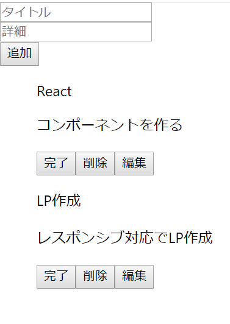

## Reactとスタイル
ここまでのUIは、ひどくこざっぱりとしていたと思います。スタイルをつけて、このアプリをおしゃれにしていきましょう。

### Reactとcss[SHA1値 : 36fc543]
Reactにcssを使ってスタイルをつける方法は、

1. .cssファイルの作成
1. インラインスタイル
1. css in js

等があります。
.cssファイルは、コンポーネントごとに分けてしまうと大量のファイルの作成が必要になりますし、インラインスタイルでは疑似要素などが利用できません。そこで、最もポピュラーなcss in jsを実装してみましょう。


#### styled-componentsの利用
css in jsを利用するには、styled-componentsをインストールする必要があります。
下記のコマンドをfirst-appディレクトリ上のターミナルで実行してください。
```
yarn add styled-components
```
<br>
styled-componentsは、以下のフォーマットで使います。

```
import styled from "styled-components"
const タグ名 = styled.htmlのタグ名`
cssの内容の記述
`
：
render() {
    return (
    ：
    <タグ名></タグ名>
    ：
    )
}
：
```

<br>
それでは、実際に使っていきます。
まずは、入力フォームのタイトルと詳細が横並びになっているのを縦並びにしてみましょう。
以下のコードをForm.jsxに書いてください。

```js:Form.jsx
import React from "react"
import styled from "styled-components"

const Container = styled.form`
input {
    display: block;
}
`

export default class Form extends React.Component {
    render() {
        return (
            <Container onSubmit={this.props.handleSubmit}>
                <input type="text" name="title" placeholder="タイトル" />
                <input type="text" name="desc" placeholder="詳細" />
                <button type="submit">追加</button>
            </Container>
        )
    }
}
```

<br>
それでは、これをヒントとして、TodoItem.jsxでリストの・をなくしてみてください。
下記のようなコードになります。

```js:TodoItem.jsx
：
import styled from "styled-components"
const Li = styled.li`
list-style: none;
`
：
return (
            <Li>
                {todo}
            </Li>
        )
：
```
このようにして、コンポーネントにスタイルをつけていくことができます。<br>



### Reactとmaterial-UI[SHA1値 : 63b6013]
Reactにスタイルをつける場合に、material-UIを使用することができます。
例えば、[material-UI公式ページ](https://material-ui.com/)を訪れて、Components => Inputs => Buttonsをみてください。
様々なスタイルのボタンのデモと共にコードが参照できます。
<br>
このように、material-UIを使用することによって、楽にスタイルをつけながらコンポーネントを作成することができます。

#### material-UIの使用
まずは、material-uiをインストールする必要があるので、以下のコマンドをfirst-appディレクトリ上のターミナルで実行してください。
```
yarn add @material-ui/core
```
それでは、
実際にmaterial-uiを利用して見ましょう。
<br>
Form.jsxを開いて、下記のコードを記述してみてください。

```js:Form.jsx
：
import Button from "@material-ui/core/Button"
：
render() {
    return (
        <Container onSubmit={this.props.handleSubmit}>
            <input type="text" name="title" placeholder="タイトル" />
            <input type="text" name="desc" placeholder="詳細" />
            <Button type="submit">追加</Button>
        </Container>
    )
}
：
```
Buttonをインポートし、Buttonタグとして使用しただけです。
少し色がわかりにくいので、
```js:Form.jsx
<Button type="submit" variant="contained">追加</Button>
```
にすると、画像のようにボタンにスタイルがついていると思います。<br>

<br>

このようにして、material-uiを使っていきます。それでは、[完成像サイト(githubPage)](https://sawaki1998.github.io/React-class/)を見ながら、material-uiを実装して、同じスタイルを適用してみてください。
<br>
ヒントは、Paper, TextField, Buttonです。
<br>
下記に、それぞれに加えたコードを記しておきます。

App.jsx↓

```js:App.jsx
：
import styled from "styled-components"
const Container = styled.div`
background-color: #F5F5F5;
`
：
render() {
		return (
	  		<Container>
				<Form handleSubmit={this.handleSubmit.bind(this)}></Form>
				<TodoList todos={this.state.todos} 
				handleClick={this.handleClick.bind(this)}
				handleClickDelete={this.handleClickDelete.bind(this)}
				handleEdit={this.handleEdit.bind(this)}
				handleEditSubmit={this.handleEditSubmit.bind(this)}
				></TodoList>
	  		</Container>
		)
  	}
：
```

Form.jsx↓

```js:Form.jsx
：
import styled from "styled-components"
import Button from "@material-ui/core/Button"
import Paper from "@material-ui/core/Paper"
import TextField from "@material-ui/core/TextField"
const Container = styled.form`
padding: 15px;
.textField {
    display: block;
}
`

export default class Form extends React.Component {
    render() {
        return (
            <Paper>
                <Container onSubmit={this.props.handleSubmit}>
                    <TextField className="textField" type="text" label="title" name="title" placeholder="タイトル" margin="normal" />
                    <TextField className="textField" type="text" label="desc" name="desc" placeholder="詳細" margin="normal" />
                    <Button type="submit" variant="contained">追加</Button>
                </Container>
            </Paper>
        )
    }
}
```

TodoItem.jsx↓

```js:TodoItem.jsx
：
import styled from "styled-components"
import Button from "@material-ui/core/Button"
import Paper from "@material-ui/core/Paper"
import TextField from "@material-ui/core/TextField"

const Li = styled.li`
list-style: none;
.paper {
    margin-top: 10px;
    padding: 15px;
}
.textField {
    display: block;
}
`
：
：
if (this.props.isEdit === true) {
            todo = 
            <form onSubmit={(e)=>{
                e.preventDefault()
                this.props.handleEditSubmit(e, id)}}>
                <TextField className="textField" type="text" label="title" name="title" placeholder={this.props.title} />
                <TextField className="textField" type="text" label="desc" name="desc" placeholder={this.props.desc} />
                <Button type="submit" variant="contained">編集完了</Button>
            </form>
        } else {
            todo = 
            <div>
                <p>{this.props.title}</p>
                <p>{this.props.desc}</p>
                <Button onClick={()=>{handleClick(id)}} variant="contained">{buttonText}</Button>
                <Button onClick={()=>{this.props.handleClickDelete(id)}} variant="contained">削除</Button>
                <Button onClick={()=>{this.props.handleEdit(id)}} variant="contained">編集</Button>
            </div>
        }
        return (
            <Li>
                <Paper className="paper">
                    {todo}
                </Paper>
            </Li>
        )
：
```
