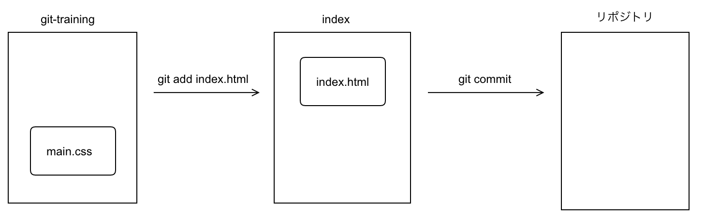
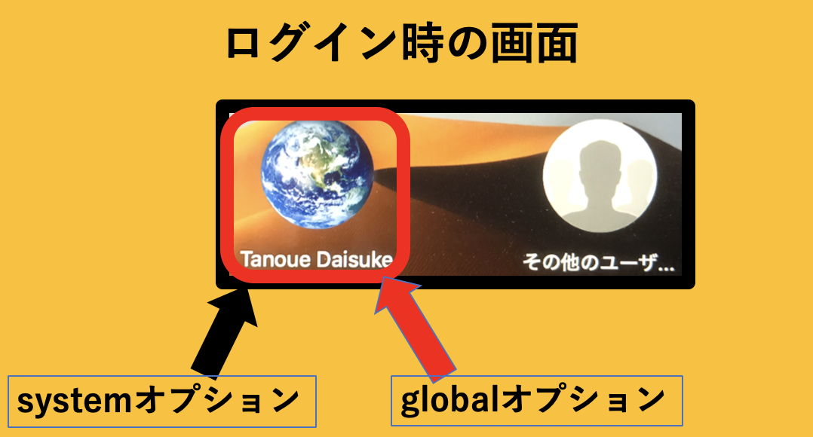

# Gitとは？
**分散型バージョン管理システム**


何ができるの？
- ファイルの変更履歴を保存する。
- ファイルを以前の状態に戻す。
- 共同開発を行う。

## gitを使用してみよう
macの方はターミナル、windowsの方はPowerShellで実行してください。

macの方は標準でgitが入っています。
Windowsの方は以下のリンクからインストールしましょう。

https://git-scm.com/download/win

※特にデフォルトの設定を変更することなくインストールして大丈夫です。


### ①初期化
gitは基本的に、プロジェクトごとに管理していきます。
まずは、gitで管理したいプロジェクトを、gitで管理するために以下の手順で初期化しましょう。
ホームディレクトリ直下に、git-trainingというディレクトリを作成し、以下のコマンドを実行しましょう。

```sh
$ cd ~/git-training
// cdコマンドを用いて、カレントディレクトリをプロジェクトディレクトリのルートまで移動します。

$ git init
//　git initコマンドを用いて初期化します。
```

上記のコマンドを用いると、以下のように出力されます。

```sh
$ git init
Initialized empty Git repository (ディレクトリパス)/.git
```

git initコマンドを用いることで、プロジェクトディレクトリ直下に、.gitという名前のディレクトリができます。
但し、このフォルダは.から始まっています。.から始まるフォルダは、隠しフォルダとなるので、そのままでは確認できません。
以下のコマンドを実行し、.gitディレクトリが生成されたことを確認しましょう。

```
$ ls -a
. .. .git 
```

### ②ステージング

次のコマンドを学習する前に、gitの基本概念を理解する必要があります。


gitを用いて変更履歴を保存するには、以下の段階を踏む必要があります。

1. ファイルを変更し、保存する。
1. ファイルの変更をstagingエリアに追加する。
1. ファイルの変更をコミット(記録)する。

変更を保存した瞬間に変更履歴が保存されるわけではありません。
必ず、**ステージング**し、**コミット**する必要があります。

ステージングとは、一体何でしょうか。ファイルを保存してそのまま変更履歴が保存されないのはともかく、すぐにコミットさせてほしいものです。

ステージングには、「変更を記録したいファイルを指定する」という役割があります。つまり、「変更を記録したくないファイルを意図的に排除する」こともできるということです。
そのようにして、コミットしたいファイルを仕分けするのが、ステージングの目的になります。

実際にステージングを行ってみましょう。
まず、git-trainingディレクトリ配下に、index.htmlとmain.cssを用意します。

```
$ touch index.html //windowsは`ni index.html`
$ touch main.css //windowsは`ni main.css`
```

index.htmlをステージングに追加しましょう。

```
$ git add index.html
```

git statusを実行すると、現在の状態を確認することができます。


```
$ git status
On branch master

No commits yet

Changes to be committed:
use "git rm --cached <file>..." to unstage)

    new file:   index.html   

Untracked files:           
(use "git add <file>..." to include in what will be committed)

    main.css

```

翻訳してみます。

```js
$ git status
On branch master
//マスターブランチにおいて

No commits yet
まだコミットされていません。

Changes to be committed:
use "git rm --cached <file>..." to unstage)
//コミットされるべき変更(コミット対象の変更内容)
//ステージングから外すにはコマンドを実行して下さい。

    new file:   index.html  
    //index.htmlが新しく作成されました。 

Untracked files:           
(use "git add <file>..." to include in what will be committed)
//追跡していないファイルは以下(コミット対象にするにはaddコマンドを使用して下さい。)

    main.css

```

このように、git addコマンドを使用することで、ステージングに追加することが可能です。

main.cssに関しては、addしていないため、コミット対象外となっています。

なお、上のようにファイルを一つずつステージングしていくことも可能ですが、プロジェクトディレクトリ直下のファイルを全てステージングするオプションもあります。

```
$ git add -A
```

### ③コミット

変更を記録したいファイルをステージングエリアに移動しました。main.cssをaddしていなければ、以下のような状態になっています。



ステージングされた変更内容をコミットすることで、変更内容を保存することができます。

実際にコミットしてみましょう。

```
$ git commit -m "index.htmlを追加"
[master (root-commit) f994ed5] index.htmlを追加
 1 file changed, 0 insertions(+), 0 deletions(-)
 create mode 100644 index.html
```

コミットするには、git commitコマンドを実行します。

コミットする際には、「メッセージ」が必要です。
-mオプションは、インライン(一行)でコメントを書く際に使用できるオプションです。
もっと具体的に書きたい際は、-mオプションなしで以下のように実行します。

```
$ git commit
(エディタが開きます。)
```

git logコマンドを使用することで、過去のコミット履歴を確認する事ができます。

```
$ git log
```


このように、ステージングし、コミットを行うことを繰り返し、変更を記録していくことがgitの基本になります。

### (捕捉)git config
先ほどコミットするときに以下のメッセージが出るかもしれません
```
*** Please tell me who you are.

Run

  git config --global user.email "you@example.com"
  git config --global user.name ""you

to set your account's default identity.
Omit --global to set the identity only in this repository.

fatal: unable to auto-detect email address (got ... )
```
このエラーはGitで**自分の情報を登録していないことが原因です。**


主に初めてGitを使う際に起こるエラーです。

エラー文の警告に従い、ユーザー名とE-mailアドレスを設定しましょう。
```
$ git config --global user.name "名前"
$ git config --global user.email メールアドレス
```
ここで`git config`は簡単に言うとGitの設定ができるコマンドです。

`--global`とはオプションの１つです。これによって対象範囲が異なります。以下にまとめます。
|オプション名|対象範囲|
|:----------|:--------:|
|local|該当リポジトリ(初期値)|
|global|OSにログインしているユーザー|
|system|使用してるOS全体|




