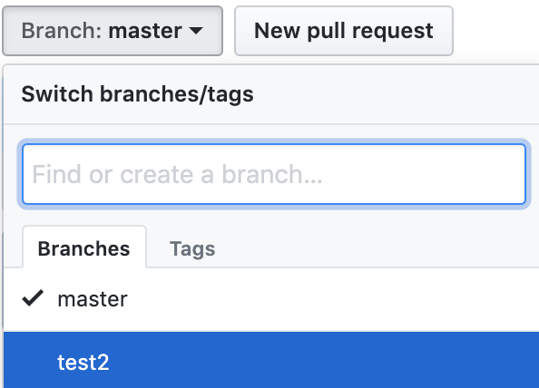
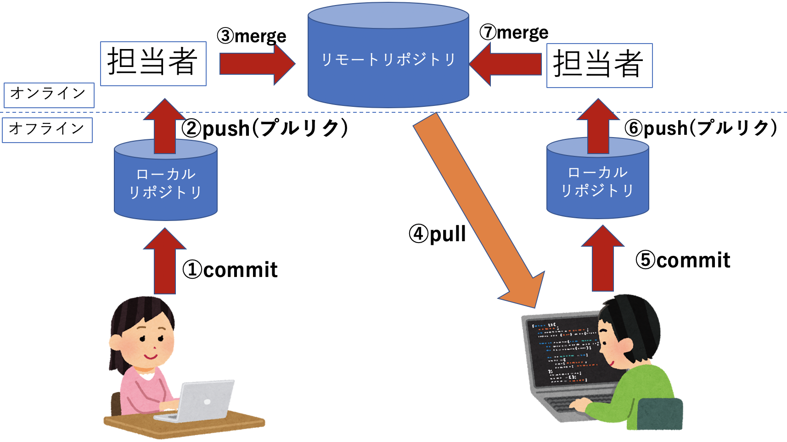

<!-- git, git_hubが終わったら -->
# Gitのブランチ運用からプルリクエストまで
## ブランチとは？
作業履歴(コミット)を枝分かれさせて記録していくためのもの。
特徴として、**分岐したブランチは他のブランチの影響を受けない。**

Gitの管理下にあるときは何かしらのブランチで作業が行われます。

初期値として`master`という名のブランチが入っています。(`git init`したときに作成)

基本的にmasterブランチを軸に作業を進めていきます。
<br>
## ブランチの確認
次のコマンドで自分のブランチ一覧を取得できます。
```
$ git branch
``` 
現在作業中のブランチは「*」がついています。
<br>
## ブランチの切り替え

新しいブランチを作ってブランチ運用の準備をしてみましょう。
```
$ git branch test
```
これで`test`という名前のブランチができました。

再び`$ git branch`コマンドでブランチ一覧を確認してみましょう。

`test`というブランチは作成されていますが、まだ「*」は変わっていません。

`test`ブランチに切り替える場合は以下のコマンドを実行します。
```
$ git checkout test
```
このコマンドは作成済みのブランチ(今回は`test`)に切り替えるものです。

`$ git branch`コマンドでブランチ一覧を確認してみましょう。

`test`というブランチに「*」がついているはずです。
<br>

**※ちなみにブランチを作成して切り替えるコマンドは以下の１行でできます。**
```
$ git checkout -b test
```

<div style="page-break-before:always"></div>

## ローカルリポジトリ上でのブランチの運用
`test`ブランチ上で`index.html`に何かしらの変更を加えて**ローカルリポジトリ**にコミットしましょう。

(例)`h1`タグに文字列を追加して、背景色を黄色に変更。

変更した`index.html`をブラウザ上で開いて変更点を確認してみましょう。

**ここまでの変更は`test`ブランチ上での変更です。**
<br><br>

最初に以下のように説明しました。
>特徴として**分岐したブランチは他のブランチの影響を受けない。**

つまり`test`ブランチの変更を`master`ブランチでは影響を受けないということになります。

`master`ブランチに切り替えて変更されていないことを確認してみましょう。
```
$ git checkout master
```
先ほど開いたブラウザを更新してみましょう。変更点が戻っていることが確認できます。
<br><br>

## ブランチの変更点の反映
最初にこんな説明もしました。
>基本的にmasterブランチを軸に作業を進めていきます。

そこで`test`ブランチの変更点を`master`ブランチに反映させます。

`master`ブランチ上で以下のコマンドを実行しましょう。
```
$ git merge test
```
これで`test`ブランチに置ける変更点が`master`に反映(マージ)されます。

先ほどの`index.html`をブラウザで開いて変更点が反映されているか確認してみましょう。

<div style="page-break-before:always"></div>

## 実際のチーム開発におけるブランチ運用
これまでの変更点は**ローカルリポジトリ上のもの**にすぎませんでした。

ローカルリポジトリでは自分のPC上でしか変更が反映されないのでこれではチーム開発ができません。

ここでは**リモートリポジトリ**で実際にチーム開発現場での運用を体験してみましょう。


まずは先ほどの変更点をリモートリポジトリの`master`にプッシュしましょう。
```
$ git push origin master
```
GitHub上で変更点が反映されているか確認してみましょう。

**リモートリポジトリでのブランチ運用とはいっても、途中まではローカルリポジトリと同じです。**


先ほどのように新規ブランチ作成(`test2`)からそのブランチ上でローカルリポジトリにコミットしてみましょう。
<!-- $ git checkout -b test2
変更
add & commit -->

コミットまでできたらコミット履歴を確認しましょう。
```
$ git log
```
先ほどのコミットが記載されていればOKです。

<br>

## ローカルブランチとリモートブランチ
次に以下のコマンドを実行してください。
```
$ git push origin test2
```
ここで以前は`origin master`としていましたが、今回は`origin test2`としています。

### そもそも`git push origin master`とは何でしょうか？
これは**現在のローカルブランチのコミットをオンライン上のリモートブランチである`master`(origin/master)に反映させる**というコマンドです。

`origin`はリモートを意味するものぐらいの理解で大丈夫です。

ローカルとリモートの`master`ブランチは別物です。

ここで**ローカルブランチ**と**リモートブランチ**という２つのブランチが出てきました。
### ①ローカルブランチ
あなたのPC上にあるブランチです。ローカルリポジトリと結ばれてます。
プッシュしない限り他人からは見えません。

`$ git branch`コマンドで一覧取得できるものがこれにあたります。


### ②リモートブランチ
オンライン上(GitHub)にあるブランチ。リモートリポジトリと結ばれてます。
チーム内での共有も可能。
`$ git branch -r`コマンドで確認できます。


<br>
ここで先ほどのコマンドに戻ってみましょう。

```
$ git push origin test2
```

先ほどの知識を用いると、現在ローカルブランチが`test2`なので**ローカルブランチである`test2`のコミットをリモートブランチである`test2`に反映する**というコマンドであると説明できます。


GitHub上でリモートブランチが作成されたか確認しましよう。



作成されたブランチがあればオーケーです！
<br>

## リモートブランチ`master`に`test2`を反映する
これまではローカルの`master`ブランチでコミットしそのままリモートに反映していましたが、これは本来すべき行為ではありません。

なぜかと言うとこれまでのやり方では**誰かのチェックを受けることなく変更点が反映されてしまうからです。**

仮に間違った内容に気づかずプッシュしてしまうと、それが原因でファイルが動かなくなったりバグが発生する可能性があります。チーム開発をしているときはプロジェクトリーダーなどに一度自分のコードを見てもらい、反映するかの判断をしてもらうのが普通です。

### プルリクエスト(Pull Request)
ではどのような機能を使えば他人にコードのチェックをしてもらえるのでしょうか。それを可能にするのが**プルリクエスト**です。


作成方法は簡単です。

①Pull requests > New pull requestを選択。

②base:master, compare:test2を選択して`Create pull request`をクリック。
(`test2`ブランチから`master`ブランチにプルリクエスト)

③どんな変更したかコメントして`Create pull request`をクリック。


### プルリクエストのマージ
先ほどの作成後の画面で`Merge pull request`という緑色のボタンがあればクリックすることでリモートの`master`ブランチに反映できます。

※ちなみにボタンが押せない状態もあります。ここでは詳しくやりませんが今回の場合だとマージ先のブランチである`master`と変更した`test2`の変更点が被っている場合です。その場合GitHubが`master`と`test2`のどちらを優先すればいいのか判断できないため、`test2`の変更点を反映できないというわけです。


これをコンフリクトといいます。

これはチーム開発する際にまた詳しく取り上げます。

<div style="page-break-before:always"></div>

## ローカルリポジトリに反映
先ほどのプルリクエストをマージしたことでリモートリポジトリが更新されました。GitHub上でリモートブランチを`master`にして変更内容が反映されているか見てみましょう。

しかしここで問題点があります。

ローカルリポジトリに戻って以下のコマンドを実行してください。
```
$ git checkout master
```
**ローカルブランチ**の`master`にブランチを切り替えました。

それでは変更したファイルをブラウザなどで開いて変更内容を確認してみましょう。

変更点は反映されていないはずです。なぜ変更されていないかというと今のブランチが**ローカルブランチ**である`master`だからです。

ここで注意点として**リモートブランチの`master`を変更してもローカルリポジトリには反映されない**ということです。

それではどのようにリモートリポジトリの変更点をローカルリポジトリに反映すればいいのでしょうか。

以下のコマンドを実行してみてください。
```
$ git pull origin master
```
似たようなコマンドを今までに何回か実行しましたがよく見ると`push`ではなく、`pull`です。

このコマンドの意味を簡単に説明すると**リモートリポジトリの`master`をローカルリポジトリの`master`に反映する**ものです。

このコマンドを使うことで他人の変更点を自分のPC上に取り込み、それを踏まえた変更ができるようになります。

だんだんチーム開発のイメージがわいてきましたか？



