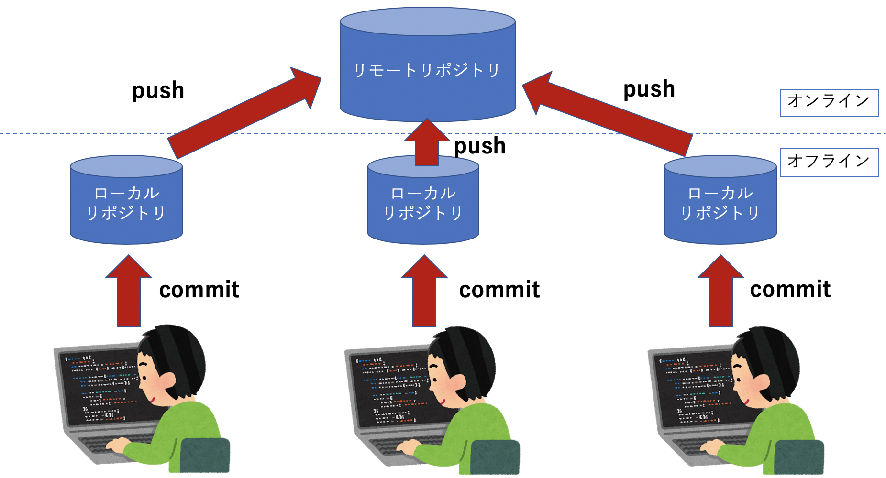

# GitHubとは？
GitHubとはソースコードを**オンライン上で管理する**サービス。

何ができるの？
- 自分のソースコードをオンライン上で公開できる。
- 他人のコードを見れる。
- 効率よくチーム開発が行える。

# ２つのリポジトリ
そもそもリポジトリとは...
**ファイルやディレクトリの状態を記録する場所**

### ①ローカルリポジトリ
自分のパソコン内のリポジトリ。
Gitのみでも作成可能。

<ファイルの変更>

↓
```
$ git add 変更したファイル名
```
↓
```
$ git commit -m "コミットメッセージ"
```
↓

**ローカルリポジトリに保存**

### ②リモートリポジトリ
オンライン上にある複数人で共有できるリポジトリ。
**GitHub**を使うことで作成可能。

<ローカルリポジトリ>

↓
```
$ git push origin master
```
↓

**リモートリポジトリに保存**




# 実際にGitHubを使ってみましょう！
簡単な手順を示します。

①GitHubのトップページにアクセスしてアカウントを作成しましょう。

②プランは無料で使えるFreeプランがあるのでそちらを選びましょう。

③`first_repository`という名のリポジトリを作成しましょう。

### ここで新たにフォルダやファイルを作る場合と既存のリポジトリを使うかで手順が変わります。
（１）新たにフォルダやファイルを作る場合

`README.md`というファイルに変更を加えてリモートリポジトリに反映しています。
```
echo "# f_repo" >> README.md
git init
git add README.md
git commit -m "first commit"
git remote add origin https://github.com/TanoueDaisuke/f_repo.git
git push -u origin master
```

（２）既存のローカルリポジトリを用いる場合

既存のローカルリポジトリをリモートリポジトリに追加, 反映しています。
```
$ git remote add origin https://github.com/ユーザー名/first_repository.git
$ git push -u origin master
```


今回は（２）でやってみましょう。
先ほど作った`git-training`リポジトリを使ってみましょう。
以下のコマンドを入力して`git-training`フォルダに移動してください。
```
$ cd ~/git-training
```
次に（２）のコードを入力してください。(**ユーザー名は自分のものを使ってください**)

これでローカルリポジトリがリモートリポジトリにデータ反映することができました！

## 変更からプッシュまでやってみましょう
<ファイルの変更>

↓
```
// 変更内容をファイルの変更をstagingエリアに追加する。
$ git add 変更したファイル名
```
↓
```
// ローカルリポジトリに保存
$ git commit -m "コミットメッセージ"
```
↓
```
// リモートリポジトリに反映
$ git push origin master
```


## README.mdとは？
先ほど少しだけ登場した`README.md`はリポジトリの一般的な情報を記載したファイルです。
チーム開発でのコーディング規約やそのリポジトリの説明など記載できます。


