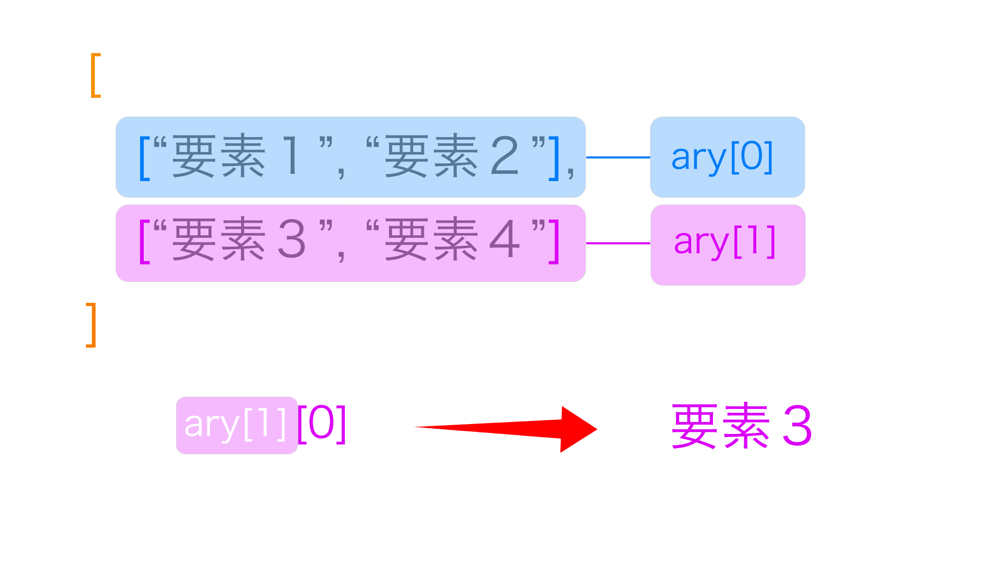

# 配列
複数の値を格納したもの。**順序がある**という点がミソ。

## 配列の書き方
配列はArrayコンストラクタのインスタンスであるので書き方は二通りあり……という話はどうでもいいのでとりあえず下記を覚えよう。非常に単純。
```js
// 変数を用意してその中に入れる
let myAry = [1, 6, 89, 21, 2, 0]
```

もちろん数値以外のものも入れられる。

```js
// 文字も入るし
let myAry2 = ["りんご", "ゴリラ"]

// 変数も入る
let apple = "りんご"
let myAry3 = [apple]

// 他にも色々入れられる
```
## 配列の用語を覚える

各部位それぞれ名前がある。意思疎通に齟齬が生じないよう正確に覚えよう。
- 配列：そのまま。後に出てくるオブジェクトや連想配列とは別物なので注意
- 要素：配列の中に格納されている値
- インデックス：要素１つずつに振られている番号


## consoleに表示してみよう
こんだけ。レッツトライ。
```js
console.log(myAry)
```
表示結果

ここで注意して欲しいのは下記のように６つの数字をそれぞれ表示したのではないということ。


表示されたものは飽くまで**myAryという配列１つだけ**である。

## 配列の要素にアクセスする
言葉は格好いいけどつまり要素を１つずつ取り出したいだけ。

```js
// 配列名［インデックス］

// 例
ary[0]
```
- **インデックスは0から始まる点に注意！**

配列の最初の要素、つまりインデックスが0の要素を取り出すなら以下のようになる。

```js
myAry[0]
```
コンソールでみてみるとこんな感じ。


### 二次元配列とアクセス
配列の中に配列が入っているものを**二次元配列**という。

```js
let ary = [
    ["0-0", "0-1"],
    ["1-0", "1-1"]
]
```
取り出す際は以下のような感じ。例えば1-0にアクセスする場合。割と単純。
```js
ary[1][0]
```


### 【プチ演習】配列の要素を変更する
下記の配列```sample```の、２つめ(インデックス1)の要素『りす』を『Linux』変更してみよう。

```js
let sample = ["しりとり", "りす", "Suica"]
```
・<br>・<br>・<br>・<br>・<br>
### 【解答】
ただ再代入して終わり
```js
sample[1] = "Linux"
```

## 配列の要素の個数を調べる：lengthプロパティ
配列の要素の個数を調べたいことが割とある。そういう時はlengthプロパティを使う。
> length**メソッド**ではないので注意。

```js
let ary = [2, 3, 4, 5, 1, 3]
ary.length
```

### lengthプロパティを使って要素を削除
lengthプロパティにインデックスを再代入すると、それ以降の要素がなくなる。0を代入すると配列は空になる。
```js
let ary = [2, 3, 4, 5, 1, 3]
ary.length = 0
console.log(ary)// []
```

### 【演習】for文を使って配列の要素を列挙する
下記の配列の要素を１つずつコンソールに出力する方法を考えてみよう。
```js
let nums = [8, 2, 0, 1, 35, 2, 1, 23, 11, 33]
```
> for文を知らない人は基礎的な構文だけでいいのでさらってこよう

今回は配列の要素の個数が丁度10個なので、これでとりあえず実現可能。

```js
for(let i = 0; i < 10; i++) {
    console.log(nums[i])
}
```
しかしこれでは配列の要素数が1000個以上あったり、もしくは**そもそも個数が状況によって変わってしまうような時**に対応できない。どうすれば良いだろうか？
<br>・
<br>・
<br>・
<br>・
<br>・

### 【解答】
lengthプロパティを使うのが定石。
```js
for(let i = 0; i < nums.length; i++) {
    console.log(nums[i])
}
```
不等号をイコール付き(<=)にしてしまうのも不可。lengthは配列のインデックスではなく**配列の個数**を返してくれる。つまり一番大きいインデックス＋１の値が帰って来てしまう。


> 結構簡単なことかと思うが、今やったように配列の個数をlengthを使って表現して汎用性を高めたような、この考え方が結構大事。定数ではなく変数(この定数と変数は数学的な文脈)として表現することで式を抽象化し、状況に対する依存性を下げている。「そんなこと言われなくても分かるわ」と思いがちだけど、案外少しでも形が変わると割と応用出来ない人を見かけるので甘くみずにしっかり五臓六腑に刻み込もう。


以上