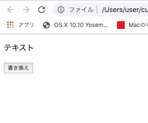
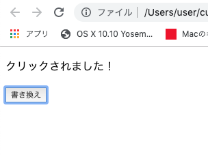
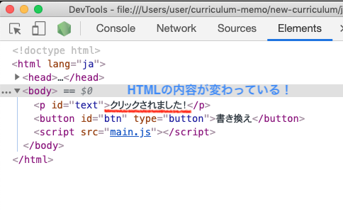
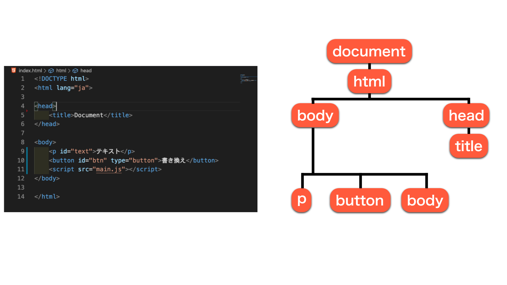
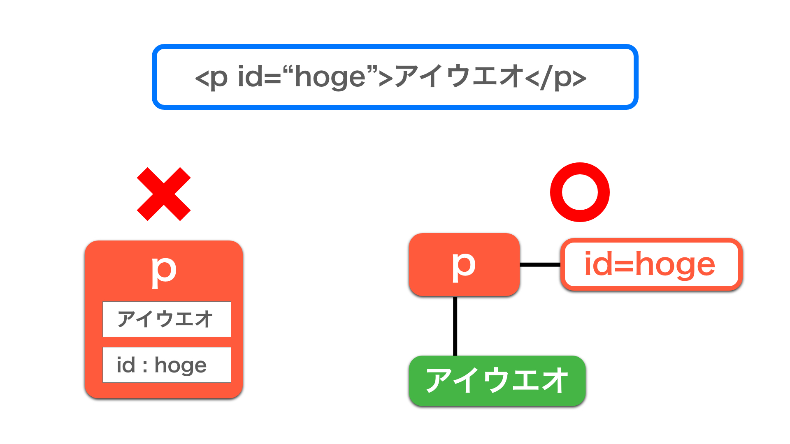
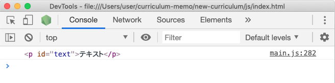
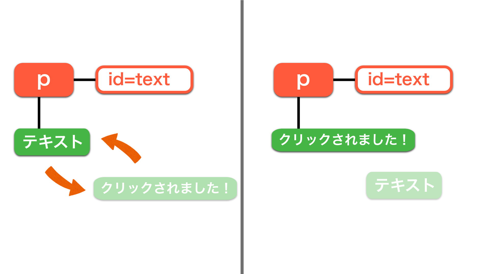
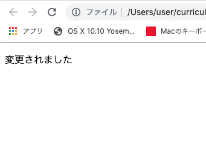

# DOM基礎
DOM(ドム)について取り扱っていく。今までみてきたように、javascirpt自体にはhtmlファイルに直接干渉するような機能はなかったが、このDOMというものによっていよいよそれが可能になる。

## 学習の時は
いよいよ実践的になってくるに伴って一気に使える道具(メソッドとか)が爆増する。しかし、DOMに限らないが逐一覚えたりする必要はない。というか覚えるのは現実的じゃない(数が多すぎ)。ので、肝の理解だけ済んだら後は都度調べて済ますようにする癖をつけよう。


### プログラマーのように考える
以前も紹介したがMDNのこちらの『プログラマーのように考える』は一度目を通しておこう。『言語仕様とかの知識量』と『ロジックの引き出しと発想力』の分別をつけておくこと。https://developer.mozilla.org/ja/docs/Learn/JavaScript/First_steps/A_first_splash

### 一番正確なのはMDN
言語仕様などの領域ならMDNがおすすめ。他のサイトやブログなどを見るにしても一度は必ず訪れるようにしよう。
> 特に調べたいメソッドなどが明確な時はおすすめ。逆にやりたいことを実現するのに何かいいメソッドないかなぁ、のような抽象的な段階では少し見辛いかもしれない。

### ロジックの部分はqiitaやgithub
ロジックの部分は非常に抽象的。知っているメソッドとかしか使ってないのにそれが実現できるのか！みたいな発見はMDNのようなソースは向かない(畑違い)。その際はqiitaなどのブログ系は良記事が沢山ある。電車の中でも読めておすすめ。<br>
ある程度コードが読めるようになってきたらgithubなども覗いてみよう。作りたいもの・機能の名前でリポジトリを検索しよう。外国人のコードでも尻込みしちゃいけない(勿体無い)。コードに日本語も英語もないので大丈夫。


## 導入(ここから本題)
DOMは『Document Object Model』の略である。DOMはブラウザが提供するAPIで、DOMを用いることで初めてjsを用いてwebページ(html)を操作することができる。

> 【APIって？】<br>
プログラミング言語における拡張機能のようなもの

### 特に準備は必要ない
DOMを使うと言っても特に何かをインストールしたりと言った環境構築は一切必要ない。エディタとブラウザのみあればすぐに使うことができる。

### まず触ってみよう
ということでなんでもいいので実際に触ってみよう。今までコンソールに出力することしかしてこなかったが、テキストを書き換えてみよう。<br>
今回は「ボタンを押したらテキストが書き換わる」というのを目指す。
```html
<!-- HTML -->
<body>
    <p id="text">テキスト</p>
    <button id="btn" type="button">書き換え</button>

    <script src="main.js"></script>
</body>
```
```js
// js
const text = document.getElementById('text')
const btn = document.getElementById('btn')

const changeText = () => {
    text.textContent = 'クリックされました！'
}
btn.addEventListener('click', changeText)
```
> 大文字小文字、それぞれの括弧の位置や数などのタイピングミスに気をつけよう

このように表示されていると思うので、ボタンを押してみよう。



すると、こんな感じにテキストが書き換わるのが確認できたと思う。



続いて検証ツールを確認してみよう。ここで確認して欲しいのは、jsがやったのは**HTMLの書き換えである**ということ。



> consoleではなくてElementsタブなので注意。

このような感じでHTMLファイルに色々な処理を施し、webページの装飾等を行っていく。

## DOMの基本概念
では一旦手を止めて基本的な概念をみていこう。特に深く理解する必要はないので肩の力を抜いて欲しい。

### HTMLを『オブジェクトのツリー状の集合』と解釈
DOMはHTMLドキュメントをオブジェクトがツリー状に集合したものと解釈している。それぞれに親子・兄弟関係などがあり、それぞれのオブジェクトのことを**ノード**という単位で呼んでいる。

> HTMLではノードのことを要素と呼んでいましたね。



### テキストや属性も１つの独立したノードなので注意
例えば下記のHTML要素の場合、
```html
<p id="hoge">アイウエオ</p>
```
『アイウエオというテキストとhogeというidのついた１つのp要素』と解釈していたが、DOM的には『要素ノード:p,テキストノード:アイウエオ,
属性ノード:id=hoge』と言った具合にそれぞれ独立したノードとして解釈している。


> あんまりよく分かんないと思うのでふーんと思っていただければいい。

## DOMで出来ること
DOMで出来ることは基本的に下記の5つのことのみである。
- ノードの取得(選択)
- ノードの変更
- ノードの作成
- ノードの削除
- イベントの定義
これに加えて今まで習ってきた関数や制御構文やらを組み合わせて色々と実装していく。

<br>
それぞれ実際に触れてみよう。

### ノードの取得
ノードに対してなんらかの操作をしていくわけだが、その操作対象を選んでやる必要がある。それがノードの取得である。なんらかの条件を指定→条件に合致する要素が取ってこられる、という流れになっている。まずは一般的なidでの取得をやってみよう。

```js
// 構文
// document.getElementById('ここにid名')
```
```html
<!-- html -->
<p id="text">テキスト</p>
```
```js
// js
console.log(document.getElementById('text'))
```


こうなっていれば正解。
> うまく行かない人エラー文を元に大文字小文字、括弧の数などを確かめよう。後はHTMLでのscriptタグに記述ミスがないかなども確かめよう。

これでp要素が取ってこれた。要素を取ってきた時、長くて面倒だし見にくいのでほぼ100%変数に格納する。

```js
const text = document.getElementById('text')
```
idで取ってきた時などは、変数名をid名と同じにしてやると分かりやすい。

### ノードの変更
ノードの変更をやってみよう。例えばボタンクリックでテキストが変わるサンプルに関しても、『テキストが変わる』の部分がこのノードの変更に該当する。pタグの**テキストノードを変更する**ということである。ノードツリーを思い出すと分かりやすい。



> ノードの変更方法は多岐に渡るが、ほとんどが結局は**オブジェクトのプロパティの書き換えやメソッドの利用に過ぎない**。そのメソッド、プロパティを知っているか知らないかみたいな側面が大きい。(別途解説)

ではテキストを書き換えてみよう。要素のテキストの書き換えの１つの方法として```textConent```がある。
```js
// textContentの使い方
// 要素.textContent = "入れ替えたい要素"
```
先ほど取ってきて変数```text```に格納したp要素のテキストを変更してみよう。
```js
const text = document.getElementById('text')
text.textContent = "変更されました"
```
ページをリロードしてみよう。HTMLには、
```html
<!-- HTML -->
<p id="text">テキスト</p>
```
と書いたはずなのに、下記のように表示されているはずである。


> ページがリロードされた時点でjsファイルが実行されるので読み込みと同時に書き換わっている＝textContentが実行されている

テキストを書き換える以外にも
- クラスをつけたり外したりする
- styleを記述する
- href属性の値を変える(リンク先を変える)

など色々ある。が、今回は割愛する。

### イベントの定義
イベントの定義がある。要は処理を実行するタイミングの定義である。先ほどの```textContent```はjsファイルが読み込まれた瞬間に実行されてしまったが、イベントの定義をすることでいよいよ実用性が見えてくる。今回は先のサンプル同様『クリックしたら』を使用してみる。

> ノードの作成と削除は一旦飛ばします

```js
// 構文
// 要素.addEventListener('イベント', 関数)
// →「要素」に「イベント」したら「関数」を実行
```
```html
<!-- HTML -->
<p id="text">テキスト</p>
<button id="btn" type="button">書き換え</button>
<script src="main.js"></script>
```
```js
// button要素をidを用いて取得
const btn = document.getElementById('btn')

btn.addEventListener('click', )
```
ここまでで「```btn```をクリックしたら……」まで書けたことになる。
後は何をするかを**関数の形で**書いてやればいいだけなので、下記のようになる。

```js
const btn = document.getElementById('btn')

const changeText = ()=> {
    text.textContent = "クリックされました！"
}

btn.addEventListener('click', changeText)
```
```addEventListener```の第二引数に直接関数を入れてしまっても大丈夫。その場合は下記のような書き方になる。

```js
const btn = document.getElementById('btn')

btn.addEventListener('click', function(){
    text.textContent = "クリックされました！"
})
```

### ノードの作成
ではボタンが押されるたびに下記のような要素が追加されていく機能を追加してみよう。
```html
<!-- これが追加されていく -->
<p>追加されました</p>
```
要素を作成し、htmlに表示させるときは、ざっくりと
- 要素の作成
- 作成した要素に対して属性やテキストなどを設定
- HTML上のどの場所に追加するのかを記述する

といった工程を踏む。<br>
では要素を作成してみよう。要素を作るのは```document.createElement('タグ名')```とすることで可能になる。

```js
// 要素の作成(pタグの作成)
const p = document.createElement('p')
```
これでpタグが作成された。これも長いので変数に入れておく。<br>
現段階ではただの空のpタグになっている。これにテキストを追加しよう。同様にtextContentで出来る。
```js
p.textContent = "追加されました！"
```
これで現在は```p```という変数に、下記
```html
<p>追加されました！</p>
```
が入っていることになる。この状態ではまだHTMLにこのpタグは存在しないので、HTMLに埋め込む命令を書いてやる。それには```appendChild```メソッドを使う。
```js
// HTMLに要素を追加
// 要素１.appendChild(要素)

// 「要素１」の最後の子要素として「要素」を追加するという意味
```
今回はbodyの子要素として書いてみよう。
```js
document.body.appendChild(p)
```
> bodyを指定する場合はbody.appendChild(p)ではなく、document.body~とする必要がある。

これで要素の作成からHTMLへの反映まで出来た。後はこれを「いつ」実行するかという話である。今回は「ボタンがクリックされたら」を目指すので、changeText関数内に書いてやればテキストの変更と共に実行される。最終的なコードは下記の通りになる。
```html
<!-- HTML -->
<body>
    <p id="text">テキスト</p>
    <div id="wrap"></div>
    <button id="btn" type="button">書き換え</button>
    <script src="main.js"></script>
</body>
```

```js
const text = document.getElementById('text')
const btn = document.getElementById('btn')

const changeText = () => {
    text.textContent = 'クリックされました！'
    const p = document.createElement('p')
    p.textContent = '追加されました！'
    document.body.appendChild(p)
}
btn.addEventListener('click', changeText)
```

以上がDOMの基本的なチュートリアルである。削除は特に今回は扱わないので、試してみたい人は調べながら以下を実装してみよう。
- 削除用にもう１つボタンを作る
- 削除ボタンを押したらbodyの子要素を最後の方から消していく

出来ちゃったら下記も実装してみよう。ロジックによりけりだが、恐らく削除ボタンを連打していくと削除ボタン自体やscriptタグまでもが消えるようになってしまっているのではないかと思う。それの対策である。

- bodyの最後の子要素がpタグじゃなかったら、削除処理を実行しない

下記にサンプルを用意しておく。できれば自分で最大限に悩んでからor完成してから見ることを推奨する。
・<br>
・<br>
・<br>
・<br>
・<br>
・<br>
・<br>
・<br>
・<br>
・<br>
・<br>
・<br>
・<br>
・<br>
・<br>
・<br>
・<br>
・<br>
・<br>
・<br>
・<br>
・<br>
### サンプル
```html
<p id="text">テキスト</p>
<div id="wrap"></div>
<button id="btn" type="button">書き換え</button>
<button id="delete" type="button">削除</button>
<script src="main.js"></script>
```
```js
const text = document.getElementById('text')
const addBtn = document.getElementById('addBtn')//追加ボタン
const deleteBtn = document.getElementById('deleteBtn')//削除ボタン
let lastElementInBody//bodyの最後の要素

// pタグの作成からテキスト挿入、HTMLへの反映まで
const changeText = () => {
    text.textContent = 'クリックされました！'
    const p = document.createElement('p')
    p.textContent = '追加されました！'
    document.body.appendChild(p)
}

// bodyの最後の子要素を削除
const deleteElement = () => {
    //この関数が実行されたタイミングでlastElementInBodyを更新
    lastElementInBody = document.body.lastElementChild

    if (lastElementInBody.tagName !== "P") {
    // pタグじゃなければ削除しない
        alert('うわああああああ！！！！')
        return;
    } else {
    //pタグだったら削除する
        lastElementInBody.remove()
    }
}

addBtn.addEventListener('click', changeText)
deleteBtn.addEventListener('click', deleteElement)
```
