# 繰り返し処理
同じ処理を複数回繰り返したい時に使う構文。一番基礎的なものとしてはwhile文とfor文があるが、基本for文中心で考えれば良い。

## for文基礎
for文という構文の構造は下記のようになっている。初期化・条件・増減の区切りはセミコロン。
```js
// for(初期化処理; 条件; 増減式){
//     処理
// }
```
まず繰り返し処理を日本語で説明する。これをプログラミング言語で言っているだけである。
- Xが〇〇の間、Aを繰り返す
これだけ。具体例として『```console.log('こんにちは')```10回繰り返す』という処理を考える。上の式と照らし合わせて見て欲しい。
```js
for(let i = 0; i < 10; i++) {
    console.log('こんにちは')
}
```

これは下記のような順番で処理されていると考える。
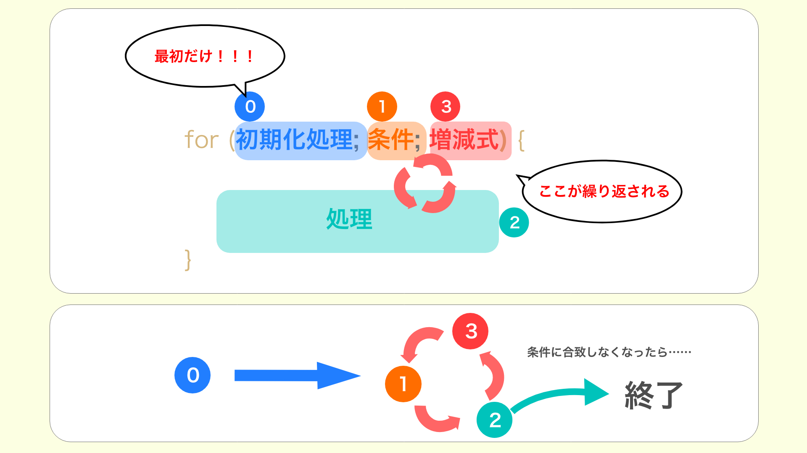

つまり、
1. ```i```を定義し０を代入
1. iが10以下(i \< 10)であるか判定
1. 条件クリアでconsole.log('こんにちは')
1. ```i```に１を足す
1. ２へ→合致しなければ終了
となっている
>【```i++```】<br>
これは```i```に１を足して再代入、つまり```i = i + 1```と全く同じ。忘れていた人はしっかり覚えよう。

> 【```i < 10```】<br>
これは１０を含まず、且つ```i```が０から始まっているので```i```は０〜９で１０回繰り返されることになる。

## 無限ループダメ絶対
繰り返し処理を書くときは無限ループに気をつけよう。先に言っておくが**下記のコードは実行しないこと**。では見てみよう。
```js
for(let i = 0; i < 10; i--){
    // なんか処理
}
```
繰り返す度に```i```が1引かれていく。つまりこれは**iが条件から脱することがないので永遠に繰り返してしまう**。このようなものを無限ループという。最悪PCがクラッシュしたりするので、後述のwhile文でも同様に気をつけよう。

## constは使えない
for文で良く使う```i```に相当する変数を定義する時、```const```は使えない。
```js
// const i = 0　になっている
for (const i = 0; i < 10; i++) {
    console.log(i)
}
```

```const```は再代入不可の変数の定義なので、当然この部分
```js
i++
// これは  i = i + 1 と同義
```
で引っかかってしまう。


for文以外でも見る事のあるエラーが出てくるので、一度実行して見ておこう。
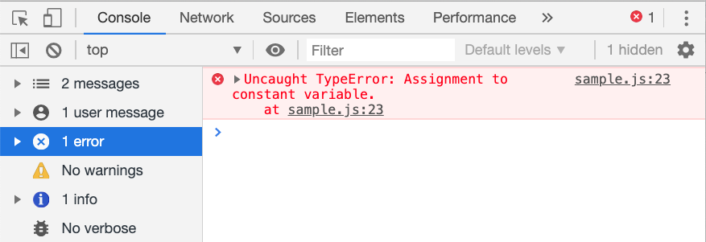
『constに再代入は出来ないよ』って教えてくれてます。

### 【ちょっと演習】
ひとまずまとめ。簡単そうだけど案外言葉にされると迷ったりするので練習してみよう。
- for文を使ってconsoleに九九の2の段を表示してみよう(下記参照)
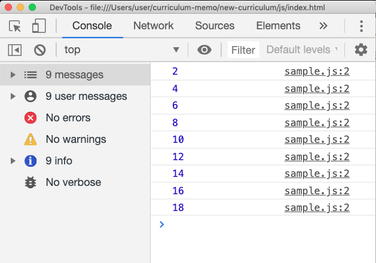
<br>・
<br>・
<br>・
<br>・
<br>・
<br>・
<br>・
<br>・
<br>・
<br>・
<br>・

### 【解答】
```js
// i < 10でも大丈夫です
for (let i = 1; i <= 9; i++) {
    console.log(i * 2)
}
```
下記などでも可能だが、ひとまず上記を模範解答とする。
```js
// 分かりにくいし『拡張性がない』
for(let i = 2; i <= 18; i = i + 2){
    console.log(i)
}
```
> 【拡張性がない？？？】<br>
例えば上記２つのコードで、13の段を表示するように書き換えることを考えてみて欲しい。どちらの方が容易か、容易でない方はなぜ複雑なのかは一目瞭然だと思う。(言語化して説明するのが難しかったとしても)

## 配列にfor文を使う

for文は結局やっていることは**数値を順番に入れていくだけである**。その為、インデックスで要素を参照できる配列と相性が良く、合わせて使うケースは一般的である。

### 配列の要素を順番に取り出す
配列の章で同様のことをしているので詳細は割愛する。配列とfor文の組み合わせはよく出てくる。
```js
// aryの要素を列挙するだけ。
let ary = ["りんご", "ゴリラ", "ラッパ", "パンツ"]

for(let i = 0; i < ary.length; i++){
    console.log(ary[i])
}
// iが0から(インデックスが0からだから)
// ary.lengthを用いている
// 以上がミソ
```

## ネスト(入れ子)for文
これまではそんなに難しくなかったとは思うが、初学段階だと以下が厄介。頭ごちゃごちゃになる。for文の中にfor文が入っているパターン。と言っても紐解いてしまえば非常に単純。<br>
例題として九九を1の段から9の段までコンソールに列挙するコードを取り上げる。
```js
for (let i = 1; i <= 9; i++) {
    for (let j = 1; j <= 9; j++) {
        console.log(`${i} * ${j} = ${i * j}`)
    }
}
// console.logの中はテンプレートリテラルというものを使っている(ES6)
// ${}で囲まれたものが変数として展開される記法。
// 下記を面倒臭がって書いただけである。
console.log(i + "*" + j "=" i * j )
```
表示結果
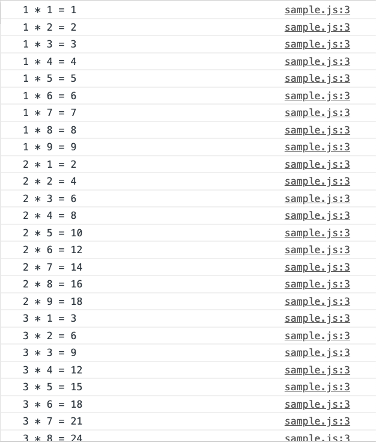
順番に処理を見ていこう。

### ネストfor文の流れ
まず便宜的に親forと子forで分けて考えよう。
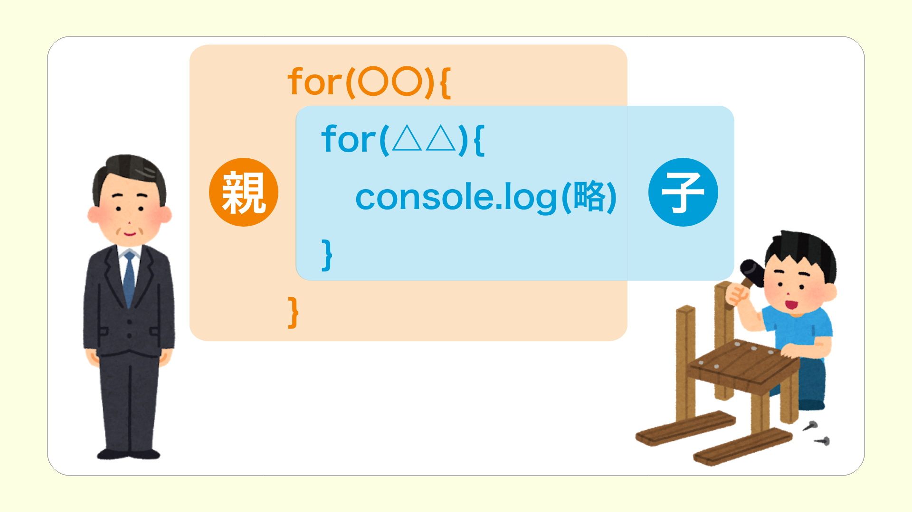

親は自分に与えられた処理を指定回数繰り返すだけ。いつもと変わらない。ここまでがいつものfor文。
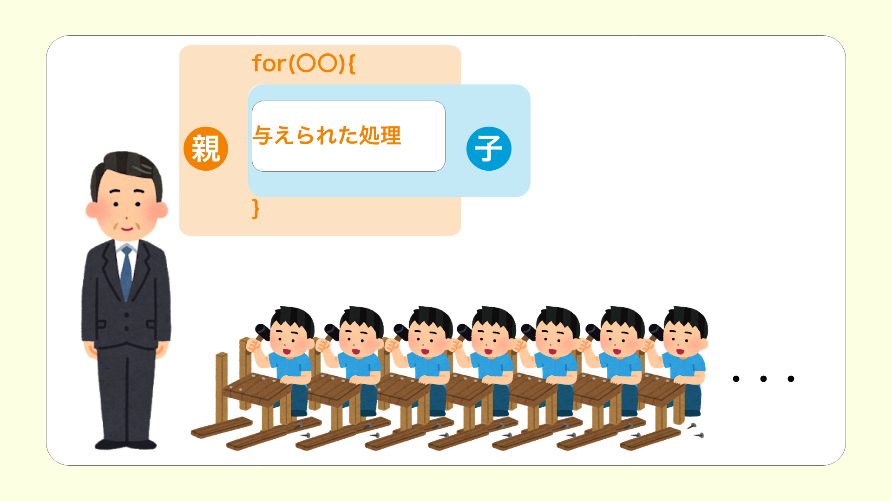

今回は『与えられた処理』自体が繰り返しになっている。
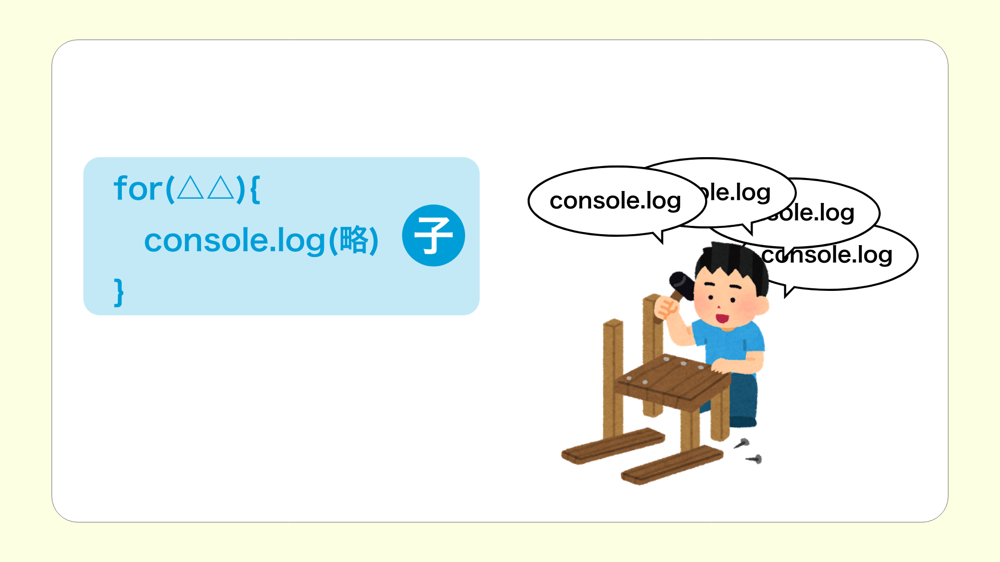

で、多分これが一番重要。for文に於いて2回目の処理が始まるのは１回目の処理が終わったら。つまり、**子の処理が全て完了したら親は次の処理を開始する**。
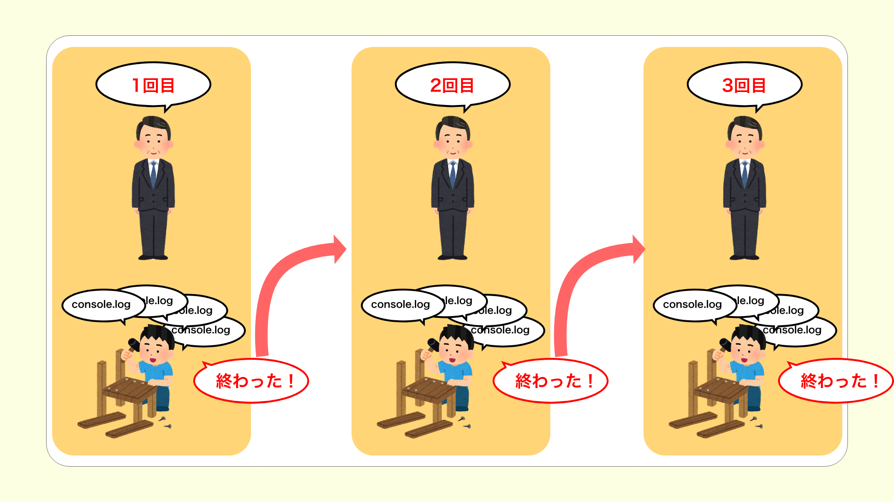

コードに戻って考え直してみると、
```js
for (let i = 1; i <= 9; i++) {
    for (let j = 1; j <= 9; j++) {
        console.log(`${i} * ${j} = ${i * j}`)
    }
}
```
1. ```i```に１が渡されて
1. 子が実行される
1. 子もforなので、9回繰り返される
1. 子が終了し
1. 親の二回目実行→1に戻る

と言った流れになる。
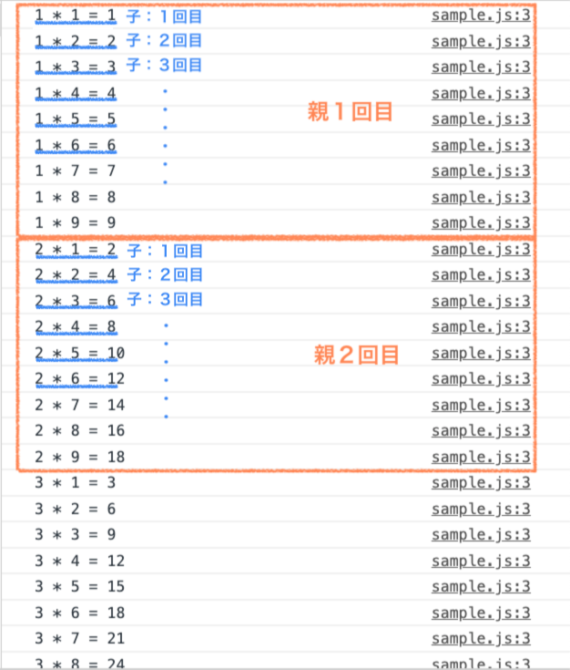

### 【演習】ネストfor文
下記のようにハンバーガーのメニューを格納したリストと、ドリンクのメニューを格納したリストがある。
```js
const HAMBURGER = [
    "ハンバーガー",
    "チーズバーガー",
    "BLTバーガー",
    "おでんバーガー"
]

const DRINK = [
    "コーラ",
    "ビール",
    "コーヒー",
    "ストロングゼロ"
]
```
これらのリストからそれぞれ１つずつ取り出してセットを作ろうとした場合の、全ての組み合わせを下記のような文章とともにコンソールに出力してください。並び順などは問いません。
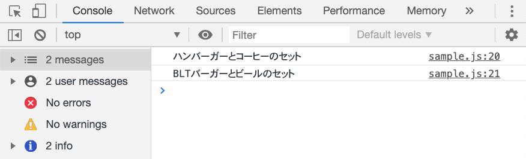
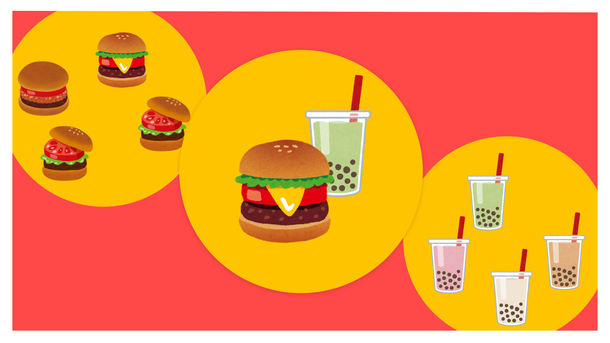
・<br>
・<br>
・<br>
・<br>
・<br>
・<br>
・<br>
・<br>
・<br>
・<br>
・<br>

### 【解答】
```js
for (let i = 0; i < HAMBURGER.length; i++) {
    for (let j = 0; j < DRINK.length; j++) {
        console.log(`${HAMBURGER[i]}と${DRINK[j]}のセット`)
    }
}
```
特に解説は要らないかと思う。分からなければもう一度九九の例をしっかり理解しよう。

## オブジェクトにfor文を使う
いきなりだが以下の問題を考えてみよう。
```js
let obj = {
    a: 1,
    b: 6,
    c: 24,
    d: 17
}
```
上記のオブジェクトにおいて、各プロパティの値をそれぞれ2倍にする。つまり最終的にこうなっていて欲しい。
```js
let obj = {
    a: 2,
    b: 12,
    c: 48,
    d: 34
}
```
良くやってしまいがちなのは下記のようなコード。
```js
for(let i = 0; i < obj.length; i++){
    obj[i] = obj[i] * 2
}
```
これでは何も起きない。色々突っ込みどころ満載のコードだけどなんとなくやりたいことは分かっていただけるかと思う。
- for文は数字しか渡せない
- オブジェクトは配列のようにインデックスで参照出来ない

この二点を思い出していただければなぜこれが動かないのかは分かると思う。要はオブジェクトに数字渡したところで何？ということである。

### オブジェクトを繰り返し処理するならキーのみを配列に直す
標題の通り。まずはコードを見てみよう。
```js
let obj = {
    a: 1,
    b: 6,
    c: 24,
    d: 17
}
let objKey = ["a", "b", "c", "d"]

for(let i = 0; i < objKey.length; i++){
    obj[objKey[i]] = obj[objKey[i]] * 2
}

```
手動で```objKey```という変数に、```obj```のキーを配列として格納した。ちょっとややこしいかもしれないので少し分割してみてみると、
```js
for(let i = 0; i < objKey.length; i++){
    console.log(objKey[i])
}
```

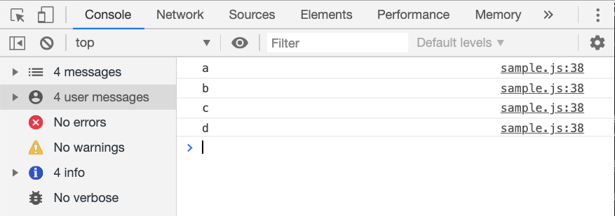

このように、```objKey```にfor文を用いることで、```obj```のキーを順番に列挙することが出来る。ここで最初のコードをみてもらえば意味が分かると思う。<br>
このようにして、オブジェクトにfor文を用いたければ、兎に角**キーを配列として用意する**ことを考えると良い。

### Object.keysメソッド
上記のコードには問題点がある。具体的には```objKey```に問題がある。
今回は手動で```objKey```を作ったわけだが、例えば```obj```のキーが1000個あるオブジェクトだったらどうだろう。
```js
let obj = {
    a1: 1,
    a2: 1,
    ・
    ・
    ・,
    a998: 1,
    a999: 1,
    a1000: 1,
}
```
流石に主導は現実的ではないのが分かるとおもう。そういう時に便利なのが```Object.keysメソッド```である。**オブジェクトのキーを列挙した配列を作成してくれるメソッド**。

```js
let obj = {
    a: 1,
    b: 6,
    c: 24,
    d: 17
}
let myObjKey = Object.keys(obj)
console.log(myObjKey)
```
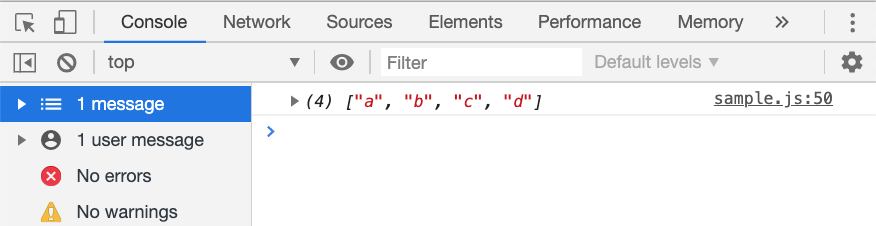
これを用いれば先ほどのコードはこう書ける。

```js
let obj = {
    a: 1,
    b: 6,
    c: 24,
    d: 17
}
let objKey = Object.keys(obj)

for(let i = 0; i < objKey.length; i++){
    obj[objKey[i]] = obj[objKey[i]] * 2
}
```
> 【```Object.values```と```Object.entries```】<br>
Object.keysの兄弟的メソッドに``Object.values``と``Object.entries``というのもある。Object.keysがキーを列挙するものだったのに対し、valuesは値、entriesはプロパティを、それぞれ配列として格納する。使い方などはObject.keysと同じなので、あとは自分で書いて試してみよう。

### for…in文
for文の１つにfor…in文というのがある。for文が順番に数値を入れていったように、for…in文では順番にオブジェクトのキーを入れていってくれる。まずは見てみよう。

```js
let hoge = {
    a: 1,
    b: 2,
    c: 3
}
for(let key in hoge){
    console.log(key)
}
```
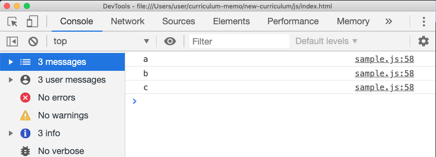

このように、```Object.keys```も書かずしてオブジェクトに繰り返し処理が書ける。一見便利そうな構文だが、実はfor…in文には、**親オブジェクトのプロパティまで列挙してしまう**ことを筆頭にいくつか問題点がある。現段階ではこの問題点に関しては重要ではないので、**for…inではなくObject.keys+for文を使う**とだけ覚えておけば大丈夫。

> 【for…in文の構文】<br>
最初は少しややこしく感じるかもしれない。上記のコードでいう```let key```の部分が主な原因だと思うが、これは関数でいうところの仮引数のようなものと考えると分かりやすい。オブジェクトから```in```のあとで指定されたオブジェクトから引き抜かれたキーが自動でここに入っていく。

## while文
for文とは別にもう１つ繰り返し処理をする構文に、```while文```というものがある。やっていることはfor文と同じ。見てみよう。
```js
// while(条件){
//      処理
//      増減式
// }

let x = 0
while(x < 7){
    console.log(x)
    x += 1
}
```
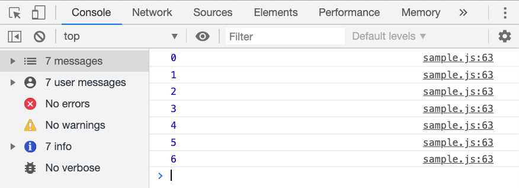
これだけ。while文は処理の中にループをだっするような条件を書かなければならないため、for文の方が安全であるし、while文じゃないとどうにもならないケースはなかなかお目にかかれない。少なくとも初学の段階では忘れてしまっても構わないかもしれない。for文でダメそうなケースが出てきたらwhile文を検討しよう。

> do while文<br>
while文に似たようなものにdo while文というものがある。こちらも重要度が低いので割愛する。気になる人は決して難しくないので調べてみよう。

## まとめ
- 繰り返し処理にはfor文とwhile文がある
- for文の方が圧倒的によく使う
- 無限ループには注意
- 配列と相性がいい
- オブジェクトに使うときはキーを配列に
- キーを配列にするにはObject.keysメソッドが便利
- for…inは使わない