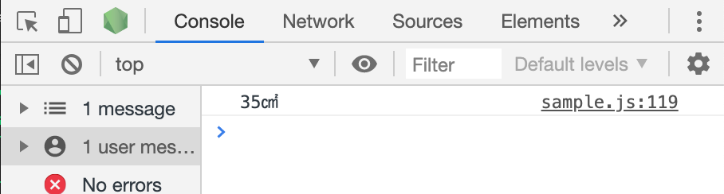
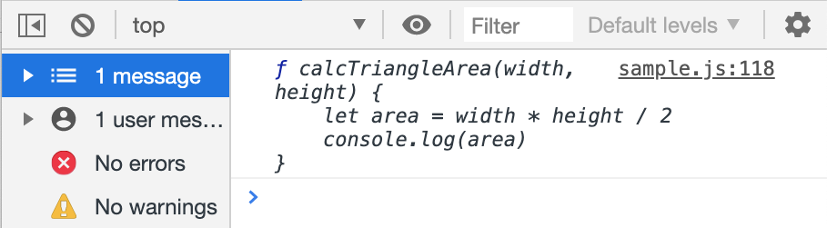
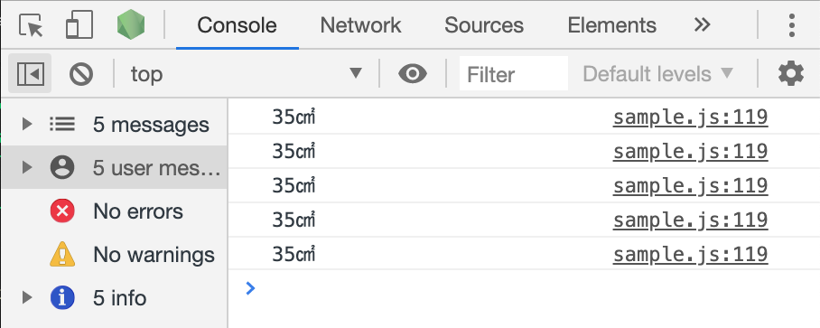
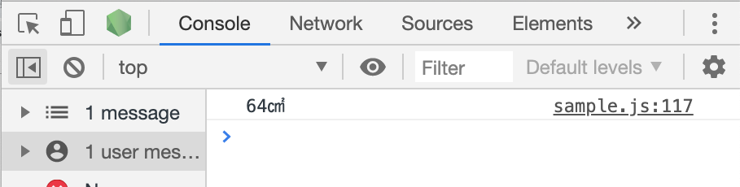
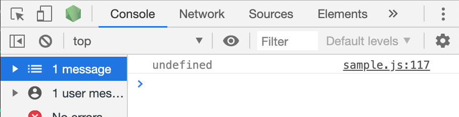
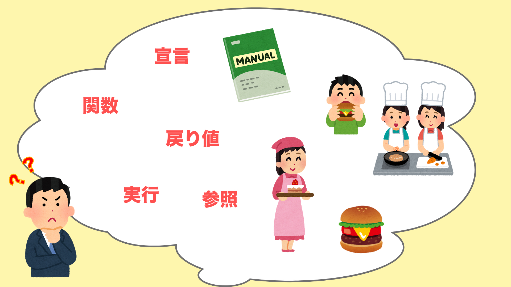
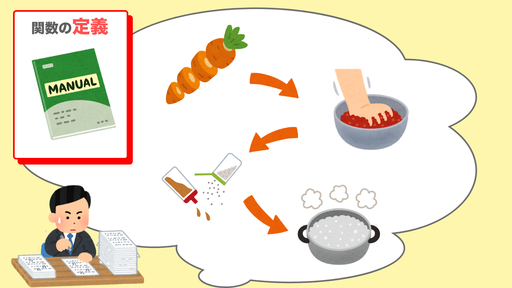
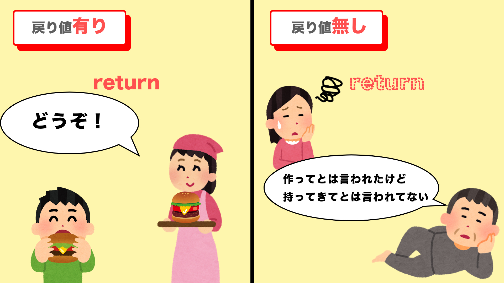

# 関数基礎
関数について取り扱っていく。関数、特に戻り値に関してなかなかイメージの掴めない人が多いようなので、今回は細かい文法がどうのではなく、ざっくりとしたイメージをつかむことを目的としている。言語的な規則や構文については次の『func2』の資料から解説する。下記に特に疑問を抱かない・もしくは既知の人はこの資料は読まなくて構わない。

- 関数は定義・参照・実行・戻り値の工程がある
- 定義しただけでは処理は実行されない
- 実行は 関数名() とする
- 戻り値がないと実行後の値などを使えない

## 関数は処理をまとめたもの
関数とは一連の処理を１つのものとして纏めるもの。これにより使い回しが出来たりする。勉強していくなかで自然と使い方は分かってくるので、今は構文や決まりなどを理解することに集中しよう。

## まずは触ってみよう
とにかく触ってみよう。変数にも宣言(定義)の仕方があったように、関数にも宣言の仕方がある。関数の場合は、下記のように```function```から始まる構文を用いる。
```js
// 関数の定義
function name (){
    // 処理
}
```
```name```は自分で任意につけられる関数の名前が入る。基本なんでもいい。
あとは中に処理を書いていけばいいだけである。今回も三角形の面積を求めるプログラムを例に取り上げよう。<br>
三角形の面積を求めるには以下のようなプログラムを書けばいい。
```js
let width // 底辺
let height // 高さ
let area // 面積

// それぞれに適当な数値を代入する
width = 14
height = 5

// 面積areaに、widthとheightを用いた公式を代入
area = width * height / 2

// 一応コンソールで表示しておく
console.log(area + "㎠")
```

上記の数行は、三角形の面積を求める『一連の処理』と言える。これを関数化したければ、先ほどの関数宣言の中にこの処理を全て入れてしまえばいい。
```js
function calcTriangleArea(){
    // 長かったので変数定義と代入をまとめました
    let width = 14
    let height = 5
    let area = width * height /2
    console.log(area + "㎠")
}
```
これで関数は出来たので、あとは**実行**してやればいい。関数の実行は```関数名()```とする。後で詳しく解説するが、**括弧をつけるのとつけないのとでは全く意味が変わるので注意しよう**。
```js
// 関数の実行→関数名()
calcTriangleArea()
```
これでChromeのconsoleを確認してみよう。


このように表示されているはず。<br>
因みに括弧をつけいないバージョンはというと、
```js
console.log(calcTriangleArea)
```

このようになる。これは関数の内容を表示しただけであり、決して実行はされていない。 


## 引数・仮引数
これでいつでもこの処理を使いまわせるようになった。
```js
// 〜略〜
calcTriangleArea()
calcTriangleArea()
calcTriangleArea()
calcTriangleArea()
calcTriangleArea()
```
実行結果


しかしこれではまだ不便である。なぜなら、底辺が14cm,高さが5cmの三角形しか出してくれないからだ。どうせなら**実行した時に底辺と高さを指定できるようにしたい**。言い方を変えると実行時に関数が底辺と高さを受け取れるようにしたい。それには**引数(ひきすう)**というものを使う。

```js
// 引数を使う
function calcTriangleArea(width, height){
    let area = width * height / 2

    console.log(area + "㎠")
}
```
このように、最初の括弧内()に変数のようなものを入れておく。これを**引数**という。引数を用いた場合は、実行時に引数に入る値を渡してやる必要がある。
```js
calcTriangleArea(32, 4)
```
これで```width```に```32```、```height```に```4```が入った状態で計算される。



> 【実は仮引数】<br>
実は、```function(ここ)```に入った```width,height```は厳密には仮引数という。後で渡される値の受け皿、受付のようなものである。一方、仮引数に実際に入る値、上記では３２と４が引数である。とは言ってもそこまでこの厳密な呼び分けが必要な局面もないので知識として持っておく程度で良い。本稿でも基本的に引数・仮引数をまとめて引数と表現する。呼び分けが必要な局面では都度言及するようにする。

### 引数は『宣言不要』
引数使用前と後のコードを見比べると、```width,height```の定義がなくなっていることに気が付く。これはおかしな事である。ここに違和感を感じない人は、変数の項の『変数の色々な決まり』を軽く復習してこよう。
```js
function calcTriangleArea(width, height){
    // widthとheightの定義がされてない！

    let area = width//略
}
```
これは関数、もとい引数の性質である。引数は実質変数であるが、**letやvarなどに依る宣言は不要である。**
一方、```area```は引数ではなくただの変数なのでいままで通り定義してやる必要がある。
```js
function calcTriangleArea(width, height){
    // 引数は定義せずとも下記のように暗黙的に内部で定義してくれている
    // let width
    // let height
    let area = width * height / 2
}
```
## 戻り値(返り値)
関数には**戻り値**というものがあり、これを使うと関数内の任意の値を実行結果として受け取ることができる。<br>
```calcTriangeArea```関数内にあった```console.log()```を関数の外に出して分離した場合を考えよう。
```js
function calcTriangleArea(width,height){
    let area = width * height / 2
}
// 関数外に出し、areaを表示したい
console.log()
```
この場合、このようにしてもダメである。```undefined```と出てしまうはず。
```js
function calcTriangleArea(width,height){
    let area = width * height / 2
}
console.log(calcTriangleArea(32, 4))
```


これは戻り値、つまり実行結果に対する**報告**がないためである。下記のように修正するとちゃんと出てくれる。これこそが**戻り値**である。

```js
function calcTriangleArea(width,height){
    let area = width * height / 2
    return area
}
console.log(calcTriangleArea(32, 4))
```
戻り値は関数内で、
```js
return //値
```
と書くことで指定できる。<br>
戻り値によって返された値(結果)は、変数に代入することで保持出来る。
```js
let result = calcTriangleArea(32, 4)
console.log(result) // 64
```
## 一旦関数まとめ
まだまだ続く。戻り値あたりから混乱してきたと思うのでひとまずここまでで内容をまとめておこう。
- 関数の宣言は```function name (){}```
- 引数を使うと実行時に値を渡す事ができる
- 引数は変数のようなものだが、特別に定義しなくて良いことになっている
- 関数は定義・参照・実行・報告(戻り値)の４行程から成る
- 宣言(定義)後しただけでは処理は行われない
- 宣言したら実行する→実行は```関数名()```
- ```関数名```だけは関数の参照
- 戻り値を設定しなければ関数に処理結果を受け取る事ができない

## 関数の宣言・参照・実行・戻り値(報告)を整理しよう
ここら辺でなかなか混乱してくる人が多いので(気持ちはとても分かる)、一度例え話を交えて関数の４行程について理解を定着させてみよう。

### 関数は仕事


今回は関数を『マニュアルの元実行するお仕事』と解釈してみよう。
- ハンバーガーを作るためにマニュアルを作って
- 実際にハンバーガーを作って
- 完成したハンバーガーを提供するまで

というハンバーガーチェーンにありそうな行程を関数に照らし合わせて見ていく。

### 関数の宣言 = マニュアルの作成
```js
function getHam(){
    // 処理
}
```


関数の宣言とはハンバーガーの作り方マニュアルの作成である。マニュアルを作っただけでは当然まだハンバーガーは食べられない。マニュアルを元に作る、つまり**マニュアルを実行しないと**当然成果物は出来ない。

### 関数の実行 = マニュアルの内容を実行
```js
// 関数名 + 括弧！！！！
getHam()
```


マニュアルを作ったらそれを元に**実行**する必要がある。**関数名の後に括弧を付けると実行という意味になる**。

> 【括弧をつけないのは？】<br>
括弧をつけないと実行がされない。作ったマニュアルを見ているだけな感じ。console.log(関数)で見てみよう。

### 戻り値 = 成果物の提供(報告)
```js
function getHam(){
    // let cut = 野菜切る
    // let meat = 肉をこねる・焼く
    // let bread = パンを用意
    // let ham = cut + meat + bread
    return ham // 完成品
}
```


最初はここが一番腑に落ちづらいところだと思う。戻り値は実行結果の提供（報告）に当たる命令である。人間に仕事を頼んだら、報告が必要な仕事などならわざわざ言わなくても提供or報告までしてくれるのが当たり前だが、**コンピューターはそこまで命令しないと報告までやってくれない**。



### 戻り値は必須？？？
ではこうなってくると戻り値が必須なのではないかという気にならないだろうか。しかしそんなことはない。戻り値が不要な関数というのも全然存在する。**関数内で処理した結果が特に必要ないもの**がこれに当たる。例を見てみよう。

### 戻り値の要らない関数とは
まず、またまた何かの仕事に例えて見ていこう。先のハンバーガーの例ではマニュアルを元に作り上げた成果物、つまりハンバーガーだが、これを客に届ける必要があるのでreturn必須だった。<br>
では『ゴミを捨てる』という仕事だった場合はどうだろうか？ゴミを捨てるという業務が実行さえされればそれでいいはず。それによって生じる成果物もない。従って一々報告する必要もない(もっとも実際の仕事は報連相は大事だが)。戻り値が必要ない関数とはそういうもののことである。実際のコードで見てみよう。今回のプログラムの仕様・目的は
- ユーザーが入力した税抜き価格を受け取る
- それを元に税込価格・消費税分を算出する
- 上記をアラートにて表示する

とした。
```js
// valueにはユーザーが入力した税抜き価格が入る
function calcTax(value) {
    const tax = 1.08// 消費税率
    let result = value * tax// 税込価格

    // アラートに表示
    alert('税抜き' + value + '円の税込価格は' + result + "円です。この内" + result - value + "円が消費税です。")
}
```
アラートに表示するまでが目的なので、これで完璧に目的が達成出来ている。その為、このコーディングであれば戻り値は必要ない。
勘付いた人もいるかもしれないが、```alert()```の処理が```calcTax```に含まれない時は戻り値が必要になる。

```js
// alertが外に出ているので戻り値必要
function calcTax(value){
    const tax = 1.08// 消費税率
    let result = value * tax// 税込価格

    // 戻り値の性質上このような書き方になる(※補足参照)
    return {value, result}
}
// 補足参照
const {value, result} = calcTax(1000)

alert('税抜き' + value + '円の税込価格は' + result + "円です。この内" + result - value + "円が消費税です。")
```

> 【戻り値補足】<br>
本稿では取り扱わないが、戻り値には「１つの値しか返せない」という性質がある。それの対策として上記のような書き方になっている。今は、```return {value, result},const{value, result}```の二文によって```value```と```result```という関数内で生成された２つの値を戻り値として設定している、とだけ理解しておこう。

以上が関数に関しての概要である。
- 定義
- (参照)
- 実行
- 戻り値

までの流れがざっくりイメージできたら、次の資料で詳細のルールやより進んだ構文などを見ていこう。