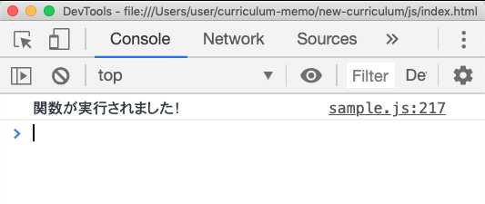

# 関数
本稿より、関数に関するより詳細な決まりなどを見ていく。関数は結構関連トピックが多いので、まず最初に今回取り扱う項目と取り扱わない項目を明記しておく。
> 『関数基礎』がまだ頭に入っていない人は先にそちらを読んでこよう。

## 取り扱う項目と取り扱わない項目
- 【取り扱う項目】
    - 戻り値
    - 即時関数
    - 無名関数
    - 関数式
    - アロー関数
    - 再帰関数
    - 組み込み関数(いくつか紹介)
    - メソッド

- 【取り扱わない項目】
    - アロー関数におけるthis(別資料)
    - arguments
    - スコープ(別資料)
    - コンストラクタ(別資料)
    - クラス(別資料)

## 戻り値
関数の戻り値は１つの値しか設定出来ない。
```js
function calc(num1, num2){
    let sum = num1 + num2
    let diff = num1 - num2
    let prod = num1 * num2
    let quto = num1 / num2

    // これは出来ない↓
    return sum diff prod quot
}
```
加えて、
- returnが実行されたらそこで関数の処理が終了する

という決まりもあるので、複数```return```を書くのも却下。
```js
function calc(num1, num2){
    let sum = num1 + num2
    let diff = num1 - num2
    let prod = num1 * num2
    let quto = num1 / num2

    return sum
    // こっから下は無効
    return diff
    return prod
    return quot
}
```
とは言ってもやっぱ複数の値を戻り値として設定したくなることがある。そういう時は**戻り値にしたい値をオブジェクトor配列の形にしてまとめて返す方法**がある。やってみよう。
```js
function calc(num1, num2){
    let sum = num1 + num2
    let diff = num1 - num2
    let prod = num1 * num2
    let quto = num1 / num2

    let calcResult = [sum, diff, prod, quot]

    return calcResult
}
```
これを実行すると、
```js
// （略）
console.log(calc(10, 5))
```


このように、４つの値が入った配列が返ってくるので、あとはこれは取り出してそれぞれの変数に代入してやればいい。

```js
function calc(num1, num2) {
    let sum = num1 + num2
    let diff = num1 - num2
    let prod = num1 * num2
    let quot = num1 / num2

    let calcResult = [sum, diff, prod, quot]

    return calcResult
}
const calcResult = calc(10, 5)

let sum = calcResult[0]
let diff = calcResult[1]
let prod = calcResult[2]
let quot = calcResult[3]
```
> sum,diffなどの変数が、関数内外で合わせて二回宣言されているのに気付いただろうか。変数の決まりを思いだせば当然アウトだが、**スコープ**というもののおかげでこれはセーフ。スコープについては別紙参照。

## ES6(ES2015)での複数の戻り値
ES6より追加された、
- 分割代入
- オブジェクトの省略記法

の２つを用いると、複数の戻り値をもっと簡単にかつ安全に書ける。こちらの方法が使えるときはこちらの方法を使うようにしよう。<br>
ではまずは分割代入から。
### 分割代入【ES6】
配列の要素やオブジェクトのプロパティなどをまとめて変数宣言できる方法。実際にコードを見てみよう。
```js
// 配列
let ary = [1, 2, 3]
let [x, y, z] = ary
console.log("x →" + x)
console.log("y →" + y)
console.log("z →" + z)
```


```js
// オブジェクト
let obj = {
    x: 1,
    y: 2,
    z: 3
}
let { x, y, z } = obj
console.log("x →" + x)
console.log("y →" + y)
console.log("z →" + z)
```


> オブジェクトの分割代入は、キーと変数名を同じにする必要がある点に気をつけよう！

### オブジェクトの省略記法【ES6】
オブジェクトのキーとその値が同じ名前なら下記のように省略して書ける。
```js
const name = "名前";
const obj = {
    // キーと値(変数)が一緒なら……
    "name": name
};
// 
```
> ※↑分かりやすさのためにキーをクオートで囲んでます
```js
const name = "名前";
const obj = {
    // このように省略できる
    name
};
```


### ２つ合わせて複数戻り値をスッキリ書く
上の２つを合わせると、複数戻り値をスッキリ書ける。完成形はこれ。
```js
function calc(num1, num2) {
    let sum = num1 + num2
    let diff = num1 - num2
    let prod = num1 * num2
    let quot = num1 / num2

    let calcResult = {sum, diff, prod, quot}

    return calcResult
}
let {sum, diff, prod, quot} = calc(10, 5)
```
一応この形になるまでの過程を分解して見ておこう。
まずはこの部分。
```js
let calcResult = {sum, diff, prod, quot}
```


これは**オブジェクトの省略記法**を用いている。省略せずに書くと下記のようになる。キーは分かりやすさのためにクオートを書いている。
```js
let calcResult = {
    "sum": sum,
    "diff": diff,
    "prod": prod,
    "quot": quot
}
```
次はこの部分の右辺をみる。関数を実行しているだけだがまだ慣れないと思うので一応。
```js
let {sum, diff, prod, quot} = calc(10, 5)
```
これは実行されると**戻り値**の部分が返ってくる。つまり```calcResult```になる。
```js
let {sum, diff, prod, quot} = calcResult
```
```calcResult```は先のことと合わせると、
```js
let {sum, diff, prod, quot} = {
    "sum": sum,
    "diff": diff,
    "prod": prod,
    "quot": quot
}
```
である。```sum,diff,prod,quot```にそれぞれ引数10, 5を入れた場合の計算結果を代入すると、
```js
let {sum, diff, prod, quot} = {
    "sum": 15,
    "diff": 5,
    "prod": 50,
    "quot": 2
}
```
となる。あとは、**左辺の変数名が右辺のオブジェクトのキーに等しい**ので**分割代入**の構文に基づき、
```js
let sum = 15
let diff = 5
let prod = 50
let quot = 2
```
となり、擬似的に複数の値を戻り値として取得することに成功している。以上。

## 戻り値の初期値
戻り値には実は『初期値のようなもの』がある。戻り値、即ち```return```を書かなくても実はあるものが返ってきている。まずは先ほどのcalc関数を何も変更せずに実行してみよう。
> コンソールにも直接コードが書ける。検証ツールからコンソールを開いてそのままコードを書くだけ。


このように出てくる。２行目が戻り値である。
では次は```calc関数```の戻り値をコメントアウト(削除)してから、同様に実行してみよう。
```js
function calc(num1, num2){
    // ~~~~~~~
    // ~~~~~~~

    // return calcResult←ここ
}
```


このようになったはずである。この```undefined```こそが今回の要。実は戻り値を書かなかった場合、戻り値が全くないのではなく```undefined```が返ってくるようになっている。コンソールで直接、適当に```console.log```を実行してみよう。同様に```undefined```が返ってきたと思う。これは```console.log```が戻り値の設定されていない関数だからである。

## 色々な関数宣言
関数には色々な書き方がある。それぞれ見ていこう。
- 関数式
- 無名関数(匿名関数)
- 即時関数(即時実行関数)
- アロー関数【ES6】

### 関数式
今までの関数宣言は下記であった。
```js
function sentence(){
    // 処理
}
```
関数式という方法もある。
```js
const equation = function(){
    // 処理
}
```
実行の仕方は両方とも一緒。
```js
sentence()
equation()
```
これだけ。
> 今までの関数宣言は**文**であり、関数式による定義は**式**である。プログラミングの根幹の概念であり大切だが今回はあまり関係がないので割愛する。

関数式を用いた宣言であっても、名前つき関数を使うことができる。
```js
const outer = function inner(){
    // 処理
}
```
しかし、上記でいう```inner```は関数の外からは呼び出すことが出来ない。

```js
const outer = function inner(){
    //処理
}
inner()//NG
```
これでは関数式の場合に関数名をつける意味がないように思われる。しかし、その関数自身内でなら呼び出すことができる。
```js
const outer = function inner(){
    inner()//OK!
}
```
このように、自分の中で自分を呼び出すような関数を定義したい場合は、関数式であっても名前つき関数を定義する。このような関数を**再帰的に呼び出す**と言ったり、**再帰関数**と呼んだりする。


### 無名関数(匿名関数)
上記の関数式の右辺に注目していただきたい。関数名が省略されている。あれが**無名関数(匿名関数)**。実行は代入した変数名を呼び出すことで可能なため省略しても良い。
```js
// 無名関数
function(){
    // 処理
}
```
無名関数が利用可能なのは以下の時のみ。
- 関数式
- 即時関数(後述)
- メソッド定義時(後述)

### 即時関数(即時実行関数)
即時関数は、定義と実行を同時に行う関数である。下記のように書ける。関数宣言を括弧で括って、そのあとに空の括弧を書くだけ。
```js
//即時関数：基本構造
//(関数)()
```
```js
// function宣言の場合
(function(){
    // 処理
})()
```
```js
// アロー関数の場合(後述)
(()=>{
    // 処理
})()
```
即時実行関数はその名の通り、読み込まれたらその場で実行までされる。以下２つを比べてみよう。
> 関数の宣言と実行が別だということを忘れている人はそこが分かってないときついので『関数基礎』を読み直してこよう。

```js
function test(){
    console.log("関数が実行されました！")
}
// こっちは当然これ→test()を書くまでコンソールには何も表示されない
```
```js
(function(){
    console.log("関数が実行されました！")
})()
// これだけで実行までされる(下記画像参照)
```


即時関数は、働き的には下記の省略記法のようなものだと思ってしまって問題ない。
```js
function test(){
    // 処理
}
test()
```

### アロー関数【ES6】
**ES6より追加された新しい関数宣言方法**。一番よく見るのは関数式の形での書き換え。
```js
// 今までの宣言
const arrow = function(hikisuu){
    // 処理
}
```
```js
// アロー関数での宣言
const arrow = (hikisuu)=>{
    // 処理
}
```
アロー関数にはこれよりも簡単に書ける省略記法がいくつかあるが特に重要ではないので簡単に調べておこう。

### アロー関数の特徴
アロー関数と今までの関数に違いはないが、一点のみ非常に大きく且つ重要な違いがある。それが```this```の挙動というところなのだが、そこを解説するには
- thisについて
- apply,call,bind

などを中心にやや高度な前提知識が必要となる。その為今回の資料では扱わないこととする。

## メソッド
関数は関数でも、オブジェクトの値として設定された関数は特別な呼び方をする。それが**メソッド**である。
まずはオブジェクトの基本を簡単におさらいしよう。


各部名称はこれで、プロパティの呼び出しは、
```js
let obj = {
    pro: "value",
}
obj.pro
```
とするのが基本だった。
この時、値に関数を入れることができる。
```js
let obj = {
    pro: "value",
    meth: function(){
        // 処理
    }
}
```
この時、```pro```の方はプロパティと呼ぶが、```meth```方は**メソッド**になる。


関数なので**実行するときは括弧をつける**という決まりは今まで通り。下記を試してみよう。

```js
let greet = {
    hello: function(){
        alert('へろー')
    }
}
```
まずは括弧なし。実行がされないので(マニュアルの中身を確認しているだけなので)うんともすんとも言わない。
```js
// 何も起きない
greet.hello
```
が、括弧をつけると**実行される**ので、
```js
// アラートが出る！
greet.hello()
```
アラートが出るはずである。

### メソッドの省略記法【ES6】
メソッドには省略記法がある。ES6からの書き方。
```js
// 従来
let greet = {
    hello: function(){
        alert('へろー')
    }
}
```
```js
// 省略
let greet = {
    hello(){
        alert('へろー')
    }
}
```
特に挙動などに違いはないが、分かりやすさの為ES6が使える環境であればこちらの書き方を使っていこう。

### 【コラム】実はほとんどメソッドとプロパティ
jsに出てくるものはほとんど実はオブジェクトだしプロパティだしメソッドである。
<br>
ここまで勉強を終えるとだいたい何が何なのか分かってくる。例えば今まで散々使ってきた```console.log()```を見てみよう。

```js
console.log('ほげ')
```
実はこれも例に漏れずオブジェクトのメソッドを呼び出しているにすぎない。以下のコメントアウトは超重要なのでよく読んでほしい。
```js
console.log("ほげ")
// consoleというオブジェクトの
// logというメソッドを実行している
// logメソッドの引数に「ほげ」を渡してる
```
実際に確認してみよう。```console.log```を使って```console```というオブジェクトを見てみる。<br>
検証ツールのコンソールを開いて下記を入力し、


Enterで実行。左サイドの矢印を開いて展開すれば……


このように出てくるはずである。


このように、```console```もオブジェクトであることが確認できた。では```log```という関数がメソッドとして格納されているはずである。探してみると、


ある。次に、```console.log()```は最後に括弧がついていることに注目してほしい。よってこれはlogプロパティではなく**logメソッド**である。一方プロパティは何があるだろう。配列の時に使った**lengthプロパティ**である。
```js
let ary = [1, 2, 3, 4, 5]
ary.length
```

これらはjsを触っている限り絶対にそうである。基礎的なことだが、特に初学の段階ではコードを読むときの一助となる知識なのでよく理解しておこう。
- ```hoge.huga```のように、ドットで繋がっているものが出てきたら……
- ドットの左はオブジェクト
- ドットの右はプロパティかメソッド
- 末尾に括弧がついていなければプロパティ
- ついていればメソッド

以上が言える。

## 再帰関数
再帰関数とは、関数が処理の中で自身を呼び出している関数である。
```js
function reverb(){
//↓自分を呼び出している
    reverb()
}
```
### 再帰関数を読んでみる
練習として以下の関数を読み解いてみよう。これがなんの関数だか分かるだろうか？
```js
function sample(n){
　if (n > 0){
　　return n * sample (n-1);
　}
　else{
　　return 1;
　}
}
```
ややこしいと思うので、引数```n```に実際に数字を入れて展開してみればいい。試しに３を入れた場合で考えてみよう。あとは見やすさのため、一旦if文は無視する。
> 多少書き方が文法的におかしい部分は解説の為ということで目を瞑っていただきたい。
```js
// if文は一旦無視
sample(n){
    return n * sample(n - 1)
}
```
引数に３を与える＝nを３に書き換える
```js
sample(3){
    // return 3 * sample(3 - 1)
    return 3 * sample(2)
}
```
```sample(2)```というのが出てきた。そこだけ取り出して見てみよう。
```js
sample(2){
    // return 2 * sample(2 - 1)
    return 2 * sample(1)
}
```
```sample(1)```も同様にやってみる
```js
sample(1){
    // return 2 * sample(2 - 1)
    return 1 * sample(0)
}
```
一旦ここでやめておく。ここまでで出てきたものをまとめると
- ```sample(3)```→ ```3 * sample(2)```
- ```sample(2)```→ ```2 * sample(1)```
- ```sample(1)```→ ```1 * sample(0)```

それぞれを連結すると、
```js
// sample(3)の戻り値は……
3 * 2 * 1 * sample(0)
```
だということが分かった。なんとなく分かっただろうか。これは**nの階乗を求める関数である。**<br>
では最後に無視していた```if文```と```sample(0)```に関してである。
```js
if(n > 0){

}else {

}
```
となっているので、```sample(0)```以外は```if```の節が実行され、```sample(0)```で初めて```else```の節が実行される。```else```の節は、
```js
return 1
```
つまり```sample(0)```は１になる。よって、```sample(3)```の最終的な戻り値は
```js
3 * 2 * 1 * 1
```
となる。これを読む時、ややこしくさせるのは```if文```ではないかと思う。このような時は、「仮にif文がなかったらどうなるかな」と試してみると理解が早い。```if文```がない場合は、sample(0)以降も```...*(-1)*(-2)*(-3)...```と、延々に演算が繰り返されてしまう。それの対策である。

以上で関数の一般的な知識の解説を終える。ここまで学習を終えれば、簡単なwebページのアニメーション用のコードなどなら読めるようになっていると思うので、色々書いたり読んだりしてみよう。