# 条件分岐
プログラミング言語には、設定した条件によって処理を分ける**条件分岐**の構文がある。jsではif文とswitch文の２つがある。構文自体にはややこしものはそんなにないので、軽く基礎を学んだ後、if文に関連するひっかかりやすい部分も一緒に見ていこう。


## if文基礎
if文の構文は以下の通り。<br>**括弧内の条件が成立したらif文内の処理を実行する。そうでなければ実行しない**というだけの構文。
> 『括弧内の処理が成立したら』と言ったけど実はちょっと嘘(殆ど本当)。```true,false```(**真偽値**)というものが関わっているので詳細は後ほど。お楽しみに。
```js
// if(条件){
//     処理
// }
```
早速上記画像の『65歳以上なら20%割引』をif文で書いてみよう。商品の値段を```price```、客の年齢を```age```とする。
```js
let price = 1000 // 商品の価格
console.log(`if文前のprice →　：${price}`) 

let age = 75 // 客の年齢
if(age > 65){
    price = price - (price * 0.2)
}
console.log(`if文後のprice →　：${price}`) 
```
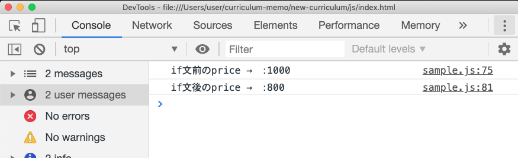
ちゃんと表示された。客が若者だった場合(ageが25だった場合)は以下のようになる。

```js
let price = 1000
console.log(`if文前のprice →　：${price}`) 

let age = 25 // 若者(65より小さい)に変更

let discount = 0.2
if(age > 65){
    price = price - (price * discount)
}
console.log(`if文後のprice →　：${price}`) 
```
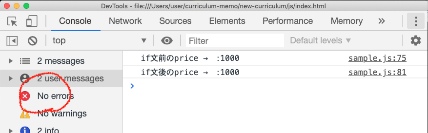

もちろん変わらない。たまーーーに勘違いしちゃう人もいるので一応言っておくが、別に条件に合致しなくてもエラーにはならない。ただ**if文内の処理が実行されないだけ**。
> 【price = price * 0.8でよくない？回りくどくない】<br>
確かにそう。しかし、細かいが今回は拡張性を考えて上記のような記述にした。割引率が変わる可能性を考えると、変数で管理した方がスマート。

### 複数の条件：else if
第二の条件を追加したいことがある。そういう時に使うのが```else if```。例えば『65歳以上は20%割引、55歳以上は10%割引』というような時に使う。
```js
// 〜略〜
let discountMid = 0.1
if(age > 65){
    price = price - (price * discount)
}else if(age > 55){
    price = price -(price * discountMid)
}
```
```else if```はいくつ繋げて書いても問題ない。
```js
// 〜略〜
let discountMid = 0.1
if(age > 65){
    price = price - (price * discount)
}else if(age > 55){
    price = price -(price * discountMid)
}else if(age > 45){
    price = price -(price * discount4)
}else if(age > 35){
    price = price -(price * discount3)
}else if(age > 25){
    price = price -(price * discount2)
}else if(age > 15){
    price = price -(price * discount1)
}
```
### その他：else
『どの条件にも当てはまらなかった時』という時は```else```を使う。『その他』と言い換えてもいいかもしれない。
その他であり、特に条件がないので括弧は書かない。
```js
// 〜略〜
let discountMid = 0.1
if(age > 65){
    price = price - (price * discount)
}else if(age > 55){
    price = price -(price * discountMid)
}else {
    console.log("若いね")
}

```

## 真偽値
先ほど「括弧内の処理が成立したらと言ったけど実はちょっと嘘」と書いたが、その理由がここにある。以下を実行してみよう。
```js
let num = 100
console.log(num > 0)// 成立してる
console.log(num < 0)// 成立してない
```
結果はこうなる
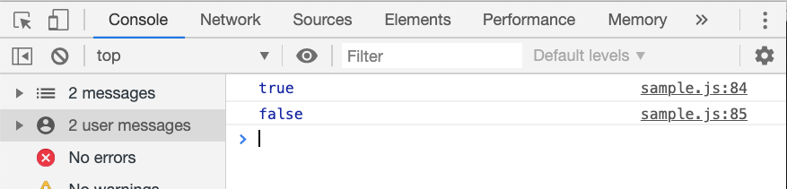

```true(トゥルー)```と```false(フォルス)```という謎の文字が出てきた。これこそが**真偽値**である。この真偽値というのは文字でもなければ変数でも数値でもなく、真偽値である。```true```は**真**、```false```は**偽**と呼ぶ。数値や文字列などと並んで**プリミティブ値**と呼ばれるものに属する値であるが、最初はこの辺の概念は掴みにくいので、今は**特殊な意味を与えられた値**と理解しておこう。

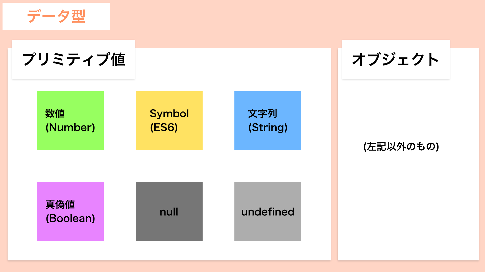

## もう少しif文を理解する
いよいよ「括弧内が成立したら〜」の部分を正確に理解しよう。if文とは**与えられた条件がtrueだった場合に実行される構文**のことである。与えられた条件というのはつまり```if```の隣にある括弧のことである。<br>
「別にそれ知ったところで今までと何も変わらなくない？」と思うかもしれない。が、次のコードが理解出来るようになる。
```js
if(true){
    console.log("成立だよ")
}
```
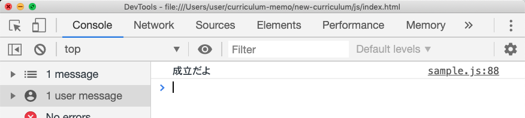
「条件が成立したら」だと少し飲み込みづらいと思うが、「条件がtrueだった場合」と理解しておけばそのままである。<br>

付随して、```else```はその他だと書いたが、**```if,else if```の条件全てがfalseだった時に実行される**とも言い換えられる。
```js
if(false){
    console.log("ifの節だよ")
}else {
    console.log("elseの節だよ")
}
```
## 条件式に真偽値以外を渡した場合
本題の前に一度ここまでのおさらい。
- 比較の式は結局```true```,```false```になっていた
- if文の条件式部分には必ず真偽値が入る

では、if文に真偽値以外のものを渡した場合はどうなるのだろうか？以下のコードをみてみよう。

```js
if(8){
    console.log("if文実行完了")
}
```
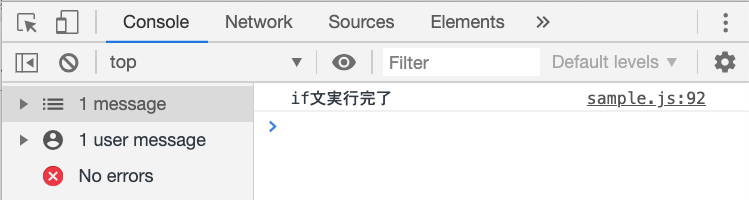

実行された。決してif文の条件式部分には真偽値(true/false)以外は入らないというのは変わらない。これはif文に真偽値以外を渡した場合は**暗黙的な型変換が行われる**という決まりが働いている。

> これはjsの『決まり』なので、理解するものじゃない。覚えちゃおう。

### 暗黙的な型変換・falsyな値
真偽値以外のものが与えられた場合、jsが勝手に真偽値に変換しちゃう。規則は以下の通り。
- falseに変換されるもの
    - undefined
    - null
    - 0
    - NaN
    - ""(空文字)
    - (false)

- trueに変換されるもの
    - 上記以外

falseに変換されてしまうものを**falsyな値**という。用語として覚えておこう。


## 比較演算子：色んな条件を書こう①
if文自体はもう殆ど問題ないが、先で取り扱った条件は『ほにゃらら以上』だけ。『AとBが等しかったら』『AとBが等しくなかったら』『AとBが同時に成り立つ時』などなど、他にも条件は色々ある。それぞれ書き方を学んでいこう。

### 〜より大きいor小さい【 >, < 】
顔文字じゃないですよ。不等号です。数学と全く同じなので特に注釈はないですが、これらは**対象は含まない**点のみ注意してください。
```js
let num = 10
if(num < 10){
    // 9.9999999999.......より小さい時
    // 10を含まない
    console.log("成立！")
}else{
    console.log("不成立！") // こっちが実行される
}
```
### 〜以上or以下【 >=, <= 】
上記の、**対象は含むバージョン**。
```js
let num = 10
if(num <= 10){
    // 10ぴったりより小さい時
    console.log("成立！")// こっち
}else{
    console.log("不成立！")
}
```

### AとBが等しい【 === 】(厳密等価演算子)
数学のイコールと全く一緒。
```js
let a = 1
let b = 1
if(a === b){
    console.log("成立")// 実行される
}
```

### AとBが等しくない【 !== 】(厳密不等価演算子)
上記の逆の意味。
```js
let a = 1
let b = 12983749
if(a !== b){
    console.log("成立！")// 実行される
}
```
### 使っちゃだめ！等価・不等価演算子
学習の段階でこのようにイコールが３つではなく２つの等価演算子(不等価演算子)を目にすることがあるかもしれない。
```js
a == b
// もしくは
a != b
```

**これは基本的に使ってはならない**。なぜなら、変数の項で出てきたvarと似たように、凡そ看過出来ない欠点がある。ここで１つ質問。下記を見ていただきたい。
```js
let one = 1
let wan = "1"
```

この```one```と```wan```は同じと言えるだろうか？**答えはNOである**。一度イコール３つの方で試してみよう。
```js
let one = 1
let wan = "1"
if(one === wan){
    console.log('同じだよ！')
}else{
    console.log('違うよ！')// こっち！
}
```
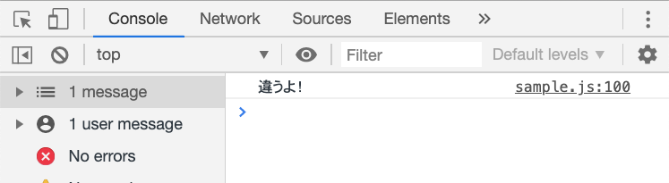

なぜなら値の**型**が違うからだ。```one```(1)は数値(数値型)で、```wan```("1")は文字列(文字列型)だ。型というのはちょい深い話なのでとりあえず今は、**数値と文字列のように型が違うものは別物として解釈される**と理解していただきたい。
もう察しがつくと思うが、**イコール２つの時は型の違いが無視されてしまう**。上が正しい挙動で下がおかしな挙動であるという感覚を持とう。
```js
let one = 1
let wan = "1"
if(one == wan){
    console.log('同じだよ！')// こっちが実行される
}else{
    console.log('違うよ！')
}
```
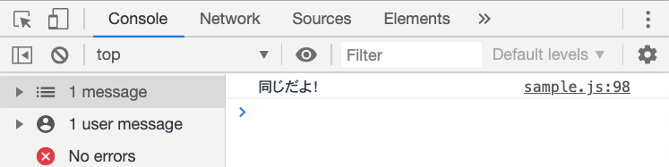

> ```var```や今回の等価演算子(===)の決まりの緩さに関して、たまに「エラーが出ない分便利じゃないんですか？」という人がいるが、この感覚はやめよう。機械がこちらが言った事以外を勝手に実行しちゃうのは非常に困る事(勉強していけばすぐ分かります)。エラーが出ない→柔軟、ではなく、エラーが出ない→いい加減 と思おう。

## 論理演算子：色んな条件を書こう②
詳しい解説も必要ないと思うので下記にまとめる
- AND → &&
- OR → ||
- NOT → !
```js
let a = 10
let b = 20

// A AND B → AとB両方成り立つ(true)時にtrueを返す
console.log(a < 15 && b < 25)// true
console.log(a < 15 && b < 15)// false

// A OR B → AかBどちらか一方でも成り立つ(true)時にtrueを返す
console.log(a < 15 || b < 25)// true
console.log(a < 15 || b < 15)// true
console.log(a < 5 || b < 5)// false

// A NOT → 成り立つ(true)ならfalse,不成立(false)ならtrueを返す

console.log(!true)// false
console.log(!false)// true
console.log(!(a < 100))// false
```
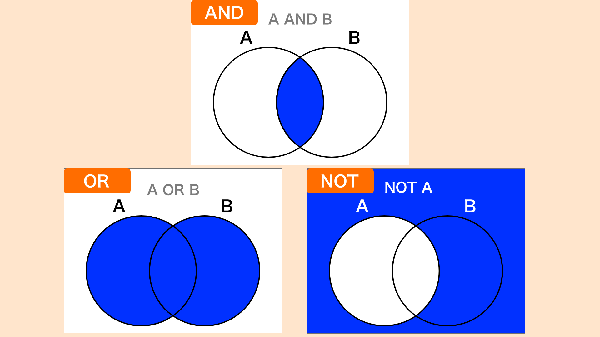

### 1 < x < 10 のようには書けない！
『xが1以上10以下の時』みたいな条件を書く時、上記標題のようには書けない。これはAND演算子を用いて以下のように書く。

```js
console.log(1 < x && x < 10)

// 以下などでも同じ意味
console.log(x > 1 && 10 > x)
```

## if文は上から順番に実行される
if文も実行に順番があり、上から順に実行されていく。テストの点数に対して```alert```でコメントを出す簡単なプログラムを考えてみよう。今コードを書ける人は折角なので一回自分で書いてみよう。
```js
// たかし君のテストの点数
const score = 86
// 10点以下だったら
alert('お先真っ暗！！！！')

// 80点以上だったら
alert('すごい！')

// 100点だったら
alert('天才！')

// それ以外(11~79点)
alert('うん')
```
例えばこれを正直に、下記のように書いたとする

```js
const score = 86
if(score <= 10){
    alert('お先真っ暗！！！！')
}else if(score >= 80){
    alert('すごい！')
}else if(score === 100){
    alert('天才！')
}else {
    alert('うん')
}
```
```alert```に「すごい！」と出れば問題ないが……
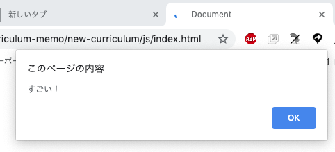

出た。では```score```を100に変えて試してみよう。「天才！」と出てくれるはずだが……
```js
// const score = 80 ↓変更
const score = 100

// 〜略〜
```


画像の貼り間違いではない。```score = 100```としても「すごい！」が出てしまうはず。これが『if文は上から実行される』と言う事である。```score```が最初に該当するのは、```score >= 80```である。この時点でif文は処理を実行→終了となってしまう為、以降の処理は判定されない。


解決策としては、

- 先に判定されるべきものから書く

```js
if(score === 100){// ここ
    alert('天才！')
}else if(score >= 80){
    alert('すごい！')
}else if(score <= 10){
    alert('お先真っ暗！！！！')
}else {
    alert('うん')
}
```
- 範囲を限定する
    - 今回のように数値などでは使える
    - 可読性が低くならないように気をつけよう

```js
if(score <= 10){
    alert('お先真っ暗！！！！')
}else if(score >= 80 && score < 100){// ここ
    alert('すごい！')
}else if(score === 100){
    alert('天才！')
}else {
    alert('うん')
}
```
などがある。適切に使い分けよう。

## 三項演算子
if文のもう１つの書き方に**三項演算子**というものを用いたものがある。以下が構文。
```js
// 条件式 ? trueの時の処理 : falseの時の処理
```
特に挙動などに違いはなく、１行で書けるだけ。
下記はif文と、それを三項演算子での記述に変えたものである。
```js
// if文
if(score >= 50){
    alert('合格！')
}else {
    alert('不合格！')
}
```
```js
// 三項演算子
score >= 50 ? alert('合格！'):alert('不合格!')
```
### 三項演算子の使い所

- 基本```if, else if```を使う
- **三項演算子を使った方が読みやすい時のみ使う**

```if```と意味も処理も何も変わらないので、極論最初は読めれば書けなくても良い。

## 【演習】if文：FizzBuzz問題
下記のように、1から100までの数値をコンソールに出力する```for文```がある。
```js
for(let i = 0; i <= 100; i++){
    console.log(i)
}
```
これを```if文```を用いて、
- 3の倍数の時はFizz
- 5の倍数の時はBuzz
- 3の倍数且つ5の倍数の時はFizzBuzz
- それ以外は数値

と表示するようにしてください。画像は正解時の出力。
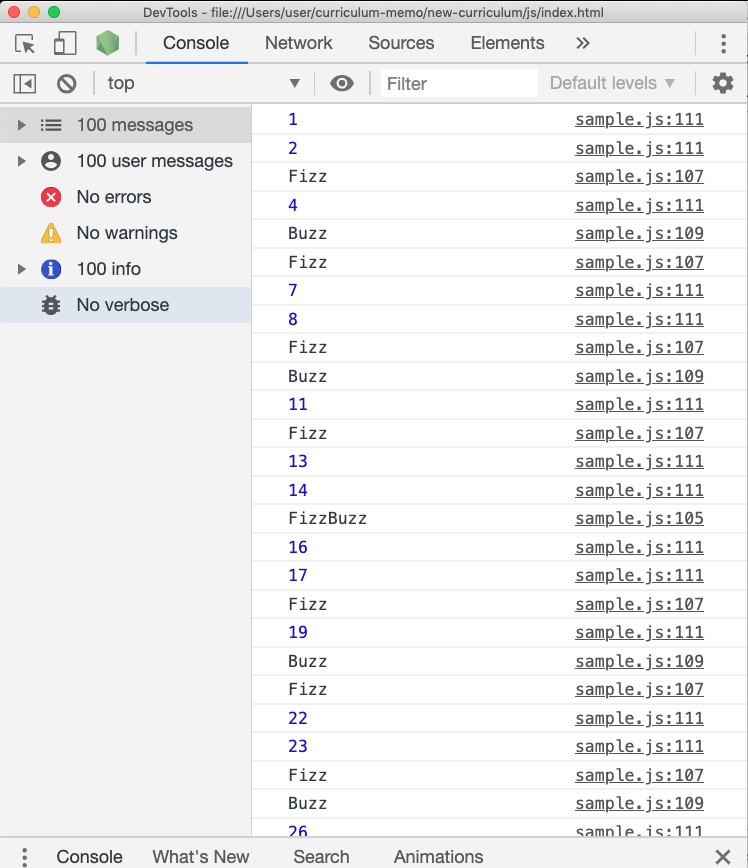

・<br/>
・<br/>
・<br/>
・<br/>
・<br/>
・<br/>
・<br/>
・<br/>
・<br/>
・<br/>
・<br/>
・<br/>
・<br/>
・<br/>
・<br/>

## 【解答】
まずは
- ほにゃららの倍数

の表現方法について考えよう。3の倍数であれば、3の倍数とはつまり3で割り切れる→3で割った時のあまりが0の時の数字の事である。よって、3の倍数・5の倍数・3の倍数且つ5の倍数はこのように記述する。
```js
const num //数字が入る

// 3の倍数
num % 3 === 0

// 5の倍数
num % 5 === 0

// 3の倍数且つ5の倍数
num % 3 === 0 && num % 5 === 0
```
> このように指定された仕様や要件を満たす為には、プログラミング言語的にどのように言い換えたらいいか、どのような仕組みを構築したらいいか、という部分のことを**ロジック(論理)**と言う。と言っても今回の例はスケールが小さいので、MDNのこちら『プログラマーのように考える』の項がロジックという概念については非常に分かりやすいのでおすすめ。
https://developer.mozilla.org/ja/docs/Learn/JavaScript/First_steps/A_first_splash

> 【```num % 15 === 0``` はダメ？】<br>
3の倍数且つ5の倍数とはつまり3と5の公倍数なので上記のような書き方でも要件は満たせる。しかしプログラミングの思想的に一度考えた方がいい問題かもしれない。```num % 15 === 0```のようにしてしまうと、後述の【発展 解答２】のような書き換えをする際、変更に多少手間がかかる(もっと複雑な処理の場合はそれだけ手間も増える)。もう一点、可能な限り「自分の頭で考えない・処理しない」ことが理想的である。```num % 15 === 0```を書く場合、脳内で一度『3 * 5 = 15』という算数をしているはずだ。これでは『3 * 5』が出来ない人はあなたのコードを読めなくなるし、計算ミスのリスクもある。あくまで思想なので今は深入りしなくていいが、１つの考え方として知っておこう。

もし、
```js
num % 3 = 0
```
のようにしてしまっている人がいたら、もう一度**代入**とはなんだったのか・**等価演算子**とはなんだったのかを復習してこよう。

あとはif文を書いていくだけ。
- if文は上から実行される

ことに留意すればこうなる。
```js
for (i = 1; i <= 100; i++) {
    if (i % 3 === 0 && i % 5 === 0) {
        console.log('FizzBuzz');
    } else if (i % 3 === 0) {
        console.log('Fizz');
    } else if (i % 5 === 0) {
        console.log('Buzz');
    } else {
        console.log(i);
    }
}
```

## 発展【解答その２】
実は上記の処理は無駄がある。5の倍数の時、```% 3, % 5```の演算を２回ずつ、計４回もしてしまっている。例えば、数値が20の時は以下のような流れになっている。
1. 20 % 3 === 0 →false
2. 20 % 5 === 0 →true(最初の条件内)
3. 20 % 3 === 0 →false
4. 20 % 5 === 0 →true

これを改善したのが以下である。

```js
for (i = 1; i <= 100; i++) {
  if (i % 3 === 0) {
   if (i % 5 === 0) {
    console.log('FizzBuzz');
   } else {
    console.log('Fizz');
   }
  } else if (i % 5 === 0) {
   if (i % 3 === 0) {
    console.log('FizzBuzz');
   } else {
    console.log('Buzz');
   }
  } else {
   console.log(i);
  }
 }
```
ちょっとややこしいかもしれないが、頑張って読んでみよう。
このように、１つの問題でも色々な書き方がある。ちなみにこれも正解というわけではない。少々見にくいなどの問題があるし、特にこれが絶対正解、というのもないかもしれない。本稿ではこれ以上言及しないので、気になる人はFizzBuzzでググってみよう。FizzBuzzくらいだったらもう色々な言語のものでもなんとなく読めるくらいにはなっているはずなので、javascriptに限定せず調べてみよう。

## switch文

> 現在更新中：
