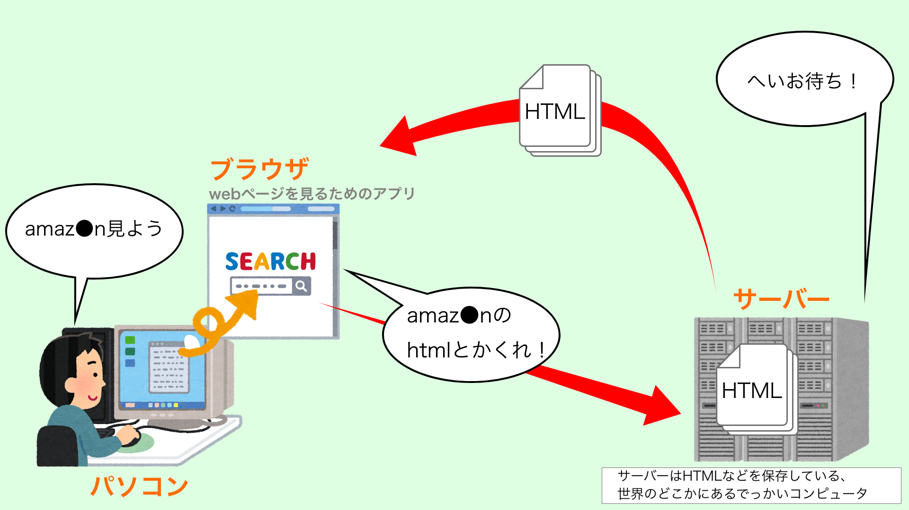
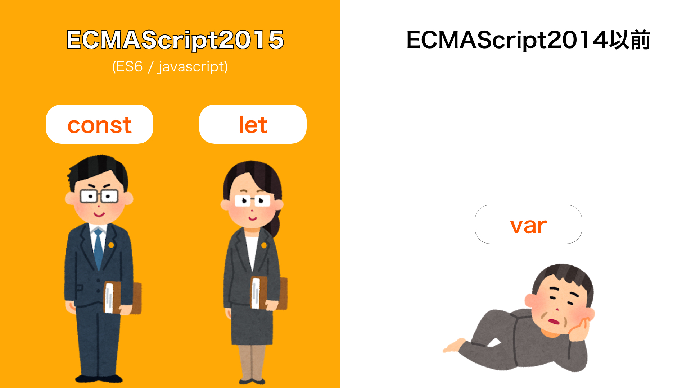
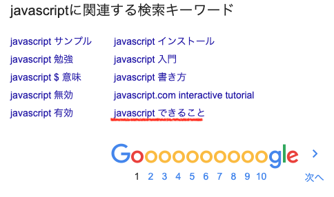
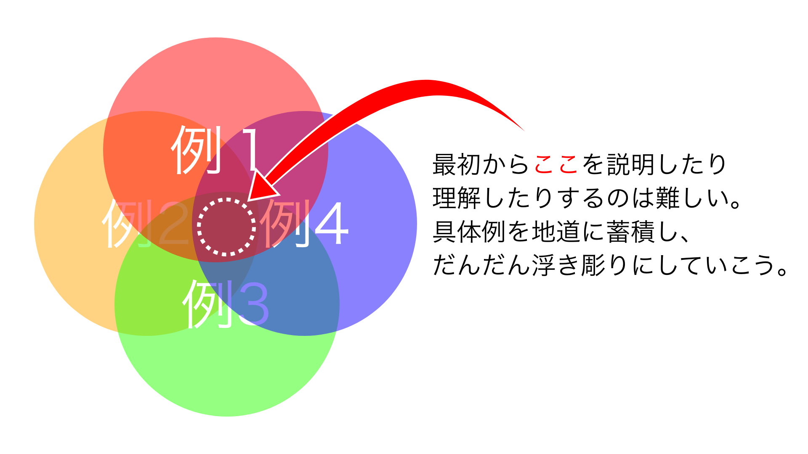

# javascript導入
プログラミング言語全体と簡単なネットワークの構造からjavascriptの立ち位置を把握する

## javascriptは『ブラウザ上で動く』プログラミング言語
表題の通りだがその前にまずは一旦下記を頭に入れて欲しい。

### そもそもブラウザって？
まずは簡単にパソコンとネットワーク周りについてみてみる。例として、私達がインターネットを使ってwebページを見るとき、裏側で何が働いているのかを極簡易的に図示するとこうなる。



1. **パソコン**で**ブラウザ**を起動する
1. ブラウザでwebページを検索するとブラウザが**サーバー**に**htmlを注文(リクエストと呼ぶ)**する
1. サーバーがリクエストされたファイルをブラウザに渡す

要はブラウザはwebを閲覧する為のアプリである。javascriptはこのブラウザ上で動くプログラミング言語である。
> サーバー側で動くものの代表としてはjavaなどがある。

> 【javaとjavascriptの違い？】<br>
全く別物である。ハムとハムスター、カーとカーペット、くらい違う。本当に全く関係ない。javascriptをjavaと略すと街を歩けないレベルの恥をかくので気をつけよう。javascriptが作られたときにjavaが大流行してたからjavaってつけちゃっただけ。ミーハー。

## ECMAScript？javascript？
javascriptについて調べているとES5やらES6やら、ECMAScriptやら見かけるかもしれない。ESはECMAScriptの略称。読み方は『エクマスクリプト』。混乱を避けるためにこれらの関係について整理しておこう。

### ECMAScriptは所謂標準語
javascriptが出てきた当初、ブラウザで動く言語ということで大変盛りあがったが、あちらこちらで独自javascriptのようなものが出来てしまった。方言のようなものである。ナマリがひど過ぎてその地方でしか伝わらない。そこでECMAinternationalという団体が中心となり**標準化**を行い出来たのでECMAScript。

> ということでみんな当たり前のようにECMAScriptを使っているので、ECMAScript = javascriptと読み替えてしまって特に問題はない。もっと詳しく知りたい人は調べてみよう。

### ES5？ES6？
ESはもちろんECMAScriptのこと。5,6の数字はバージョンのことである。ややこしいがES6が出来たのが2015年なのでECMAScript2015 = ES6である。

## 新しい文法が実装されたES6
調べているとES5とES6ばっか出てきて、1,2,3,4は取り上げられていないという事に気付くと思う。これは6になって今までのjsには無かった新しい文法が追加されたからだ。詳しくは各章にて述べるので割愛するが、一例としては変数宣言の```let```と```const```である。今までは割と致命的な挙動をしちゃう```var```しか無かった。


### ES5の文法も勉強しなきゃダメ？
結論からいうと両方知っておかなければならない。色々と理由はあるが今回は割愛(あんまり重要じゃない)。
というより『どちらを勉強すべきか』というのは考えなくていいし、どちらか一方というのがナンセンス。強いていうなら**その記法はES6からのものなのかどうかのみしっかり抑えればいい**。

### ES5の書き方が使えなくなったわけじゃない
```let```,```const```といった変数宣言は、元々あった```var```の完全上位互換と言っても差し支えない。では```var```(varは一例。ES5の記法と読み替えてほしい。)はもう使えないのかというとそうではない。**寧ろ開発者が意図的に前の文法もそのまま使えるようにしている**。

## みんなが気になる『javascriptで出来ること』

やっぱりみんな気になるみたい。


非常に気持ちは分かるが**これは少なくとも初学段階では気にしちゃいけない**。
アフリカ人に「醤油って何が出来るの？」と聞かれても困ると思う。メインの調味料としても使えるし隠し味としても使える。色々な事に使えるがなんでも出来るというわけでもない。仮に説明したとしても例をいくつかあげるくらいだと思う。javascript(というかプログラミング言語全般)も同じ。


### まずはwebページの操作を目標にしよう
とは言っても、**jsはwebページ関連の処理が得意**というのは言える。初学の導入としては必要な周辺知識などを考えても最適かと思われるのでまずはそこを目指そう。

### でも実はjavascript単体ではwebの操作は出来ない
webページの操作というのは要はHTMLファイルの書き換えであるが、実は純粋なjsだけを勉強してもこれは出来るようにならない。これが出来るようになるにはjavascriptとは別にDOMというものも勉強する必要がある。
> とは言ってもDOMはjavascriptの１つの機能みたいなものである。あくまで初学の段階ではまず分けて考えようという話。

> DOMはブラウザが提供するAPIである。APIとはプログラミング言語における追加機能みたいな認識でとりあえず大丈夫。

### ではjs単体では何が出来る？
js単体で出来るのは数字や文字などを計算したり、同じ処理を繰り返す処理を書いたり、そんなところ(やれば分かる)。料理でいうと煮る・焼く・蒸す・切る・調理器具の扱いなどの部分。なんの食材を扱うかはまた別の話。

### まずは最低限の文法を知ろう
教材によっては最初からDOM + JSで取り扱っているものも多いしそれでも全然問題ないと思う。しかしここでは混乱を避けるために敢えて分離する方向で学習を進めていく。

### まとめ
- jsはブラウザで動く言語
- ESはjsの標準語
- ES6で新しい文法が追加
- jsで何が出来るかはとりあえず考えない
- js + DOM で初めてhtmlを操作できる
- まずはjs単体の文法から知っていく

