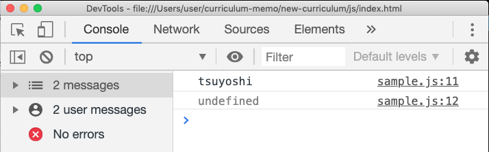

# オブジェクト
オブジェクトとはキーと値が対になっているプロパティの集合のこと。
意味がわからないと思うので順番にみていこう。

## オブジェクトの書き方
配列と割と似ている。{}この記号を用いることでオブジェクトを書ける。

```js
// 変数を用意してその中に入れる
let myObj = {
    name: "tsuyoshi",
    age: "secret",
    hobby: "ssbu"
    // カンマで区切る
}
```
もちろん文字以外のものも入れられる。

```js
// 数字も入るし
let myObj = {
    name: "tsuyoshi",
    age: 2,
    hobby: "ssbu"
}
// 変数も入る
let number = 2
let myObj = {
    name: "tsuyoshi",
    age: number,
    hobby: "ssbu"
}
// 他にも色々入れられる
```
これが基本の書き方になるので、とりあえずこれだけはしっかり覚えておこう。

## オブジェクトの用語を覚える

各部位それぞれ名前がある。意思疎通に齟齬が生じないよう正確に覚えよう。(本当に大事だよ)
- オブジェクト：そのまま。連想配列とはあんまり言わないが今はとりあえず同じものと思って大丈夫。
- キー：下図参照
- 値：キーに対して割り当てられているもの
- プロパティ：キーと値のセット


## consoleに表示してみよう
こんだけ。レッツトライ。
```js
console.log(myObj)
```
表示結果


ここで注意して欲しいのは下記のように３つのプロパティをそれぞれ表示したのではないということ。


表示されたものは飽くまで**myObjというオブジェクト１つだけ**である。

## オブジェクトのプロパティにアクセスする
言葉は格好いいけどつまり要素を１つずつ取り出したいだけ。
> 気付いてる人もいるかもしれませんがここまでほとんど配列の資料のコピペ。でもここらへんから大きく変わってくるから読み飛ばしちゃだめ。

### 一番基本的な取り出し方：ドット記法
```js
// オブジェクト.key 
// → 値

myObj.name
```
上記をコンソールに出力すると以下のようになる
```js
console.log(myObj.name)
```


> 後から出てくるブラケット記法などは、このドット記法でどうにかできない場合に使う、くらいの認識で大丈夫。混乱しない為に脳内で重要度/優先順位をつけよう。

### 値を書き換える(再代入)
下記のようにすれば良い。
```js
myObj.name = "古垣結衣"
```
### プロパティを追加する
突拍子もないように感じるかもしれないが、
<br>**オブジェクト.存在しないキー = 値**<br>
で出来ちゃう。
```js
myObj.friend = null
console.log(myObj)
```


### もう１つの取り出し方：ブラケット記法
ドット記法ではオブジェクト.キーで値を参照できた。
```js
myObj.name // tsuyoshi
```
ブラケット記法という下記のようなもう１つの参照方法もある。
```js
myObj["name"] // tsuyoshi
```
ここで１つ注目して欲しい点がある。"name"の部分である。クオーテーションで囲まれている＝文字列であることに違和感はないだろうか。因みにクオーテーションをつけないとundefinedとなる。
```js
// シングルでもダブルでも変わらないよ
console.log(myObj['name'])
console.log(muObj[name])// undefined
```


このことから分かるのは、**オブジェクトのキーは変数ではなかった**ということである。<br>
実はオブジェクトのプロパティを書く際、キーは以下のように書くことが出来る。
```js
let myObj = {
    "name": "tsuyoshi",
    "age": 129387
}
```
キーのクオーテーションに関しては省略出来る、というだけであり、決して変数ではない。
**省略しているか否かなので意味的な違いはないことに注意**。

### ドット記法のとブラケット記法の違い
下記のようなキーはドット記法では書けない。いずれも変数の命名規則に乗っ取ったものになっている。

```js
// NG：ハイフンを含むもの
myObj.my-name

// NG：数字始まりもしくは数字のみ
myObj.123
```
ブラケット記法では利用できる
```js
myObj["my-name"]
myObj[123]
```
ハイフンを含むキーはクオートを省略できません
```js
let obj = {
    // ok
    ok: "オッケー",
    12: "オッケー",
    // NG
    N-G: "だめ"
}
```

### ブラケット記法は変数を利用できる
例えば以下のケースを考える。
まずはオブジェクトを定義する。
```js
let obj = {
    // 分かりやすさのためクオートを省略せず書いてます
    "country": "japan"
}
```
これをhogeという変数を経由して呼び出したい。
```js
let hoge = "country"

// こういうことをしたい
obj.hoge
obj[hoge]
```


結論から言うと、**ブラケット記法では可能で、ドット記法では不可**である。
> 小難しく言い換えると**ブラケット記法では変数が展開される**と言える。変数を変数として認識できるということである。

```js
obj[hoge]//変数
obj["hoge"]//文字列(通常の呼び出し)
```
これを知っていると下記のような問題を解くことが出来る。逆に知っていないと出来ない。

### 【演習】オブジェクトを作る関数
引数を２つ取り、それぞれをキーと値としたオブジェクトを返す関数を作ろう。
> 関数の基礎がまだの人は簡単にさらって来よう

```js
function getObj(key, value){
    // ここに処理をかく
}
// ・keyには文字列でキーが入る
// ・valueには値
// それぞれ入力するとオブジェクトになって返ってくる
```

以下解答
<br>
・<br>
・<br>
・<br>
・<br>
・<br>
・<br>
・<br>
・<br>
・<br>

### 【解説】
とりあえずやってみる。**まず最初は間違ったパターンから紹介する**。結構最初に思いつきがちだと思う。
```js
function convertObj(key, value){
    let obj = {
        key: value
    }
    return obj
}
```
まずは実行した結果をみて、何故これではうまくいかないのかを考えよう。
```js
// 実行
console.log(convertObj("キー", "値"))
```
結果↓


値の方は上手く行ってそうだが、キーがダメダメである。これは、**キーは文字列であり、クォーテーションを省略しているだけ**というのを思い出せば分かりやすいと思う。要は変数ではないのだ。
```js
// 実はこうなってるんだよ
let obj = {
    "key": value
}
```
そうなると別の方法を考えなければならない。<br><br>
どうにかして```key```に当たる部分を変数で表現できれば良いわけだが……ってあれれ〜？？？？さっきそんなの出てこなかったっけぇ？？？？

```js
// 出てきた
    obj[key]
```
ということでとりあえず書いてみる。
> 分かっていることからとりあえず書いちゃうのは結構大事なテクニックなので覚えておこう。少しでも前進した方が考えるのが容易になる。
```js
function convertObj(key, value){
    obj[key]
}
```
この状態で足りないものを考える。以下二点を思いついて欲しい。
- そもそもobjがない
- valueをkeyの値として設定出来ていない

という訳でobjの用意からしていこう。
```js
function(key, value){
    let obj = {}
    obj[key]
}
```
> さらっと出てきた『let obj = {}』。最初は違和感があるかもしれないけどただ空っぽのオブジェクトを用意しただけ。全くおかしい事ではないので慣れておこう。

次は
- valueをkeyの値として設定出来ていない

である。これは代入で実現できる。
```js
function convertObj(key, value){
    let obj = {}
    obj[key] = value
}
```
あとは戻り値でobjを返してやれば良い。ちゃんと動くかは自分で確認してみよう。
```js
function convertObj(key, value){
    let obj = {}
    obj[key] = value
    return obj
}

// 以上
```
### もっと簡単な解答：キーに変数を用いる方法
実はもっと簡単にかける方法がある。
しかし**ES2015(ES6)からの記法なので注意**。

```js
function convertObj(key, value) {
    let obj = {
        [key]: value
    }
    return obj
}
```
このように、キーの部分を[]で囲むと変数として評価される。

## まとめ
- オブジェクト：プロパティの集合
- キー：プロパティの名前
- 値：キーに対して当てられているもの
- プロパティ：キーと値のセット
- プロパティの追加方法
- キーは文字列
- クォートは省略可能
- ドット記法とブラケット記法
- ドット記法：キーに変数は使えない
- ブラケット記法：キーに変数が使える
- キーを[]で囲むことで変数を使える(ES6~)
- (値には変数も文字列も数値もなんでも入る)