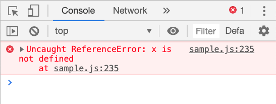
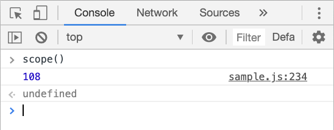
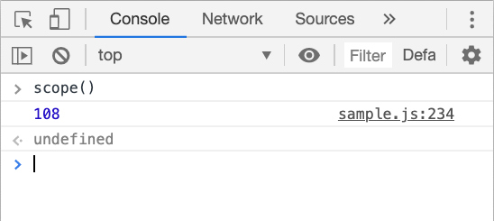
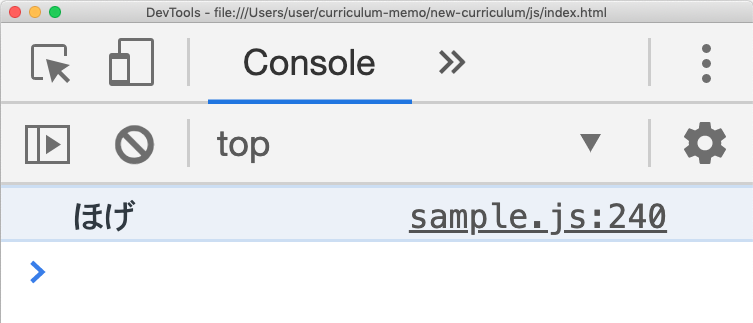
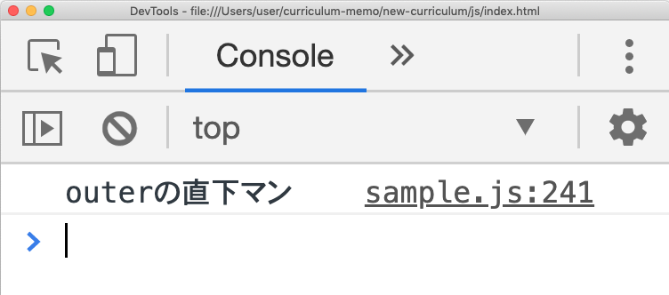
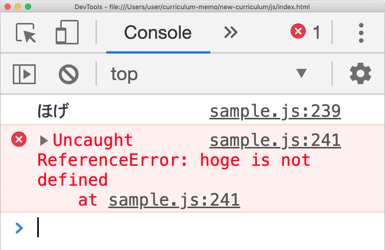
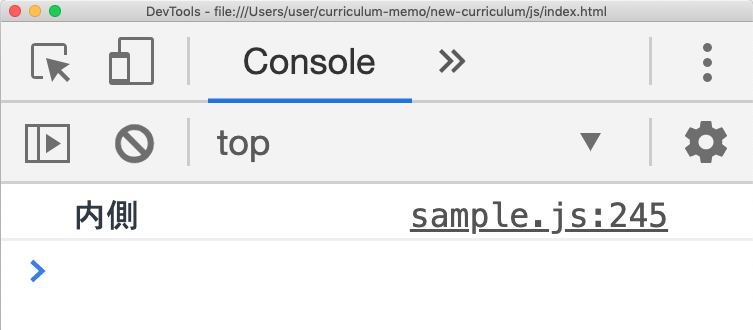
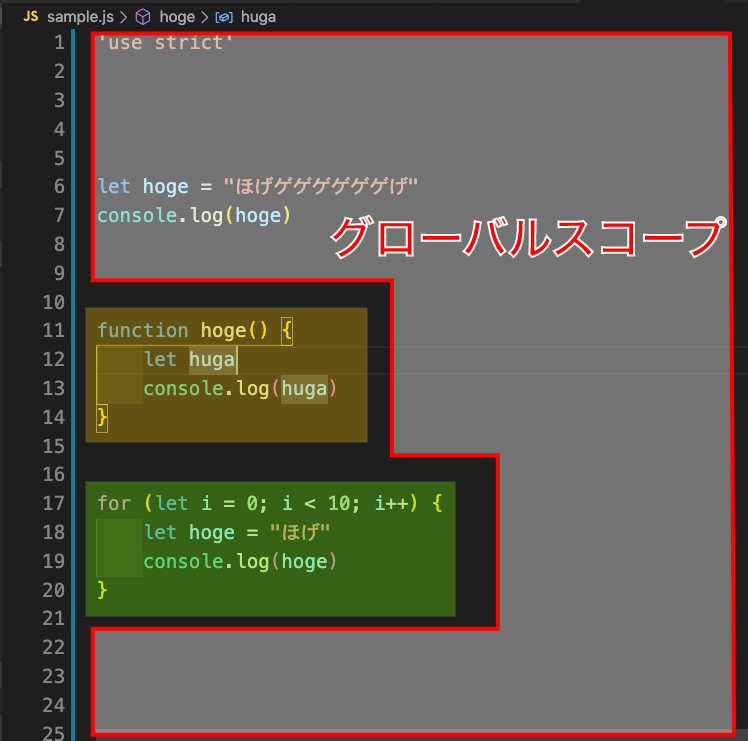
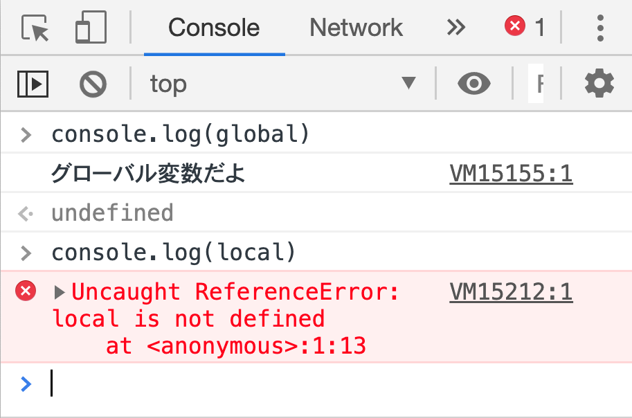

# スコープについて
スコープとは**変数の有効範囲のことである**。

## まずは触れてみよう
スコープの代表として関数スコープがある。平たく言えば**関数内で定義した変数はその関数内でしか参照できない**という決まりのことである。
```js
function scope(){
    let x = 108
}
console.log(x) // 参照出来ない
```


このようにスコープ外から参照しようとしても出来ないので、『xはまだ定義されてませんよ』と返ってきてしまう。<br>
一方関数内ならスコープの有効範囲なので問題なく参照できる。
```js
function scope(){
    let x = 108
    console.log(x)// 参照可
}
```


### スコープ内からスコープ外への参照は可能:スコープチェーン
スコープ内に参照すべきものが見つからなかった時、**外側へ探しにいく**。
```js
let x = 108
function scope(){
    console.log(x)// 参照可
}
```


下記も含め、このように内側から外側へスコープを辿っていく挙動のことを**スコープチェーン**という。概念自体は単純だが重要な用語なので覚えておこう。

### スコープの入れ子
入れ子になっている時も同様に、**見つかるまで外側へ探索にいく**。
```js
let x = "ほげ"
function outer(){
    function inner(){
        console.log(x)// ほげ
    }
    inner()
}
outer()// 実行
```


途中で見つかればそこで探索終了する。
```js
let x = "ほげ"
function outer(){
    let x = "outerの直下マン"
    function inner(){
        console.log(x)// outerの直下マン
    }
}
outer()
```


### スコープの存在意義

可能な限り参照できる範囲は狭くしたほうがいい(勿論参照したい範囲は満たしつつ)。<br>
例えば大人数で開発している際、スコープの概念がなければ都度誰がどんな変数名を使ったかをリアルタイムでメンバー全員が共有できるようにしなければならない。同じ変数名をつけてエラーでも出たらもう何も動かなくなってしまう。

### スコープ基本まとめ
- スコープ→変数の有効範囲のこと
- (関数≒スコープの)外側から内側へは参照出来ない
- スコープ内に無ければ外側に探しにいく
- 入れ子になっていても同様
- ↑の挙動のことを**スコープチェーン**と呼ぶ
- 途中で見つかったらそこで探索終了

## 関数スコープ
スコープを形成する方法はいくつかあるが、そのうちの１つが先も紹介した**関数スコープ**である。関数を定義すると自動的にスコープが生成される。
関数が違えばスコープも違うので、同じ変数名を使える。
```js
function fn1(){
    let x = 9
}

function fn2(){
    let x = 0
}
```
### 引数のスコープ
関数の章でも軽く触れたが、引数は暗黙的にこのように定義されている。
```js
function fn(arg){
    // let arg
}
```
そのため引数のスコープはその関数に属する。

## ブロックスコープ
関数スコープとは別に、スコープを形成するもう１つの方法がこのブロックスコープ。波括弧で囲むだけ。
```js
{
    let hoge = "ほげ"
    console.log(hoge)// ほげ
}
console.log(hoge)// エラー
```


```if```,```for```,```while```などもブロックスコープを形成する。

### varとletの違い
ここでも```var```と```let```の違いが出てくる。実は、**varはブロックスコープを認識してくれない**。以下のケースで見てみよう。
```js
{
    let x = "内側"
}
console.log(x)// エラー
```
これは当然```console.log(x)```は```x```を参照出来ないのでエラーになってしまう。しかし、下記のように```var```を用いてしまうと、
```js
{
    var x = "内側"
}
console.log(x)// 内側
```


エラーにならず参照出来てしまう。これは、波括弧があったらそれをスコープとしなさいという決まりを```var```が知らないからだ。つまり```var```にしてみれば波括弧は(スコープ的な意味では)無いものとして扱われている事になる。

> ```let```はES6からしか使えないことを考えると、ブロックスコープ自体もES6からしか存在しないと言える。

## グローバルスコープ
今まではプログラムの直下、要は関数の中でもブロック（{}←これ）の中でも無い場所にコードを書いていたが、実はそこも暗黙的なスコープが存在する。それを**グローバルスコープ**と呼ぶ。

グローバルスコープは一番外側のスコープであり、スコープチェーンの最終終着点でもある。

### グローバルとローカル
グローバルスコープに定義されている変数のことを**グローバル変数**と呼ぶ。一方、関数スコープやブロックスコープなどのことを、グローバルスコープに対して**ローカルスコープ**と呼ぶ。ローカルスコープに定義されている変数はローカル変数と呼ぶ。

### コンソールはグローバルスコープ
検証ツールのコンソールはグローバルスコープである。その為、コンソールに直接コードを書いて実行するような時、ローカル変数は参照出来ない。
```js
let global = "グローバル変数だよ"
{
    let local = "ローカル変数だよ"
}
```


### グローバルスコープに定義することの問題点を考える
冒頭の方、『スコープの存在意義』でも言及したように、グローバルスコープでの変数定義はあまり推奨しない(規模・人数が大きくなればなるほど)。それとは別にもう一点おすすめしない理由がある。それが**ビルトインオブジェクト**への汚染である。
> 今回の文脈では、ECMAが用意する・実行環境が用意するなどの、ビルトインオブジェクトの細かい区分けは無視する。

### ビルトインオブジェクトはグローバルスコープに定義されている
ビルトインオブジェクトとは、平たく言えば『最初から定義されている関数やメソッド、オブジェクト』のことである。
関数の章でも触れたが、```console.log()```も実はオブジェクト（とメソッド）であるというのを思い出してほしい。これなんかがビルトインオブジェクトである。
```js
//////////////////////
// ※グローバルスコープ //
//////////////////////
console = {
    log(arg){
        // コンソールにargを表示する処理
    }
}
```
> 私達には見えないところで上記のような定義がなされている為、```console.log()```をはじめとするビルトインオブジェクトを利用できる。

ではjsファイルのグローバルスコープに
```js
let console = "あああああ"
```
と書いて、ブラウザのコンソールに直接
```js
console.log(console)
```
と書いてみよう。『console.log is not a function』と出るはずである。

> エラー内容は『console.logは関数じゃ無いよ』だが、なぜこのようになったのか説明してみよう

## スコープのススメ【ES6】
説明してきたように、グローバルスコープには必要でなければ変数を定義しない方が良い。その為、ES6では下記のような対策が有効である。
```js
{
    // この中に全て処理を書いていく
    // varは使わない
}
```
プログラム全体をブロックスコープで囲むことで、グローバルスコープへの汚染を防いでいる。
加えて厳格モードも推奨されているので、
```js
{
    'use strict'
}
```
これが言わば雛形のようになっている。

## スコープのススメ【ES5】
ES5の場合は、```let```や```const```が使えない為付随してブロックスコープが使えない。要は関数スコープしか使えない。ので、即時実行関数を用いた下記のような対策が取られていた。
```js
(function(){
// ここに全て書いていく
})()
```
プログラム全体を即時関数で囲むことで関数スコープを作り、グローバルスコープへの汚染を防いでいます。即時関数なのでjsファイルが読み込まれたら実行される＝無害です。
> ES5環境しか使えない場合はこちらを使おう。

以上がスコープの基本となる。スコープ関連では『クロージャー』という発展的な仕様があるが、やや難解な為この章では取り扱わない。まずは基本をしっかり抑えよう！