# javascriptの変数
プログラミング言語に絶対出てくる変数についてみていく
## そもそも変数とは？
- 数字や文字など色々なものを入れておける箱のようなもの
- これにより同じ値を使い回したりできる
> 初学段階では「いつ使うのか？」「どういう意味？」などの疑問が湧くこともあるけど考えなくていい。きっと説明できる人は殆どいないし仮に説明されたとしても分からない。習うより慣れろの感じ。
### まずはざっくり理解する
例えば『底辺が3cm、高さが4cmの三角形』。これの面積を求めることを考える。
これは単純に
```js
// 底辺が3cm、高さが4cmの三角形の面積
3 * 4 / 2 = 6
```
これで求まる。
底辺が5cm、高さが19cmなど、別の数字になっても容易。
```js
// 底辺が5cm、高さが19cmの三角形の面積
5 * 19 / 2 = 47.5
```
なぜ私達は数字が変わってもすぐ式にして計算ができるのか？それは面積を求める以下の公式を知っているからである
```js
// 面積 = 底辺 * 高さ / 2
```
こんなのは当たり前である。そしてこの**面積・底辺・高さ が変数に他ならない**。


## 何はともあれ使ってみる
- 変数を定義し
- 値を代入し
- 使う

### 変数を定義(宣言)する
言葉は難しいかもしれないが、ただ箱を用意するだけである。変数(箱)には名前が必須。必ず命名する。定義は以下のように、任意の変数名の前に```let```と付けるだけ。
**この時点ではまだ中身はないことに注意。箱の中は空でも全く問題ない**。
```js
// 変数を定義する
let teihen
```
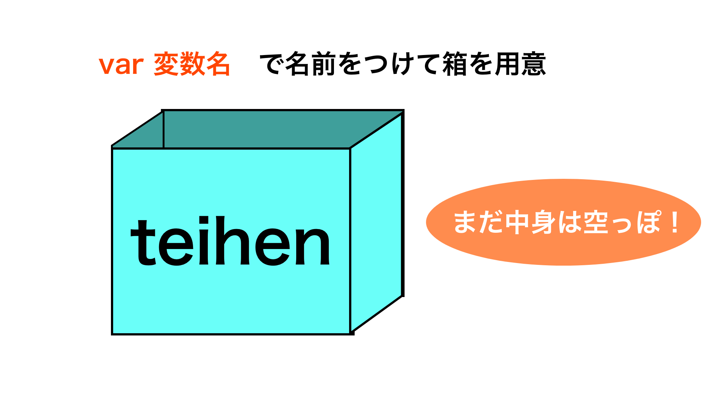

### 値を代入する
箱の中(変数)に物(値)を入れるだけ。言葉のかっこよさに惑わされてはならない。これを**代入**という。
```js
// 値を代入する
teihen = 5

// 数字以外にも色々入れられる
let moji
moji = "こんにちは"
```
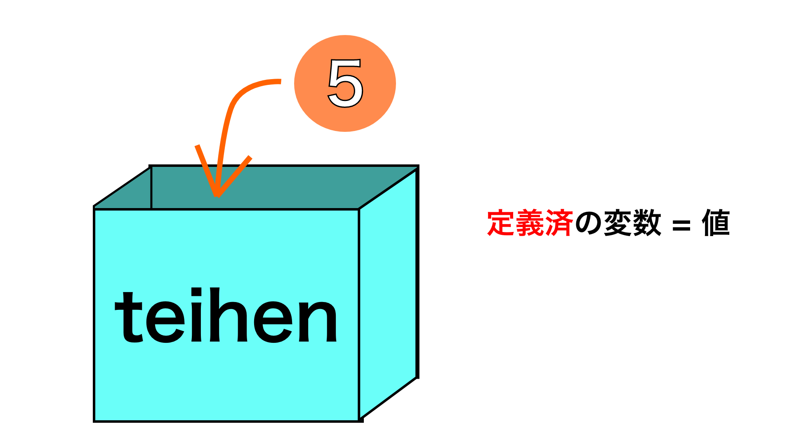

因みに定義と代入は一緒に済ませちゃうこともできる。
```js
// 定義と代入を１行で行う
let hoge = "ほげ"
```
> 代入として、しれっと使っているこの=記号。これは**数学で使ってきたイコールとは明確に全然全くめちゃくちゃ意味が異なる**ので気をつけよう。右辺のものを左辺の箱に入れる、という意味である。詳しくは代入の章で解説する。
### 変数を使ってみる
クロームのコンソールという場所に今作った変数を表示してみる。コンソールはブラウザ上で右クリック→検証、もしくは以下のショートカットキーでも開ける。
- mac：cmd + option + i
- win：ctr + shift + i

開いたらConsoleというタブをクリックする。
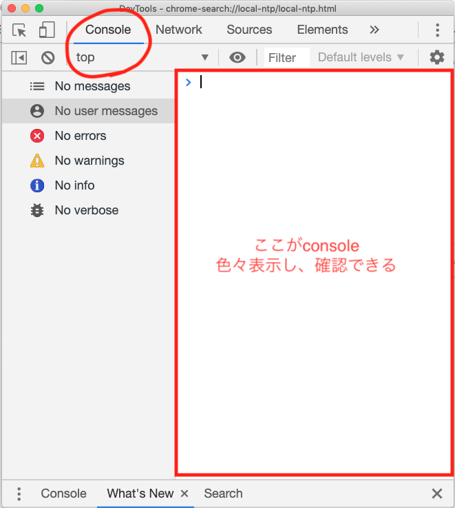
console.log()という命令を用いて変数をコンソールに出力してみる。console.log()は括弧内に書いたものをコンソールに表示してくれる。

```js
console.log(teihen)
// 5と表示される
```

## 変数の色々な決まり
変数に限らないが色々とルール、決まりがある。ルールなので「そういうもんだ」と理解しておく。サッカーでボールを持っちゃいけないことに理由を求めてはならない。
- 使う前に必ず定義する
- 同じ変数は二度定義しない(再定義)
- 命名規則を守る

### 使う前に必ず定義する
そのままの意味。定義する、を意味するのは```let```であった。以下１つずつ実際に実行してみて欲しい。
```js
// 一個ずつ実行してみよう
'use strict'

// OK
let ok1 = "ok1"
console.log(ok1)

// OK
// 決して代入は必須ではない
let ok2
console.log(ok2)

// OK
let ok3
ok3 = "ok3"
console.log(ok3)

// NG
ng1

// NG
console.log(ng2)

// NG
ng3 = "だめ"
console.log(ng3)

// NG
console.log(ng4)
let ng4
```
試しに```console.log(ng2)```をやってみると以下のような表示がコンソールに出るはずである。
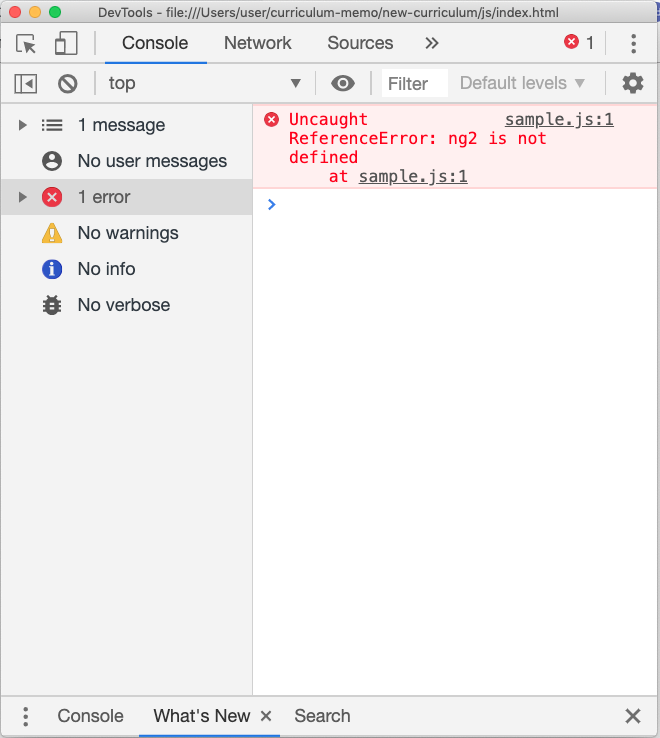
ng2はまだ定義されてませんよ、と丁寧に教えてくれている。こんな感じで、間違ったことをするとエラーがでる。逆に言えば**エラーがでなければ言語仕様的には間違いではない**ということである。これに関しては別の章で触れる。

#### 未定義の変数への代入
ng3の部分を見て欲しい。
```js
// NG
ng3 = "だめ"
console.log(ng3)
```
結構やってしまいがちだが、『変数宣言は箱を用意するもの』『代入は箱に値を入れろという命令』というのを知っていればおかしさに気づけるはず。


### 同じ変数を二度定義しない
下記がだめということ。
```js
let hoge 
let hoge
console.log(hoge)
```
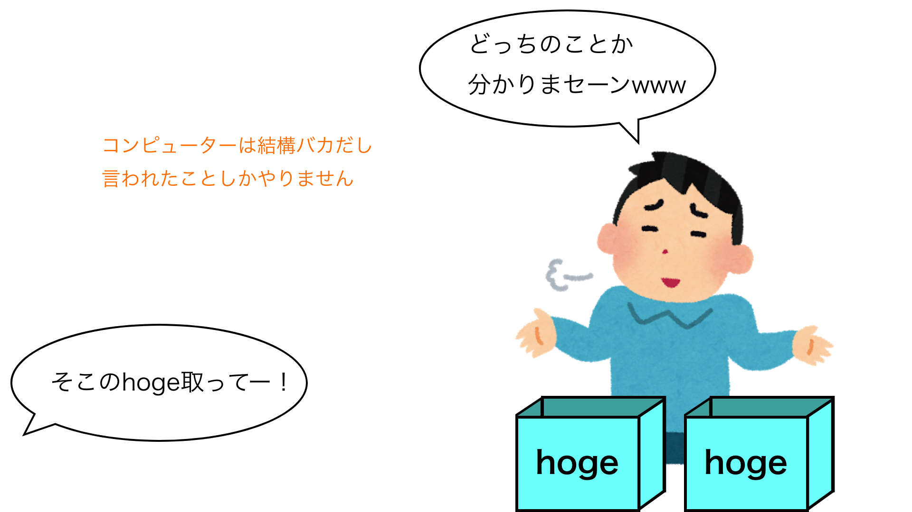

勘違いしやすいが以下は**定義は一度しかしていない**のでセーフ。繰り返すが定義は```let```であり、代入とは全くの別物。
```js
let hoge
hoge = "ほげ"
```
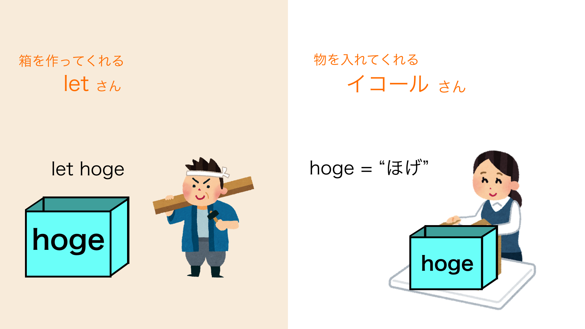

### 値が入っていない変数には何が入っている？？
定義と代入は別物であり、何も代入していない変数は何もおかしくないと言った。では定義だけした変数を出力したらなんと表示されるのだろうか？実際にみてみよう。繰り返すが構文・文法的に何ら間違っていない。
```js
let hoge
console.log(hoge)
```
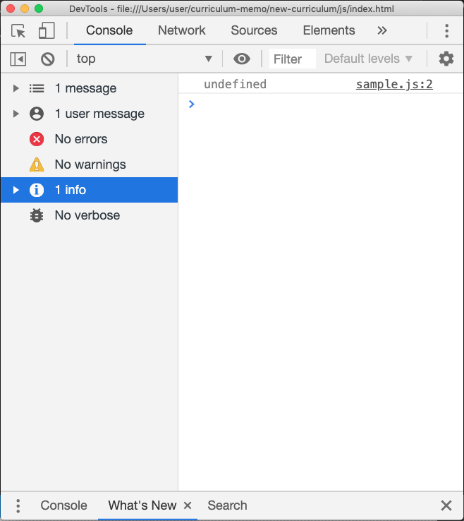

このようになるはず。重要なのは以下の二点。
- エラーではない(しつこい)
- undefinedが**入っている**

１つ目はいいとして、問題は２つ目。今まで『空っぽの箱』と言ってきたが、実はあれは少し嘘である。実は何も代入していない変数には自動でundefinedという『値』が**入っている**。鳥が０匹いる、みたいなイメージで今は大丈夫。undefinedについてはまた別の章で詳しく触れる。

### 命名規則を守る
変数に名前を付ける際にルールがある。
基本は以下の１点のみ守れば良い
- 全て小文字半角アルファベットで、単語の区切りは大文字で区別
```js
let hoge
let myName // 単語の区切りは
```
以下はエラーになる
```js
let 1st // 数字で始まる
let my-name // -はマイナス記号なので使えない
let let // 『予約語』を使う
```

中には『エラーにはならないがマナー的にアウト・グレー』というものもある。下記の通りである。

```js
let $hoge // $は使えるがjQueryの関係でよろしくない
let my_name // アンスコは特殊な変数に使う
let MyName // 大文字始まりは『コンストラクタ関数』というので使うというマナーがある
let namae // 英語にしましょう
let 日本語 // 一部の漢字や平仮名も使えるがやらない
```

## 【演習】三角形の面積を求める式で変数を理解する
下記のコードをjsファイルにコピーし、完成させる。
```js
console.log("底辺が" + width + "cm、高さが" + height + "cmの三角形の面積は" + area + "㎠です。")
```
以上のコードを使い、コンソールに
<br>
<br>
『底辺が(入力した数値)cm、高さが(入力した数値)cdの三角形の面積は(計算結果)㎠です。』
<br>
<br>
と表示されるようにしたい。width,height,areaにはあらかじめ適当に数値を入れておくこととする。javascriptで四則演算をする知識が必要だが、もしまだ知らなければ『js 四則演算』などで調べてみて欲しい。一瞬で分かるはず。

```"文字" + hoge + "文字"```のようになっていてまだ知らない構文かもしれないが、これはただ文字列と変数を連結して出力させる為のものなので気にしない。変数には入力した数字が入るだけ。
何が足りないのかを考え、解いてみて欲しい。
<br>
<br>
<br>
以下答えを記述するので解きたい人は一回スクロールをストップ。
<br>
<br>
<br>
<hr>
<br>
<br>

### 【解答】三角形の面積
では解答。
与えられたものはこれ。
```js
console.log("底辺が" + width + "cm、高さが" + height + "cmの三角形の面積は" + area + "㎠です。")
```
まず、定義されていない変数```width,height,area```があるので定義してやる。

```js
let width
let height
let area
```

この際、**変数を使っている場所より上で定義することを忘れない。**

```js
// これはダメ(エラーがでます)
console.log("底辺が(略)")
let width
let height
let area
```

widthとheightには適当に数値を入れておくだけだったのでそれぞれ適当に数字を入れておく。

```js
let width = 12938
let height = 516
```
```js
// もちろんこれでもok
let width
width = 12938
let height
height = 516
```
最後は面積。三角形の面積の公式に当て嵌めて計算した数字を入れて……、と思ったら数字がすごいことになっていてとてもじゃないが暗算が出来ないし何よりプログラミング言語である意味がない。ので、四則演算を用いてこうする。

```js
let area = width * height / 2
```
以上で完成。コンソールを確認してみよう。

<hr>

## 実はletだけじゃない変数宣言
実はjavascriptには```let```以外にも変数を宣言するものが２つ、つまり計３つの方法がある。
```js
// 以下はいずれも変数宣言
var hoge1 // ばー
let hoge2 // れっと
const hoge3 // こんすと
```


### 『letとconst』はES6以降から使用可能
javascript(ECMAScript)も日々進化している。```let```と```const```は進化の中で```var```の脆弱性を改善する為に作られた。**letとconstはES6に対応しているブラウザでないと使う事が出来ない**。
> しかし現時点(2019年)で98%程度のブラウザが対応しているのであまり気にすることはない。

### varのダメなところを知る


```var```は```let,const```出てくるES6より前から使われてきていて、今もそのまま使う事ができるが、プログラミング言語として致命的とも言える残念仕様が何故かある。
まずは```let```と比較する事で```var```の特徴を知っていく。```const```は一回置いておく。
> 『変数の色々な決まり』を復習しておこう。

> これから```let```と```var```の挙動の違いを紹介するが、**プログラミング言語としてより正しい挙動なのは```let```である。**

### varのダメポイント①：定義してなくても使えちゃう
以下を実行しても、両方ともエラーは出ない。
```js
hoge = "ほげ"
console.log(hoge) 
```
```js
console.log(hoge)
```
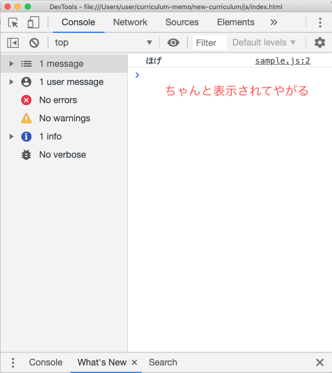


これは```var```が気を利かせて、見えないところで以下のような動きをしているからである。

``` js
var hoge // ←これ
// お、hogeなんて定義してないやんけ。定義しといたろ。
hoge = "ほげ"
console.log(hoge)

// こんな感じ
```
こんな感じで、```var```もといjavascriptは何かと緩いところがある。のちに紹介している風紀委員的存在、**『strictモード』** が必要である。

#### ちょっと演習
上記のように定義していないタイミングでvarを用いてしまった時の挙動を踏まえ、以下の問題を考えよう。答えは実際に書いて確認しよう。

```js
// それぞれなんと出力されるだろうか？
console.log(hoge)
hoge = "ほげ"
console.log(hoge)
```

### varのダメポイント①part2：巻き上げを起こす
ダメポイント①に付随した問題だが、varには変数の巻き上げという重大な過ちを犯す性質がある。これに関しては関数の章で詳しく触れる。

### varのダメポイント②：同じ変数を二度定義出来ちゃう
まずはletで以下を試してみよう。エラーが出るはずだが、これが正しい挙動である。
```js
let hoge = "ほげ"
console.log(hoge)
let hoge = "newほげ"
console.log(hoge)
```
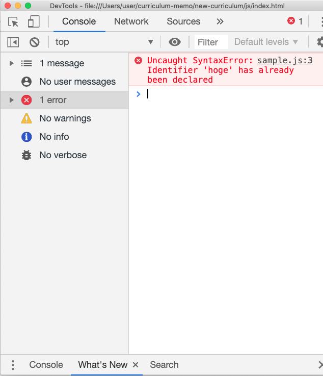

エラー内容でも『もうhogeはあるよ！！！！』と教えてくれている。
<br>
<br>
一方、問題のvarでやってみよう。

```js
var hoge = "ほげ"
console.log(hoge) // ほげ と出る
var hoge = "newほげ"
console.log(hoge)// newほげ と出る
```
やっぱエラーが出ない。これは以下のようにまた変な気を利かせてくれている為である。ありがた迷惑だと言う感覚を持とう。

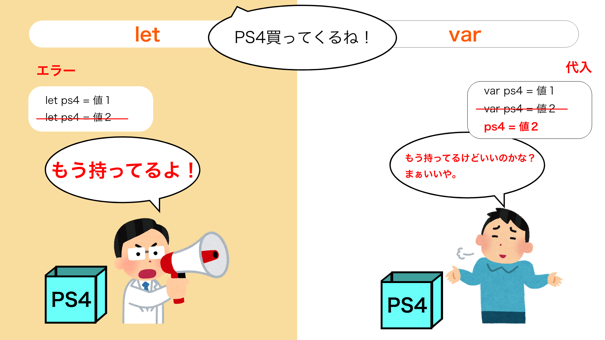

### 厳密に文法チェックしてくれるstrictモード
上記のような曖昧さを無くし、ちゃんとエラーを出してくれる**strict(ストリクト)モード**と言うものがある。使うにはjsファイルの文頭にこれを一回書くだけ。
```js
// 厳密モードとか言われたりする
'use strict'
```
strictモードの有る無しでの出力結果の違いを適当に試してみよう。

### letとvarのまとめと結論
ひとまずここまでで話を纏めておく。以下を頭に入れた上でどちらを使うか判断しよう。
- ```let```ではなく```var```じゃないと困ることはほぼ無いのでletを使おう
- ```let```はES6記法に対応していない環境では使えないがあまり心配いらないくらい普及している

> 実は上記以外にも```var```はブロックスコープ認識せず、```let```は認識するという違いもあるが、これに関してはスコープの章で触れる。

### ```const```と```let```の違いを知る
ということで```const```の解説に入る。基本的に```const```と```let```はほぼ同じものである。よって **```let```と```var```の違いが分かっていれば```const```と ```var```の違いも抑えたも同然である。**
```let```と```const```の違いを見ていく。

### ```const```は**再代入不可**の変数

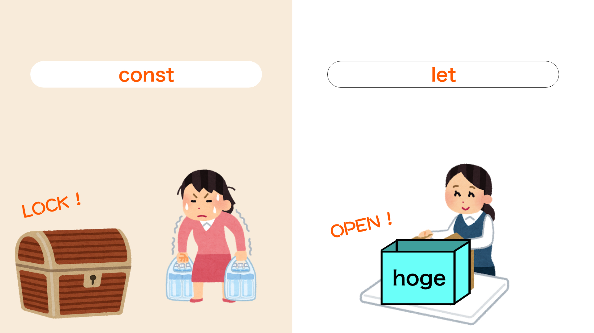

どういうことか。コードを見てみよう。
まずは```let```。
```js
let hoge = "ほげ"
hoge = "ほんげぇ"
console.log(hoge)// ほんげぇ
```
全く問題ない。では```const```を用いて同じことをしてみる。
> 今更だがこちらで示しているコードは読むだけじゃなくて実際に自分でもやってみて欲しい。一見無駄にも思えるかもしれないが実際に手を動かした方が定着するし、何より楽しい。
```js
const hoge = "ほげ"
hoge = "ほんげぇ"
console.log(hoge)// ほんげぇ
```
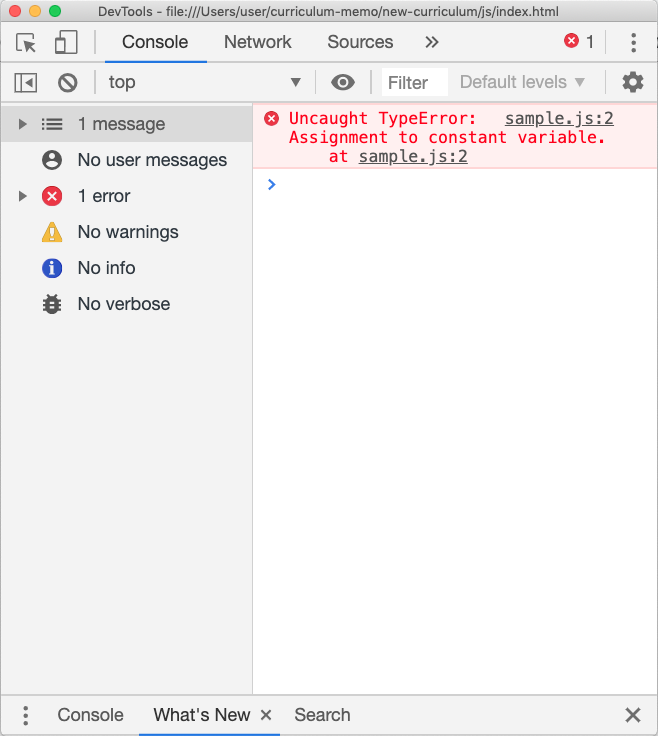

怒られた。これが**再代入不可**ということである。そのままだが、再代入が出来ない。

### ```const```は定数ではない
意味が分からないと思う。まずは言葉の意味を示そう。
- 再代入不可：そのままだが再代入が出来ない。```const```はこれ。
- 定数：一度定義した変数(定数)が常に同じ値を示すもの。```const```はこれではない。
<br>
<br>

「再代入が出来ないなら常に同じ値を示すのでは？」という疑問が出てくると思う(出てない人は無理矢理出すこと)。しかし、この２つが別れているということはつまり **「再代入をせずに値を変更する方法がある」** ということである。
> 以下は**配列**と**オブジェクト**の基礎が分かっていないと読みづらい。知らない人はまずは配列とオブジェクトの基礎についてさらってこよう。

### 再代入せずに値を変更する方法
いきなりだがコードから。
```js
const hogeObj = {
    hoge: "ほげ"
} 
console.log(hogeObj)
// hogeObj内のhogeキーの対応を更新
hogeObj.hoge = "newほげげげ"
console.log(hogeObj)
```
実行結果。**エラーが出ていなく、且つ値の更新(ほげ→newほげげげ)にも成功している**ことに注目して欲しい。
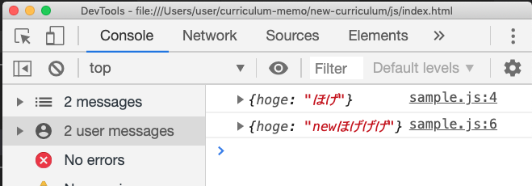

このようにオブジェクト(もしくは配列)の中身を更新するのは、**オブジェクトのプロパティに対する再代入であって、オブジェクト自身への再代入ではない**。
<br>
<br>
一方、こちらはオブジェクト自体を再代入してしまってるパターン。当然これはエラーがでる。

```js
const hogeObj = {
    hoge: "ほげ"
}
console.log(hogeObj)
hogeObj = {
    hoge: "newほげげげ"
}
console.log(hogeObj)
```
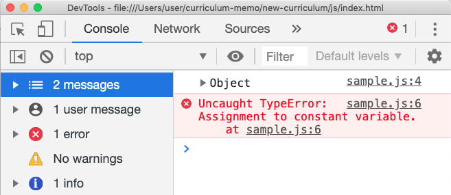
<br>
<br>
少し混乱するかもしれないが慣れて欲しい。これは変数ではなくオブジェクト・配列の話だが、オブジェクト・配列の本体は中に格納されているプロパティではなく、

```js
[] // これとか
{} // これ
```
である。

## 終わり
以上で変数に関する解説とする。